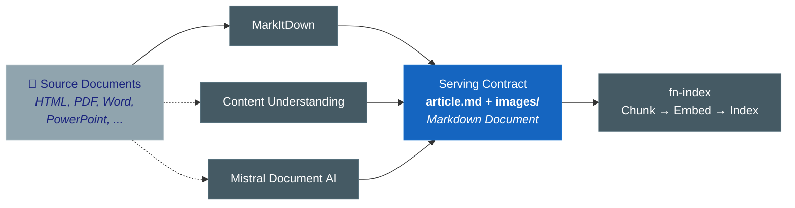
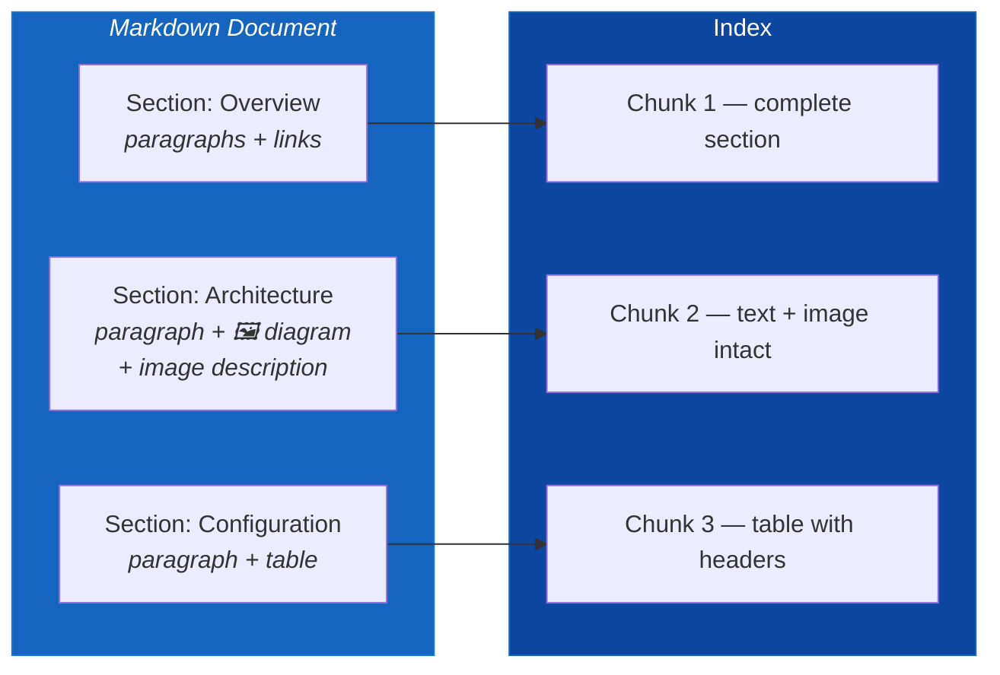
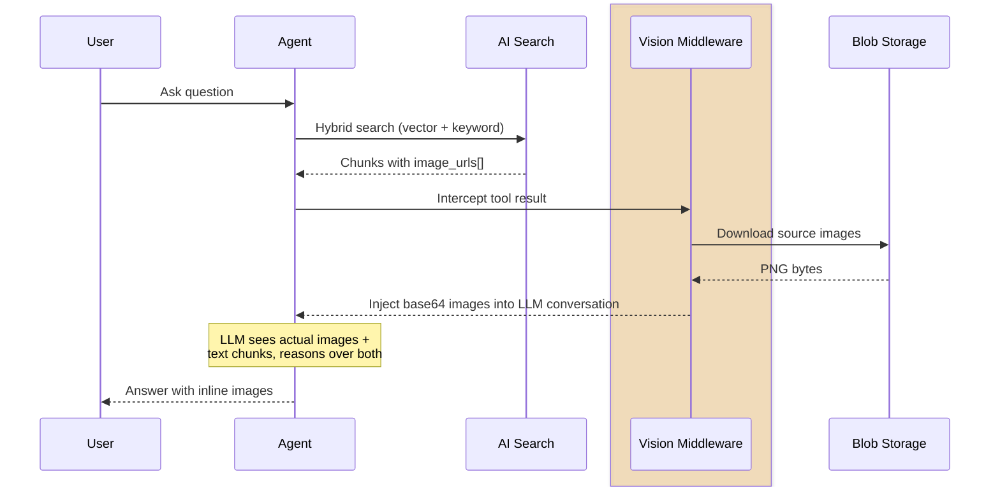
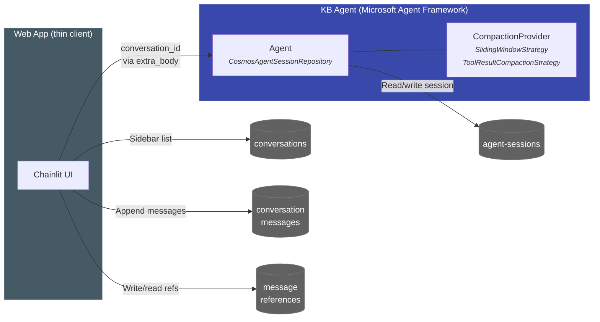
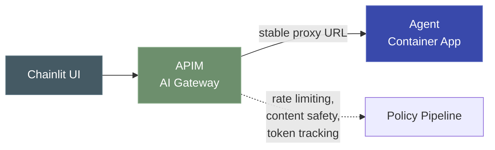
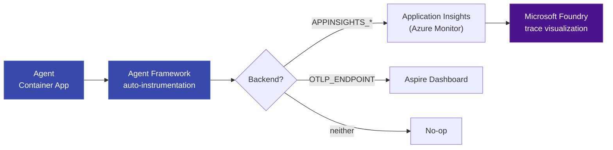
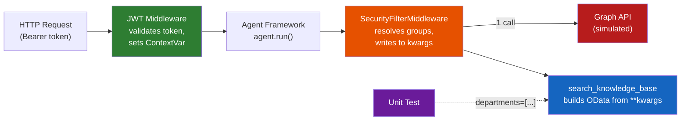
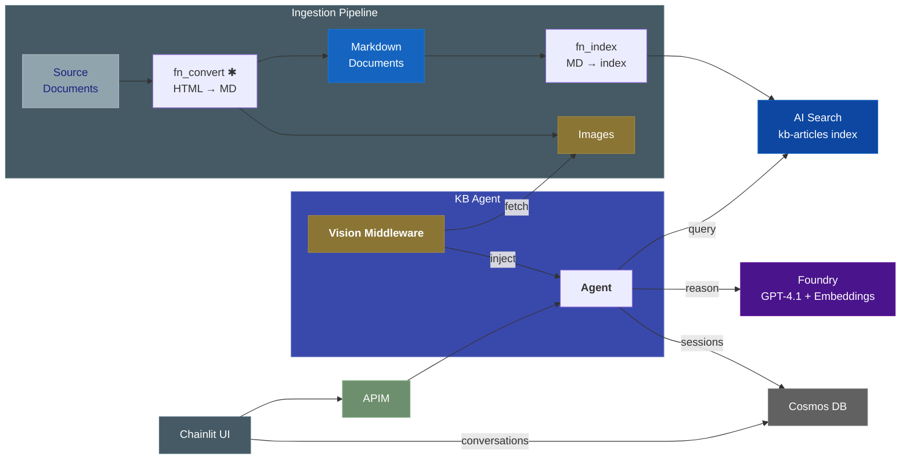

# Context Aware & Vision Grounded KB Agent

An Azure accelerator that transforms HTML knowledge base articles into an AI-searchable, image-aware index — and reasons over them with a vision-grounded conversational agent.

Enterprise knowledge bases store thousands of technical articles as HTML pages bundled with screenshots, diagrams, and UI captures. These articles are rich in information but invisible to AI search: traditional keyword search misses context, token-based chunking breaks documents at arbitrary boundaries, and the images — which often carry critical information — are completely lost. This accelerator solves all three problems with a two-stage ingestion pipeline and an agent that can *see*.


## Getting Started

### Shared

Set the converter backend used by the pipeline (applies to both local and Azure workflows):

```bash
make set-converter name=markitdown   # or: cu (Content Understanding), mistral (Mistral Document AI)
```

### Local / Dev

The local workflow is Docker-first and does not require Azure cloud resources, Azure credentials, or Entra auth. It uses smaller local Ollama-hosted models (`qwen2.5:3b`, `mxbai-embed-large`, `moondream`), so it is self-contained and cheap to run, but answer quality is below the Azure-hosted production path.

If you use an NVIDIA GPU with a native Linux or local-WSL Docker engine (not Docker Desktop), run the GPU setup once first:

```bash
sudo make dev-setup-gpu
```

Then bring everything up:

```bash
make dev-up
```

`dev-up` installs local dependencies, starts emulators, builds all services, runs the pipeline, and prints the local UI URL.

### Azure / Prod

Set the project name, then bring everything up:

```bash
make set-project name=myproj
make prod-up
```

`prod-up` installs Azure CLI and AZD if missing, provisions infrastructure, deploys services, runs the pipeline, and prints the deployed web app URL.

See [docs/setup-and-makefile.md](docs/setup-and-makefile.md) for the full target reference.

---

## Core Patterns

This solution demonstrates eight architectural patterns for building production-quality AI agents over enterprise content. Each solves a real problem encountered when moving from prototype to production.

### 1. Pluggable Document Normalization

**Problem:** KB articles come in many formats (HTML, PDF, PowerPoint), each requiring different extraction logic. Coupling extraction and indexing creates a monolith that's hard to extend.

**Pattern:** A two-stage pipeline decoupled by a **serving contract** — a normalized Markdown + images format (`article.md` + `images/` folder). The converter stage (`fn-convert`) transforms any source format into this contract; the indexing stage (`fn-index`) only reads Markdown. The existing converters already handle the hard parts (text extraction, image analysis, Markdown assembly) — adapting them to accept PDF, PowerPoint, Word, or other document types requires minimal changes on the input side, while the indexing pipeline remains completely untouched.

This repo currently handles HTML as input. Three interchangeable converter backends for HTML prove the pluggability of the pattern:

| Backend | Text Extraction | Image Description | Trade-off |
|---------|----------------|-------------------|-----------|
| **Content Understanding** | Azure CU `prebuilt-documentSearch` (HTML-direct) | Custom CU `kb-image-analyzer` (GPT-4.1) | Highest fidelity; CU internal calls can't be routed through an API gateway |
| **Mistral Document AI** | HTML → PDF (Playwright) + Mistral OCR | GPT-4.1 vision | Gateway-compatible; requires Chromium for PDF rendering |
| **MarkItDown** | Local Python ([MarkItDown](https://github.com/microsoft/markitdown) library) | GPT-4.1 vision | Fastest, cheapest — only GPT-4.1 vision calls are billed |

Select at runtime: `make convert analyzer=markitdown`


```mermaid
flowchart LR
    SRC["📄 Source Documents<br/><i>HTML, PDF, Word,<br/>PowerPoint, ...</i>"]

    MIT["MarkItDown"]
    CU["Content Understanding"]
    MIS["Mistral Document AI"]

    MD["Serving Contract<br/><b>article.md + images/</b><br/><i>Markdown Document</i>"]

    IDX["fn-index<br/>Chunk → Embed → Index"]

    SRC --> MIT
    SRC -.-> CU
    SRC -.-> MIS
    MIT & CU & MIS --> MD --> IDX

    style SRC fill:#90a4ae,stroke:#b0bec5,color:#1a237e
    style MIT fill:#455a64,stroke:#546e7a,color:#ffffff
    style CU fill:#455a64,stroke:#546e7a,color:#ffffff
    style MIS fill:#455a64,stroke:#546e7a,color:#ffffff
    style MD fill:#1565c0,stroke:#1976d2,color:#ffffff
    style IDX fill:#455a64,stroke:#546e7a,color:#ffffff
```

---

### 2. Structure-Aware Chunking

**Problem:** Token-based chunking splits documents at arbitrary boundaries — breaking paragraphs mid-sentence, separating tables from their headers, and losing the relationship between images and the text they illustrate. The resulting chunks are noisy and lack coherence.

**Pattern:** The indexer (`fn-index`) splits Markdown by **document structure** (headings and sections), not by token count. Each chunk is a complete, coherent section:

- **Paragraphs** are never split mid-sentence or mid-thought
- **Tables** stay intact with their headers
- **Images** that appear within a section stay co-located in the same chunk, with their AI-generated description embedded alongside the surrounding text

Each chunk is a **self-contained unit of meaning** — the text, its structure, and its supporting visuals travel together. This directly improves retrieval quality: when a chunk matches a query, the full context is there, not fragments scattered across adjacent chunks.


```mermaid
flowchart LR
    subgraph Article["<i>Markdown Document</i>"]
        direction TB
        S1["Section: Overview<br/><i>paragraphs + links</i>"]
        S2["Section: Architecture<br/><i>paragraph + 🖼 diagram<br/>+ image description</i>"]
        S3["Section: Configuration<br/><i>paragraph + table</i>"]
    end

    subgraph Chunks["Index"]
        direction TB
        C1["Chunk 1 — complete section"]
        C2["Chunk 2 — text + image intact"]
        C3["Chunk 3 — table with headers"]
    end

    S1 --> C1
    S2 --> C2
    S3 --> C3

    style Article fill:#1565c0,stroke:#1976d2,color:#ffffff
    style Chunks fill:#0d47a1,stroke:#1565c0,color:#ffffff
```

---

### 3. Vision-Grounded Retrieval

**Problem:** AI-generated image descriptions capture the gist of a visual but lose significant fidelity — UI details, spatial relationships, and visual cues that text alone cannot fully convey. Agents relying solely on text descriptions give incomplete answers when the image carries critical information.

**Pattern:** Images serve a **dual purpose** in this system:

1. **Search relevance (text descriptions)** — During ingestion, each image gets an AI-generated description (what the screenshot shows, UI elements, navigation path). This description is embedded in the chunk text and vectorized alongside it, boosting search relevance for visual concepts.

2. **Visual reasoning (source images)** — At query time, a `VisionImageMiddleware` intercepts search results, downloads the actual source images from blob storage, and injects them as base64 `Content.from_data()` into the LLM conversation. The LLM **sees** the real screenshot or diagram — not just the text description — and can reason about its visual content.

The agent can then embed images inline in its response using `` markdown, rendered by the browser via a same-origin image proxy.


```mermaid
sequenceDiagram
    participant U as User
    participant A as Agent
    participant S as AI Search
    box rgba(249, 168, 37, 0.25)
        participant V as Vision Middleware
    end
    participant B as Blob Storage

    U->>A: Ask question
    A->>S: Hybrid search (vector + keyword)
    S-->>A: Chunks with image_urls[]
    A->>V: Intercept tool result
    V->>B: Download source images
    B-->>V: PNG bytes
    V-->>A: Inject base64 images into LLM conversation
    Note over A: LLM sees actual images +<br/>text chunks, reasons over both
    A-->>U: Answer with inline images
```

---

### 4. Agent-Owned Conversation Memory

**Problem:** When the web app owns conversation history (the typical pattern), the agent is stateless and the UI layer must build, serialize, trim, and pass the full conversation context on every request. This couples the UI to the agent's context management strategy.

**Pattern:** The agent owns its own memory using the [Microsoft Agent Framework](https://learn.microsoft.com/en-us/agent-framework/)'s session persistence and compaction. A custom `CosmosAgentSessionRepository` persists `AgentSession` state to an `agent-sessions` container. The `CompactionProvider` (rc5) applies two strategies: `SlidingWindowStrategy` (keep last 3 turn groups) trims context before the LLM call, and `ToolResultCompactionStrategy` (keep last 1 tool call group) replaces older tool output with summaries after the LLM responds.

The web app owns conversation **display data** in three dedicated containers — `conversations` (sidebar metadata, PK `/userId`), `messages` (one doc per message, PK `/conversationId`), and `references` (one doc per citation, PK `/conversationId`). No shared documents, no read-modify-write races, no dependency on the agent's internal session format.


```mermaid
flowchart LR
    subgraph WebApp["Web App (thin client)"]
        UI["Chainlit UI"]
    end

    subgraph Agent["KB Agent (Microsoft Agent Framework)"]
        direction LR
        AG["Agent<br/><small><i>CosmosAgentSessionRepository</i></small>"]
        CP["CompactionProvider<br/><small><i>SlidingWindowStrategy</i></small><br/><small><i>ToolResultCompactionStrategy</i></small>"]
        AG --- CP
    end

    Sessions[("agent-sessions")]
    Conv[("conversations")]
    Msgs[("conversation<br/>messages")]
    Refs[("message<br/>references")]

    UI -->|"conversation_id<br/>via extra_body"| AG
    AG -->|"Read/write session"| Sessions
    UI -->|"Sidebar list"| Conv
    UI -->|"Append messages"| Msgs
    UI -->|"Write/read refs"| Refs

    style WebApp fill:#455a64,stroke:#546e7a,color:#ffffff
    style Agent fill:#3949ab,stroke:#5c6bc0,color:#ffffff
    style Sessions fill:#616161,stroke:#757575,color:#ffffff
    style Conv fill:#616161,stroke:#757575,color:#ffffff
    style Msgs fill:#616161,stroke:#757575,color:#ffffff
    style Refs fill:#616161,stroke:#757575,color:#ffffff
```

---

### 5. Zero-Trust Identity Model

**Problem:** Managing connection strings, API keys, and secrets across multiple services is error-prone and creates a large attack surface. Key rotation is manual, and any leaked credential exposes the entire service.

**Pattern:** **No keys, no secrets, no connection strings** — every service-to-service interaction uses Azure Managed Identity with least-privilege RBAC.

| Layer | Mechanism |
|-------|-----------|
| **Service-to-service** | System-assigned managed identity on each Container App, with per-service RBAC roles defined in Bicep |
| **Developer access** | `DefaultAzureCredential` — same code works locally (Azure CLI identity) and deployed (managed identity) |
| **User authentication** | Entra ID Easy Auth (platform sidecar) + Chainlit OAuth callback for per-user session isolation |
| **Agent API protection** | In-code JWT middleware (RS256, JWKS-cached) for external HTTPS ingress; environment-gated (`REQUIRE_AUTH`) for local dev bypass |
| **Data access** | Cosmos DB native RBAC (Built-in Data Contributor) — local auth disabled, Entra-only |

All RBAC role assignments are declared in Bicep and deployed with the infrastructure — no manual portal configuration.


```mermaid
flowchart TD
    DEV["Developer<br/>(Azure CLI)"]
    MI_A["Agent MI"]
    MI_W["Web App MI"]
    ENT["Entra ID"]

    subgraph Services["Azure Services"]
        AI["AI Services"]
        SRCH["AI Search"]
        BLOB["Blob Storage"]
        CDB["Cosmos DB"]
    end

    DEV -->|DefaultAzureCredential| Services
    ENT -->|Easy Auth + JWT| MI_A & MI_W
    MI_A -->|"RBAC (Bicep)"| Services
    MI_W -->|"RBAC (Bicep)"| Services

    style Services fill:#2a2d32,stroke:#5a6068
    style MI_A fill:#3949ab,stroke:#5c6bc0,color:#ffffff
    style MI_W fill:#455a64,stroke:#546e7a,color:#ffffff
```

---

### 6. AI Gateway

**Problem:** Agents deployed as Container Apps have ephemeral FQDNs that change on redeployment, and no centralized traffic governance. Adding rate limiting, content safety filters, or usage analytics requires application code changes.

**Pattern:** Azure API Management acts as a stable proxy URL fronting the agent Container App. This decouples the agent's internal FQDN from all consumers — the web app, Foundry agent registration, and future integrations all use the same gateway URL, which never changes across redeployments.

Beyond stable routing, APIM provides an extensible policy pipeline — without touching agent code:

- **Rate limiting & throttling** — protect the agent from burst traffic
- **Token tracking & cost analytics** — meter usage per consumer or tenant
- **Content safety filters** — add pre-call and post-call content filtering policies
- **Scaling governance** — route traffic across multiple agent instances
- **Access control** — API key, OAuth, or subscription-based access policies


```mermaid
flowchart LR
    CHAT["Chainlit UI"] --> APIM["APIM<br/>AI Gateway"]
    APIM -->|"stable proxy URL"| AGENT["Agent<br/>Container App"]
    APIM -.->|"rate limiting,<br/>content safety,<br/>token tracking"| GOV["Policy Pipeline"]

    style CHAT fill:#455a64,stroke:#546e7a,color:#ffffff
    style APIM fill:#6d8f6d,stroke:#8aac8a,color:#ffffff
    style AGENT fill:#3949ab,stroke:#5c6bc0,color:#ffffff
```

---

### 7. Built-in Observability

**Problem:** Agents involve multi-step chains (tool calls, model invocations, session load/save) that are opaque without structured telemetry. Debugging production issues requires visibility into each step, and different environments need different telemetry backends.

**Pattern:** The [Microsoft Agent Framework](https://learn.microsoft.com/en-us/agent-framework/) provides built-in OpenTelemetry instrumentation — tool calls, model invocations, and session lifecycle are automatically traced as spans with no application code required. The agent startup detects which telemetry backend is available and configures accordingly:

- **Azure Monitor** (production) — via `APPLICATIONINSIGHTS_CONNECTION_STRING`
- **OTLP exporter** (local dev) — via `OTEL_EXPORTER_OTLP_ENDPOINT` (e.g., Aspire Dashboard)
- **No-op** (simple local dev) — when neither is set

The same binary runs in all three modes — framework telemetry flows automatically once a backend is configured.


```mermaid
flowchart LR
    AGENT["Agent<br/>Container App"] --> FW["Agent Framework<br/>auto-instrumentation"]
    FW --> MON{"Backend?"}
    MON -->|"APPINSIGHTS_*"| AI["Application Insights<br/>(Azure Monitor)"]
    AI --> FOUNDRY["Microsoft Foundry<br/>trace visualization"]
    MON -->|"OTLP_ENDPOINT"| ASP["Aspire Dashboard"]
    MON -->|"neither"| NOP["No-op"]

    style AGENT fill:#3949ab,stroke:#5c6bc0,color:#ffffff
    style FW fill:#3949ab,stroke:#5c6bc0,color:#ffffff
    style FOUNDRY fill:#4a148c,stroke:#6a1b9a,color:#ffffff
```


*Traces are stored in Application Insights and visualized here in the Microsoft Foundry portal — available when the agent is registered to Foundry via `make azure-register-agent`.*

---

### 8. Contextual Tool Filtering

**Problem:** Agent tools query backends (AI Search, databases) but have no way to apply per-user security filters without leaking identity context into the LLM prompt. Injecting department or role into the system prompt exposes sensitive authorization logic to the model and creates prompt injection risks.

**Pattern:** Three-layer out-of-band propagation using [`ContextVar`](https://docs.python.org/3/library/contextvars.html) → [`FunctionMiddleware`](https://learn.microsoft.com/en-us/agent-framework/) → `**kwargs`. JWT claims are extracted at the HTTP boundary and stored in a `ContextVar`. A `SecurityFilterMiddleware` (Agent Framework `FunctionMiddleware`) resolves Entra group GUIDs to department names and writes enriched values into `context.kwargs`. Tools receive departments, roles, and tenant ID as plain `**kwargs` and build backend-specific filters (OData for AI Search, SQL WHERE clauses for databases). The LLM never sees the filter context. Tools are testable in isolation by passing kwargs directly.

**Index metadata pipeline:** The `department` field in the AI Search index is populated via a `metadata.json` contract between the convert and index stages. `fn-convert` reads articles from `staging/{department}/{article-id}/`, writes the processed output to flat `serving/{article-id}/`, and generates a `metadata.json` file containing `{"department": "engineering"}` (and any future index fields). `fn-index` reads `metadata.json` from each article folder and uses its fields directly as AI Search index fields — no knowledge of the staging folder structure is needed. This makes the metadata extensible: adding a new index dimension only requires `fn-convert` to write an additional field to `metadata.json`.


```mermaid
flowchart LR
    A["HTTP Request<br/>(Bearer token)"] --> B["JWT Middleware<br/>validates token,<br/>sets ContextVar"]
    B --> C["Agent Framework<br/>agent.run()"]
    C --> D["SecurityFilterMiddleware<br/>resolves groups,<br/>writes to kwargs"]
    D -->|"1 call"| G["Graph API<br/>(simulated)"]
    D --> E["search_knowledge_base<br/>builds OData from **kwargs"]

    H["Unit Test"] -.->|"departments=[...]"| E

    style B fill:#2e7d32,color:#fff
    style D fill:#e65100,color:#fff
    style E fill:#1565c0,color:#fff
    style G fill:#b71c1c,color:#fff
    style H fill:#6a1b9a,color:#fff
```

> See [docs/specs/contextual-tool-filtering.md](docs/specs/contextual-tool-filtering.md) for the full architecture comparison and implementation details.

---

## Architecture

A **two-stage ingestion pipeline** builds an image-aware search index, and a **conversational agent** (Container App with Foundry integration for tracing) reasons over it with vision capabilities. A **Chainlit thin client** calls the agent via the Responses API through an APIM AI Gateway, and conversation history is persisted in **Cosmos DB** (agent-owned via the Agent Framework's session persistence).


```mermaid
flowchart LR
    subgraph Pipeline["Ingestion Pipeline"]
        SA1["Source<br/>Documents"] --> CVT["fn_convert ✱<br/>HTML → MD"] --> SA2["Markdown<br/>Documents"] --> IDX["fn_index<br/>MD → index"]
        CVT --> IMG["Images"]
    end

    IDX --> AIS["AI Search<br/>kb-articles index"]

    subgraph AgentSvc["KB Agent"]
        AGENT["<b>Agent</b>"]
        VIS["<b>Vision Middleware</b>"]
    end

    AGENT -->|query| AIS
    AGENT -->|reason| AF["Foundry<br/>GPT-4.1 + Embeddings"]
    VIS -->|fetch| IMG
    VIS -->|inject| AGENT
    AGENT -->|sessions| COSMOS["Cosmos DB"]

    CHAT["Chainlit UI"] --> APIM["APIM"] --> AGENT
    CHAT -->|conversations| COSMOS

    style AgentSvc fill:#3949ab,stroke:#5c6bc0,color:#ffffff
    style Pipeline fill:#455a64,stroke:#546e7a,color:#ffffff
    style APIM fill:#6d8f6d,stroke:#8aac8a,color:#ffffff
    style COSMOS fill:#616161,stroke:#757575,color:#ffffff
    style SA2 fill:#1565c0,stroke:#1976d2,color:#ffffff
    style SA1 fill:#90a4ae,stroke:#b0bec5,color:#1a237e
    style AIS fill:#0d47a1,stroke:#1565c0,color:#ffffff
    style VIS fill:#8b7535,stroke:#a6893f,color:#ffffff
    style IMG fill:#8b7535,stroke:#a6893f,color:#ffffff
    style AF fill:#4a148c,stroke:#6a1b9a,color:#ffffff
    style CHAT fill:#455a64,stroke:#546e7a,color:#ffffff
```

**✱ fn_convert** — three interchangeable converter backends, selected at runtime via `analyzer=`. Each runs as its own Container App. See the [Architecture spec](docs/specs/architecture.md) for pipeline details, converter backends, and index schema.

---

## Project Structure

```
├── docs/
│   ├── ards/            Architecture Decision Records
│   ├── epics/           Epic and story tracking
│   ├── research/        Spike results and research notes
│   └── specs/           Architecture, infrastructure, and agent memory specs
├── infra/               Bicep modules — all Azure resources defined as IaC
├── kb/
│   ├── staging/         Source articles (HTML + images)
│   └── serving/         Processed articles (Markdown + images)
├── scripts/             Automation: dev setup, agent registration, auth config
├── src/
│   ├── agent/           KB Agent — Container App (Starlette + Agent Framework)
│   ├── functions/       4 Azure Functions (fn_convert_cu, fn_convert_mistral,
│   │                    fn_convert_markitdown, fn_index) — each a Container App
│   └── web-app/         Chainlit thin client (OpenAI SDK + Cosmos data layer)
├── Makefile             Developer workflow — local + Azure targets
└── azure.yaml           AZD service definitions
```

## Documentation

| Document | Description |
|----------|-------------|
| [Architecture](docs/specs/architecture.md) | Pipeline design, converter backends, index schema, agent components, image flow |
| [Infrastructure](docs/specs/infrastructure.md) | Bicep modules, resource inventory, model deployments, RBAC, networking |
| [Agent Memory](docs/specs/agent-memory.md) | Cosmos DB schema, session lifecycle, dual-writer pattern |
| [Setup & Makefile Guide](docs/setup-and-makefile.md) | Full Makefile reference, local/Azure workflows, resource naming |
| [Architecture Decision Records](docs/ards/) | Key design decisions with rationale and alternatives considered |
