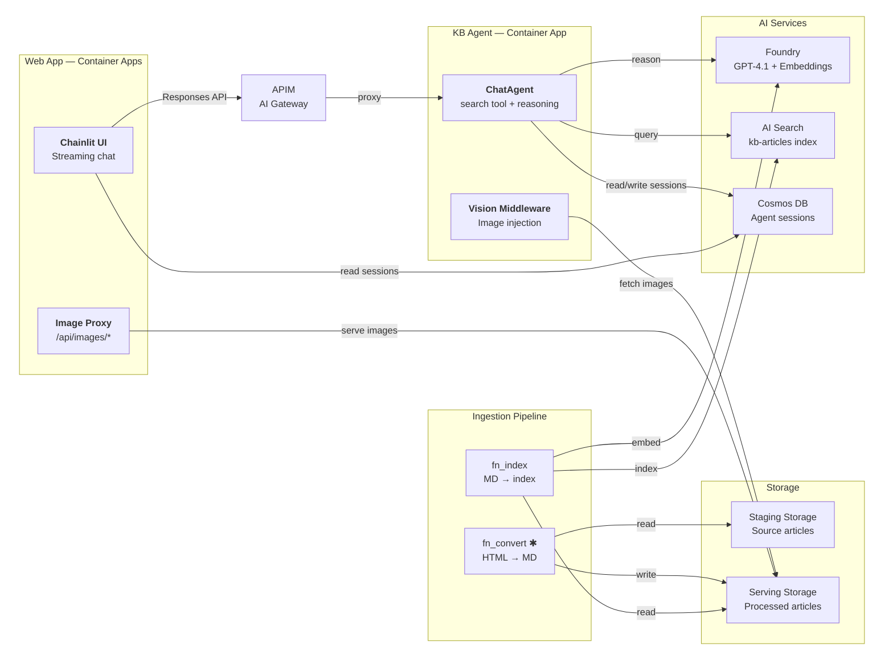

# Context Aware & Vision Grounded KB Agent

## Overview

This solution helps organizations transform HTML-based knowledge base (KB) articles into AI-searchable, image-aware content — and then reason over it with a vision-grounded agent. It bridges the gap between legacy KB systems — where articles are stored as HTML pages with embedded images — and modern AI-powered search experiences where an agent can retrieve precise, context-aware answers along with their associated visual content.

## The Problem

Enterprise knowledge bases often store thousands of technical articles as HTML files, each bundled with supporting images (screenshots, diagrams, UI captures). These articles are rich in information but difficult to search semantically. Traditional keyword search misses context, and the images — which often carry critical information — are completely invisible to search systems.

## What This Accelerator Does

This accelerator provides an end-to-end pipeline that:

1. **Ingests HTML KB articles** — each article is a folder containing an HTML file and its associated images (see [kb/](kb/) for examples)

2. **Converts articles to clean Markdown** — supports three interchangeable conversion backends, selectable at runtime via the `analyzer=` Makefile argument:

   - **Content Understanding** (`analyzer=content-understanding`) — leverages [Azure Content Understanding](https://learn.microsoft.com/en-us/azure/ai-services/content-understanding/overview) to extract high-quality text, tables, and document structure from HTML, while separately analyzing each image through a **custom CU analyzer** (`kb-image-analyzer`) with a domain-tuned field schema that extracts `Description`, `UIElements`, and `NavigationPath`. CU is deeply integrated but its internal LLM calls cannot be routed through an API gateway.

   - **Mistral Document AI** (`analyzer=mistral-doc-ai`) — renders HTML to PDF (Playwright/Chromium) with image markers, runs [Mistral Document AI OCR](https://learn.microsoft.com/en-us/azure/ai-services/mistral-document-intelligence) for text/structure extraction, then describes each image via GPT-4.1 vision. Both the OCR model and GPT-4.1 are standard Foundry model endpoints that can be fronted by Azure API Management or any API gateway.

   - **MarkItDown** (`analyzer=markitdown`) — uses [MarkItDown](https://github.com/microsoft/markitdown), a Microsoft open-source Python library, to convert HTML directly to Markdown with no cloud API calls for text extraction. Image descriptions use GPT-4.1 vision (same prompt schema). This is the fastest, cheapest, and simplest option — only GPT-4.1 vision calls are billed; text extraction runs locally with no Azure connectivity required.

   All three backends produce identical output: clean Markdown with AI-generated image descriptions placed in context, each linking back to the original image file. See the [Architecture spec](docs/specs/architecture.md) for details on each backend's approach, the custom analyzer definition, and design rationale.

3. **Produces image-aware Markdown** — the resulting Markdown preserves the full article structure with AI-generated image descriptions placed in context, each linking back to the original image file

4. **Generates context-aware chunks** — splits the Markdown by document structure (headings and sections), not by arbitrary token counts. Each chunk is a complete, coherent section — paragraphs are never split mid-sentence or mid-thought. Images that appear within a section (e.g., a screenshot illustrating a paragraph) stay co-located in the same chunk, with their AI-generated description embedded alongside the surrounding text. This means each chunk is a self-contained unit of meaning: the text, its structure, and its supporting visuals travel together.

5. **Indexes into Azure AI Search** — embeds each chunk using Azure AI embedding models and indexes them with their associated image URLs into an AI Search index, enabling both text and image retrieval

## Key Outcomes

- **Semantic search over KB content** — find answers based on meaning, not just keywords
- **Context-aware chunking** — chunks follow the document's natural structure (sections and headings), never splitting a paragraph or thought mid-way. Unlike token-based chunking, every chunk is a coherent, self-contained unit of information
- **Image-aware results** — images that belong to a section stay in the same chunk as the text they illustrate. Search results include links to the actual source images (stored in Azure Blob Storage), so the visual context is never separated from the text it supports
- **Agent-ready index** — the search index is designed for AI agents/copilots to consume, returning both answer text and supporting visuals to end users
- **No manual content conversion** — the pipeline automates the transformation from raw HTML articles to a fully searchable index

## Why Images Matter for AI Agents

Linking source images to search chunks is not just a convenience for end users — it directly improves the quality of AI agent responses. Modern LLMs are highly capable at interpreting images within the context of a question, making the original screenshots and diagrams a rich source of grounding information for the agent itself. Relying solely on alt text or AI-generated image descriptions loses significant fidelity; the actual image often contains UI details, spatial relationships, and visual cues that text alone cannot fully capture. By serving the source images alongside the text chunks, agents can reason over the full visual context and deliver more accurate, complete answers.

## Who Is This For

Teams and organizations that:

- Have existing KB article repositories in HTML format and want to make them searchable with AI
- Are building AI agents or copilots that need to retrieve knowledge articles with supporting images
- Want to evaluate Azure Content Understanding or Mistral Document AI as document processing engines for their content

## Project Structure

```
├── .github/             GitHub config (Copilot instructions)
├── docs/
│   ├── ards/            Architecture Decision Records
│   ├── epics/           Epic and story tracking
│   ├── research/        Spike results and research notes
│   └── specs/           Architecture and design specs
├── infra/               Bicep modules and infrastructure-as-code
├── kb/
│   ├── staging/         Source articles (HTML + images), one folder per article
│   └── serving/         Processed articles (MD + images), one folder per article
├── kb_snapshot/             Snapshots of each analyzer's convert step output for comparison
│   ├── serving_content-understanding/   Convert output from Content Understanding pipeline
│   └── serving_mistral-doc-ai/          Convert output from Mistral Document AI pipeline
├── scripts/
│   ├── dev-setup.sh     Dev environment setup
│   ├── register-agent.sh       Register agent in Foundry portal (via APIM gateway)
│   ├── configure-app-agent-endpoint.sh  Set web app agent endpoint after registration
│   └── functions/       Shell scripts to run fn-convert / fn-index locally
├── src/
│   ├── agent/           KB Agent — standalone Container App (Starlette + uvicorn)
│   │   ├── main.py      Agent server exposing Responses API (port 8088)
│   │   ├── agent/       Agent modules (kb_agent, search_tool, vision_middleware, image_service)
│   │   └── tests/       pytest test suite
│   ├── functions/       Azure Functions — 4 independent Container Apps (one per function)
│   │   ├── fn_convert_cu/       CU converter (HTML → MD via Content Understanding)
│   │   ├── fn_convert_mistral/  Mistral converter (HTML → PDF → OCR → MD)
│   │   ├── fn_convert_markitdown/ MarkItDown converter (HTML → MD, local Python)
│   │   ├── fn_index/    Index builder (MD → AI Search)
│   │   ├── shared/      Shared config, blob helpers, CU client
│   │   └── tests/       pytest test suite
│   ├── web-app/         Chainlit thin client (calls agent via Responses API)
│   │   ├── app/main.py  Chainlit entry point (streaming, image proxy, citations)
│   │   ├── app/data_layer.py  Cosmos DB conversation persistence
│   │   ├── app/image_service.py  Blob image download + proxy helpers
│   │   └── tests/       pytest test suite
│   ├── analyzers/       CU custom analyzer definitions (kb-image-analyzer.json)
│   └── spikes/          Spike/prototype scripts (research, not production)
├── Makefile             Dev workflow targets (local + Azure)
└── README.md
```

## Architecture

The solution has two layers: a **two-stage ingestion pipeline** (4 independent function Container Apps) that builds an image-aware search index, and a **conversational agent** deployed as an **Azure Container App** (with Foundry integration for tracing and registration) that can see and reason about the actual images. A **Chainlit thin client** calls the agent via the Responses API through an APIM AI Gateway, and conversation history is persisted in **Cosmos DB** (agent-owned via the Agent Framework's session persistence).


```mermaid
flowchart LR
    subgraph left[" "]
        direction TB
        subgraph Pipeline["Ingestion Pipeline"]
            direction TB
            CVT["fn_convert ✱<br/>HTML → MD"]
            IDX["fn_index<br/>MD → index"]
        end
        subgraph Sources["Storage"]
            direction TB
            SA1["Staging Storage<br/>Source articles"]
            SA2["Serving Storage<br/>Processed articles"]
        end
    end

    subgraph right[" "]
        direction TB
        subgraph Center["AI Services"]
            direction TB
            AF["Foundry<br/>GPT-4.1 + Embeddings"]
            AIS["AI Search<br/>kb-articles index"]
            COSMOS["Cosmos DB<br/>Agent sessions"]
        end
        subgraph AgentSvc["KB Agent — Container App"]
            direction TB
            AGENT["<b>ChatAgent</b><br/>search tool + reasoning"]
            VIS["<b>Vision Middleware</b><br/>Image injection"]
        end
        APIM["APIM<br/>AI Gateway"]
        subgraph WebApp["Web App — Container Apps"]
            direction TB
            PROXY["<b>Image Proxy</b><br/>/api/images/*"]
            CHAT["<b>Chainlit UI</b><br/>Streaming chat"]
        end
    end

    CVT -->|read| SA1
    CVT -->|write| SA2
    IDX -->|read| SA2

    IDX -->|embed| AF
    IDX -->|index| AIS

    AGENT -->|reason| AF
    AGENT -->|query| AIS
    AGENT -->|read/write sessions| COSMOS
    VIS -->|fetch images| SA2

    CHAT -->|Responses API| APIM
    APIM -->|proxy| AGENT
    CHAT -->|read sessions| COSMOS
    PROXY -->|serve images| SA2

    classDef invisible fill:none,stroke:none;
    class left,right invisible;
```

**✱ fn_convert** — three interchangeable converter backends, selected at runtime via `analyzer=`: Content Understanding (`fn_convert_cu`), Mistral Document AI (`fn_convert_mistral`), or MarkItDown (`fn_convert_markitdown`). Each runs as its own Container App. See [Architecture](docs/specs/architecture.md) for pipeline details and [Infrastructure](docs/specs/infrastructure.md) for Azure resource configuration, RBAC, and deployment.

### Search Index Structure

Each chunk in the `kb-articles` index carries the text content, its embedding vector, and references to any images that appeared in that section of the source article:

| Field | Type | Description |
|---|---|---|
| `id` | String | Unique chunk ID (`{article_id}_{chunk_index}`) |
| `article_id` | String | Source article identifier |
| `chunk_index` | Int32 | Position of this chunk within the article |
| `title` | String | Article title |
| `section_header` | String | Heading hierarchy for this chunk |
| `content` | String | Markdown text of the chunk |
| `content_vector` | Vector | Embedding (text-embedding-3-small, 1536d) |
| `image_urls` | String[] | Blob paths to images referenced in this chunk |
| `source_url` | String | Original source URL |
| `key_topics` | String[] | Extracted key topics |

**Example document** (retrieved from the live index):

```json
{
  "id": "agentic-retrieval-overview-html_en-us_2",
  "article_id": "agentic-retrieval-overview-html_en-us",
  "title": "Agentic retrieval in Azure AI Search",
  "section_header": "Agentic retrieval in Azure AI Search > Why use agentic retrieval",
  "chunk_index": 2,
  "content": "### Why use agentic retrieval\n\nThere are two use cases for agentic retrieval. First, it's the basis of the Foundry IQ experience in the Microsoft Foundry portal. It provides the knowledge layer for agent solutions in Microsoft Foundry. Second, it's the basis for custom agentic solutions that you create using the Azure AI Search APIs...",
  "content_vector": [0.012, -0.034, "... (1536 dimensions)"],
  "image_urls": [
    "images/agentric-retrieval-example.png"
  ],
  "source_url": "...",
  "key_topics": ["agentic retrieval", "Azure AI Search", "Foundry IQ"]
}
```

The `image_urls` array lets AI agents retrieve the actual source images alongside the text, enabling visual grounding in agent responses.

### How the Web App Uses Image-Aware Chunks

The Context Aware & Vision Grounded KB Agent demonstrates the full value of image-aware indexing. When a user asks a question:

1. **Search** — The agent's `search_knowledge_base` tool performs hybrid search and returns chunks. Each chunk includes its `image_urls` array (e.g., `["images/architecture.png"]`). The tool converts these to proxy URLs (`/api/images/article-id/images/architecture.png`) in the JSON returned to the LLM.

2. **Vision injection** — A `VisionImageMiddleware` intercepts the tool result, downloads the referenced images from blob storage, and injects them into the LLM conversation as base64 `Content.from_data()`. GPT-4.1's vision capabilities let it **see** the actual diagrams and screenshots — not just the text descriptions from the index.

3. **Visual reasoning** — The LLM reasons over both the text chunks and the actual images. When an image adds value to the answer (e.g., an architecture diagram for "how does agentic retrieval work?"), the LLM embeds it inline using `` markdown.

4. **Browser rendering** — Chainlit renders the markdown natively. The browser fetches images from the same-origin `/api/images/` proxy endpoint, which downloads from blob storage on demand.

#### Example: Visual Reasoning in Action


In this example, the agent retrieves a relevant chunk (Ref #5) and integrates an image from that chunk directly into its answer. The agent didn't just quote the text description of the image — it internalized the actual image through the vision middleware, reasoned over its visual content, and then used it as a supporting asset in the response. The text description of the image (generated during ingestion) plays a key role in *surfacing* the chunk as relevant during search — it's embedded alongside the surrounding paragraph text, boosting vector similarity for visual concepts. But once the chunk is retrieved, the LLM gets a detailed look at the source image itself, can leverage it for reasoning, and can include it inline when the visual adds value to the answer.

This means the images produced by the ingestion pipeline serve a **dual purpose**: they ground the LLM's visual reasoning (via the vision middleware) *and* appear inline in the user-facing answer (via the image proxy).

## Makefile Targets

Run `make help` to see all targets. Here is the full list:

| Target | Description |
|---|---|
| **Local Development** | |
| `make help` | Show available targets |
| `make dev-doctor` | Check if required dev tools are installed |
| `make dev-setup` | Install required dev tools and Python dependencies (functions + web app + agent) |
| `make dev-setup-env` | Populate .env files from AZD environment (functions + web app + agent) |
| `make convert` | Run fn-convert locally — requires `analyzer=content-understanding`, `analyzer=mistral-doc-ai`, or `analyzer=markitdown` |
| `make index` | Run fn-index locally (kb/serving → Azure AI Search) |
| `make test` | Run unit tests (pytest) |
| `make validate-infra` | Validate Azure infra is ready for local dev |
| `make grant-dev-roles` | Verify developer RBAC roles (provisioned via Bicep) |
| `make agent` | Run KB Agent locally (http://localhost:8088) |
| `make agent-test` | Run agent unit tests |
| `make app` | Run Chainlit web app locally (http://localhost:8080) |
| `make app-test` | Run web app unit tests |
| `make test-ui` | Interactive UI testing with Playwright CLI (needs running agent + app) |
| **Azure Operations** | |
| `make azure-provision` | Provision all Azure resources (azd provision) |
| `make azure-deploy` | Deploy functions, search index, and CU analyzer (azd deploy) |
| `make azure-agent` | Deploy agent Container App (`azd deploy --service agent`) |
| `make azure-register-agent` | Register agent in Foundry portal via APIM gateway |
| `make azure-configure-app` | Set web app agent endpoint after registration |
| `make azure-agent-logs` | Stream agent logs from Container Apps |
| `make azure-deploy-app` | Build & deploy the web app to Azure Container Apps |
| `make azure-app-url` | Print the deployed web app URL |
| `make azure-app-logs` | Stream live logs from the deployed web app |
| `make azure-upload-staging` | Upload local kb/staging articles to Azure staging blob |
| `make azure-convert` | Trigger fn-convert in Azure — requires `analyzer=content-understanding`, `analyzer=mistral-doc-ai`, or `analyzer=markitdown` |
| `make azure-index` | Trigger fn-index in Azure (processes serving → AI Search) |
| `make azure-index-summarize` | Show AI Search index contents summary |
| `make azure-clean-storage` | Empty staging and serving blob containers in Azure |
| `make azure-clean-index` | Delete the AI Search index |
| `make azure-clean` | Clean all Azure data (storage + index + analyzer) |

### Interactive UI Testing

The `make test-ui` target opens [Playwright CLI](https://github.com/anthropics/playwright-cli) for interactive browser-based testing of the web app.

**Prerequisites:** Node.js and Playwright CLI (`npm install -g @anthropic-ai/playwright-cli`)

**Workflow:**
1. Start the agent: `make agent` (terminal 1)
2. Start the web app: `make app` (terminal 2)
3. Run: `make test-ui` (terminal 3)

Playwright CLI opens a Chromium browser at http://localhost:8080 and provides a REPL for commands like `snapshot` (page accessibility tree), `click <element>`, `type <element> <text>`, and `screenshot`.

---

## 1. Local Environment Setup

### Prerequisites

- **Python 3.11+** and **[UV](https://docs.astral.sh/uv/)** package manager
- **Azure CLI** (`az`) — authenticated via `az login`
- **Azure Developer CLI** (`azd`) — for provisioning infrastructure
- **Azure Functions Core Tools** (`func`) — for Azure deployment
- An Azure subscription with access to AI Services, AI Search, and model deployments

### Resource Naming

All Azure resources are named using a **project name** (`PROJECT_NAME`) and an **environment name** (`AZURE_ENV_NAME`):

```
{resource-prefix}-{projectName}-{env}
```

For example, with `PROJECT_NAME=myproj` and `AZURE_ENV_NAME=dev`:

| Resource | Name |
|---|---|
| Resource Group | `rg-myproj-dev` |
| AI Services | `ai-myproj-dev` |
| AI Search | `srch-myproj-dev` |
| Cosmos DB | `cosmos-myproj-dev` |
| Storage (staging) | `stmyprojstagingdev` |

`PROJECT_NAME` must be set before provisioning. Constraints:

- **`PROJECT_NAME`**: 2–8 characters (alphanumeric + hyphens). Kept short to fit the 24-char Azure Storage Account limit.
- **`AZURE_ENV_NAME`**: 2–7 characters. Use `dev`, `staging`, or `prod` (not `production`).

Set the project name:

```bash
make set-project name=myproj
```

### Steps

```bash
# 1. Check that all required tools are installed
make dev-doctor

# 2. Install any missing tools and Python dependencies
make dev-setup

# 3. Provision Azure infrastructure (required even for local runs — CU & Search are cloud services)
make azure-provision

# 4. Populate the local .env file from AZD environment values
make dev-setup-env

# 5. Deploy the CU analyzer and search index definition
make azure-deploy

# 6. Validate that Azure infrastructure is reachable and properly configured
make validate-infra
```

---

## 2. Run Pipeline End-to-End — Local

In local mode, the pipeline reads source articles from `kb/staging/` on disk, calls Azure AI services for processing, and writes output to `kb/serving/`. The search index is populated in Azure AI Search.

```bash
# Stage 1: Convert HTML articles to Markdown with AI-generated image descriptions
# Choose a conversion backend:
make convert analyzer=content-understanding   # uses Azure Content Understanding
make convert analyzer=mistral-doc-ai          # uses Mistral Document AI + GPT-4.1 vision
make convert analyzer=markitdown              # uses MarkItDown (local) + GPT-4.1 vision

# Stage 2: Chunk Markdown, generate embeddings, and index into Azure AI Search
make index

# Verify: run the test suite
make test

# Optional: inspect the search index contents
make azure-index-summarize
```

**Flow:** `kb/staging/` (HTML + images) → `make convert` → `kb/serving/` (Markdown + images) → `make index` → Azure AI Search index

---

## 3. Run Pipeline End-to-End — Azure

In Azure mode, articles are uploaded to blob storage and the pipeline runs as deployed Azure Functions. Azure infrastructure and function code must be deployed first (see [Local Environment Setup](#1-local-environment-setup)).

```bash
# 1. Upload local source articles to Azure staging blob storage
make azure-upload-staging

# 2. Trigger fn-convert in Azure (staging blob → serving blob)
# Choose a conversion backend:
make azure-convert analyzer=content-understanding   # uses Azure Content Understanding
make azure-convert analyzer=mistral-doc-ai          # uses Mistral Document AI + GPT-4.1 vision
make azure-convert analyzer=markitdown              # uses MarkItDown (local) + GPT-4.1 vision

# 3. Trigger fn-index in Azure (serving blob → AI Search index)
make azure-index

# 4. Inspect the search index contents
make azure-index-summarize
```

**Flow:** `make azure-upload-staging` → `make azure-convert` → `make azure-index` → Azure AI Search index

### Cleanup

```bash
make azure-clean          # Clean all Azure data (storage + index + analyzer)
# Or selectively:
make azure-clean-storage  # Empty staging and serving blob containers
make azure-clean-index    # Delete the AI Search index
```

---

## 4. Run Context Aware & Vision Grounded KB Agent

The agent is a standalone Starlette ASGI service (port 8088) built with `from_agent_framework` that exposes an OpenAI-compatible Responses API. The Chainlit web app is a thin client that calls the agent via APIM, handles streaming, renders citations/images, and reads conversation sessions from Cosmos DB.

### Prerequisites

- The ingestion pipeline has been run at least once (articles indexed in AI Search)
- Azure infrastructure provisioned (`make azure-provision`)

### Setup & Run

```bash
# 1. Populate .env files from AZD environment (functions + web app + agent)
make dev-setup-env

# 2. Start the agent (in one terminal)
make agent

# 3. Start the web app (in another terminal)
make app
```

Open `http://localhost:8080` — ask questions like "What is Azure Content Understanding?" or "How does search security work?" and get grounded answers with inline images and source citations.

The web app auto-detects the agent URL scheme: `http://` → no auth (local), `https://` → Entra token auth (deployed).

> **Note:** `make dev-setup` installs dependencies for all projects (functions + web app + agent). No separate setup step is needed.

### Run Tests

```bash
make agent-test   # Agent tests (111 tests)
make app-test     # Web app tests (123 tests)
```

---

## 5. Deploy to Azure

The KB Agent is deployed as an **Azure Container App** (with Foundry integration for tracing and registration), and the Chainlit web app to a separate Container App with Entra ID authentication (Easy Auth). An **APIM AI Gateway** proxies all agent traffic.

### Prerequisites

- Azure infrastructure is provisioned (`make azure-provision` — this also creates the Foundry project, APIM gateway, Cosmos DB, and Entra App Registration)
- The ingestion pipeline has been run at least once (articles indexed in AI Search)

### Deploy Agent + Web App

```bash
# Full deploy: provision + deploy all services + register agent + configure endpoints + auth
make azure-up

# Or deploy individual components:
make azure-deploy       # Deploy all services (azd deploy)
make azure-deploy-app   # Deploy web app only
make azure-agent        # Deploy agent Container App only

# Post-deploy registration (included in azure-up):
make azure-register-agent   # Register agent in Foundry via APIM gateway
make azure-configure-app    # Set web app agent endpoint to APIM proxy URL

# Get the deployed URL
make azure-app-url

# Stream live logs (optional)
make azure-app-logs
make azure-agent-logs
```

The deployed web app is protected by Entra ID — users must sign in with their organizational account. The agent runs as a Container App with a system-assigned managed identity that has least-privilege RBAC access to AI Services, AI Search, Serving Storage, and Cosmos DB. The agent owns conversation history — it persists and loads session state via Cosmos DB using the Agent Framework's session persistence model.

Docker images are built and pushed to Azure Container Registry automatically during `azd deploy` — no local Docker build step is needed.

---

## Sample Articles

The `kb/staging/` folder contains sample articles (HTML + images) used for development and testing. After running the pipeline, processed output appears in `kb/serving/` and chunks are searchable in the `kb-articles` AI Search index.

## Documentation

- [Architecture](docs/specs/architecture.md) — pipeline design, Azure services map, index schema, observability
- [Infrastructure](docs/specs/infrastructure.md) — Bicep modules, model deployments, RBAC, Foundry project, Cosmos DB
