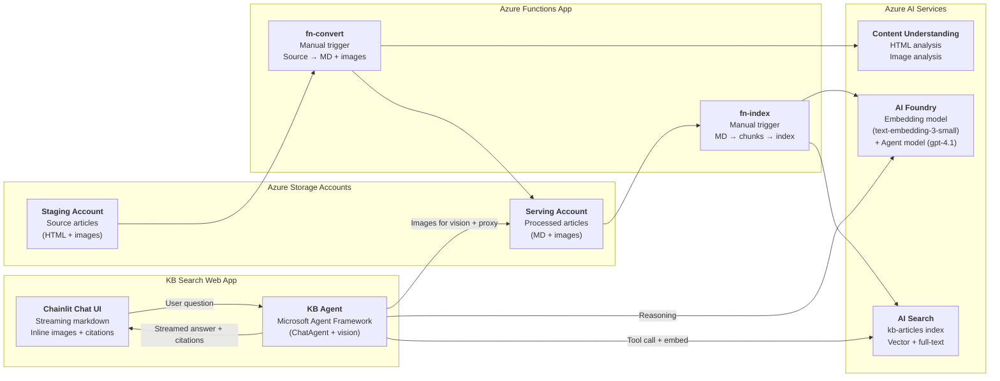

# Azure Knowledge Base Ingestion Accelerator

## Overview

This solution accelerator helps organizations transform HTML-based knowledge base (KB) articles into AI-searchable content powered by **Azure AI Search**. It bridges the gap between legacy KB systems — where articles are stored as HTML pages with embedded images — and modern AI-powered search experiences where an agent can retrieve precise, context-aware answers along with their associated visual content.

## The Problem

Enterprise knowledge bases often store thousands of technical articles as HTML files, each bundled with supporting images (screenshots, diagrams, UI captures). These articles are rich in information but difficult to search semantically. Traditional keyword search misses context, and the images — which often carry critical information — are completely invisible to search systems.

## What This Accelerator Does

This accelerator provides an end-to-end pipeline that:

1. **Ingests HTML KB articles** — each article is a folder containing an HTML file and its associated images (see [kb/](kb/) for examples)

2. **Converts articles to clean Markdown** — leverages [Azure Content Understanding](https://learn.microsoft.com/en-us/azure/ai-services/content-understanding/overview) to extract high-quality text, tables, and document structure from HTML, while separately analyzing each image to generate detailed AI-powered descriptions

3. **Produces image-aware Markdown** — the resulting Markdown preserves the full article structure with AI-generated image descriptions placed in context, each linking back to the original image file

4. **Generates context-aware chunks** — splits the Markdown into semantically meaningful chunks (by section/heading), where each chunk carries references to 0–N related images

5. **Indexes into Azure AI Search** — embeds each chunk using Azure AI embedding models and indexes them with their associated image URLs into an AI Search index, enabling both text and image retrieval

## Key Outcomes

- **Semantic search over KB content** — find answers based on meaning, not just keywords
- **Image-aware results** — search results include links to the actual source images (stored in Azure Blob Storage) when they are relevant to the matched text
- **Agent-ready index** — the search index is designed for AI agents/copilots to consume, returning both answer text and supporting visuals to end users
- **No manual content conversion** — the pipeline automates the transformation from raw HTML articles to a fully searchable index

## Why Images Matter for AI Agents

Linking source images to search chunks is not just a convenience for end users — it directly improves the quality of AI agent responses. Modern LLMs are highly capable at interpreting images within the context of a question, making the original screenshots and diagrams a rich source of grounding information for the agent itself. Relying solely on alt text or AI-generated image descriptions loses significant fidelity; the actual image often contains UI details, spatial relationships, and visual cues that text alone cannot fully capture. By serving the source images alongside the text chunks, agents can reason over the full visual context and deliver more accurate, complete answers.

## Who Is This For

Teams and organizations that:

- Have existing KB article repositories in HTML format and want to make them searchable with AI
- Are building AI agents or copilots that need to retrieve knowledge articles with supporting images
- Want to evaluate Azure Content Understanding as a document processing engine for their content

## Project Structure

```
├── .github/             GitHub config (Copilot instructions)
├── docs/
│   ├── ards/            Architecture Decision Records
│   ├── epics/           Epic and story tracking
│   ├── research/        Spike results and research notes
│   └── specs/           Architecture and design specs
├── infra/               Bicep modules and infrastructure-as-code
├── kb/
│   ├── staging/         Source articles (HTML + images), one folder per article
│   └── serving/         Processed articles (MD + images), one folder per article
├── scripts/
│   ├── dev-setup.sh     Dev environment setup
│   └── functions/       Shell scripts to run fn-convert / fn-index locally
├── src/
│   ├── functions/       Azure Functions project (fn-convert, fn-index, shared utils)
│   │   ├── fn_convert/  Stage 1 — HTML → Markdown + images
│   │   ├── fn_index/    Stage 2 — Markdown → AI Search index
│   │   ├── shared/      Shared config, blob helpers, CU client
│   │   └── tests/       pytest test suite
│   ├── web-app/         KB Search Web App (Agent + Chainlit)
│   │   ├── app/main.py  Chainlit entry point (streaming, image proxy, citations)
│   │   ├── app/agent/   KB agent, search tool, image service, vision middleware
│   │   └── tests/       pytest test suite
│   └── spikes/          Spike/prototype scripts (research, not production)
├── analyzers/           CU custom analyzer definitions (kb-image-analyzer.json)
├── Makefile             Dev workflow targets (local + Azure)
└── README.md
```

## Architecture

The solution has two layers: a **two-stage ingestion pipeline** (Azure Functions) that builds an image-aware search index, and a **conversational web app** that consumes it with an AI agent that can see and reason about the actual images.



For full pipeline details, index schema, and stage-level design, see [Architecture](docs/specs/architecture.md).

For details about the Azure services supporting this architecture, their configuration, security, RBAC roles, and deployment details, see [Infrastructure](docs/specs/infrastructure.md).

### Search Index Structure

Each chunk in the `kb-articles` index carries the text content, its embedding vector, and references to any images that appeared in that section of the source article:

| Field | Type | Description |
|---|---|---|
| `id` | String | Unique chunk ID (`{article_id}_{chunk_index}`) |
| `article_id` | String | Source article identifier |
| `chunk_index` | Int32 | Position of this chunk within the article |
| `title` | String | Article title |
| `section_header` | String | Heading hierarchy for this chunk |
| `content` | String | Markdown text of the chunk |
| `content_vector` | Vector | Embedding (text-embedding-3-small, 1536d) |
| `image_urls` | String[] | Blob paths to images referenced in this chunk |
| `source_url` | String | Original source URL |
| `key_topics` | String[] | Extracted key topics |

**Example document** (retrieved from the live index):

```json
{
  "id": "agentic-retrieval-overview-html_en-us_2",
  "article_id": "agentic-retrieval-overview-html_en-us",
  "title": "Agentic retrieval in Azure AI Search",
  "section_header": "Agentic retrieval in Azure AI Search > Why use agentic retrieval",
  "chunk_index": 2,
  "content": "### Why use agentic retrieval\n\nThere are two use cases for agentic retrieval. First, it's the basis of the Foundry IQ experience in the Microsoft Foundry portal. It provides the knowledge layer for agent solutions in Microsoft Foundry. Second, it's the basis for custom agentic solutions that you create using the Azure AI Search APIs...",
  "content_vector": [0.012, -0.034, "... (1536 dimensions)"],
  "image_urls": [
    "images/agentric-retrieval-example.png"
  ],
  "source_url": "...",
  "key_topics": ["agentic retrieval", "Azure AI Search", "Foundry IQ"]
}
```

The `image_urls` array lets AI agents retrieve the actual source images alongside the text, enabling visual grounding in agent responses.

### How the Web App Uses Image-Aware Chunks

The KB Search Web App demonstrates the full value of image-aware indexing. When a user asks a question:

1. **Search** — The agent's `search_knowledge_base` tool performs hybrid search and returns chunks. Each chunk includes its `image_urls` array (e.g., `["images/architecture.png"]`). The tool converts these to proxy URLs (`/api/images/article-id/images/architecture.png`) in the JSON returned to the LLM.

2. **Vision injection** — A `VisionImageMiddleware` intercepts the tool result, downloads the referenced images from blob storage, and injects them into the LLM conversation as base64 `DataContent`. GPT-4.1's vision capabilities let it **see** the actual diagrams and screenshots — not just the text descriptions from the index.

3. **Visual reasoning** — The LLM reasons over both the text chunks and the actual images. When an image adds value to the answer (e.g., an architecture diagram for "how does agentic retrieval work?"), the LLM embeds it inline using `` markdown.

4. **Browser rendering** — Chainlit renders the markdown natively. The browser fetches images from the same-origin `/api/images/` proxy endpoint, which downloads from blob storage on demand.

This means the images produced by the ingestion pipeline serve a **dual purpose**: they ground the LLM's visual reasoning (via the vision middleware) *and* appear inline in the user-facing answer (via the image proxy).

## Makefile Targets

Run `make help` to see all targets. Here is the full list:

| Target | Description |
|---|---|
| **Local Development** | |
| `make help` | Show available targets |
| `make dev-doctor` | Check if required dev tools are installed |
| `make dev-setup` | Install required dev tools and Python dependencies |
| `make dev-setup-env` | Populate src/functions/.env from AZD environment |
| `make convert` | Run fn-convert locally (kb/staging → kb/serving) |
| `make index` | Run fn-index locally (kb/serving → Azure AI Search) |
| `make test` | Run unit tests (pytest) |
| `make validate-infra` | Validate Azure infra is ready for local dev |
| `make grant-dev-roles` | Verify developer RBAC roles (provisioned via Bicep) |
| **Web App** | |
| `make web-app` | Run KB Search web app locally (http://localhost:8080) |
| `make web-app-setup` | Install web app Python dependencies |
| `make web-app-test` | Run web app unit tests |
| **Azure Operations** | |
| `make azure-provision` | Provision all Azure resources (azd provision) |
| `make azure-deploy` | Deploy functions, search index, and CU analyzer (azd deploy) |
| `make azure-upload-staging` | Upload local kb/staging articles to Azure staging blob |
| `make azure-convert` | Trigger fn-convert in Azure (processes staging → serving) |
| `make azure-index` | Trigger fn-index in Azure (processes serving → AI Search) |
| `make azure-index-summarize` | Show AI Search index contents summary |
| `make azure-clean-storage` | Empty staging and serving blob containers in Azure |
| `make azure-clean-index` | Delete the AI Search index |
| `make azure-clean` | Clean all Azure data (storage + index + analyzer) |

---

## 1. Local Environment Setup

### Prerequisites

- **Python 3.11+** and **[UV](https://docs.astral.sh/uv/)** package manager
- **Azure CLI** (`az`) — authenticated via `az login`
- **Azure Developer CLI** (`azd`) — for provisioning infrastructure
- **Azure Functions Core Tools** (`func`) — for Azure deployment
- An Azure subscription with access to AI Services, AI Search, and model deployments

### Steps

```bash
# 1. Check that all required tools are installed
make dev-doctor

# 2. Install any missing tools and Python dependencies
make dev-setup

# 3. Provision Azure infrastructure (required even for local runs — CU & Search are cloud services)
make azure-provision

# 4. Populate the local .env file from AZD environment values
make dev-setup-env

# 5. Deploy the CU analyzer and search index definition
make azure-deploy

# 6. Validate that Azure infrastructure is reachable and properly configured
make validate-infra
```

---

## 2. Run Pipeline End-to-End — Local

In local mode, the pipeline reads source articles from `kb/staging/` on disk, calls Azure AI services for processing, and writes output to `kb/serving/`. The search index is populated in Azure AI Search.

```bash
# Stage 1: Convert HTML articles to Markdown with AI-generated image descriptions
make convert

# Stage 2: Chunk Markdown, generate embeddings, and index into Azure AI Search
make index

# Verify: run the test suite
make test

# Optional: inspect the search index contents
make azure-index-summarize
```

**Flow:** `kb/staging/` (HTML + images) → `make convert` → `kb/serving/` (Markdown + images) → `make index` → Azure AI Search index

---

## 3. Run Pipeline End-to-End — Azure

In Azure mode, articles are uploaded to blob storage and the pipeline runs as deployed Azure Functions. Azure infrastructure and function code must be deployed first (see [Local Environment Setup](#1-local-environment-setup)).

```bash
# 1. Upload local source articles to Azure staging blob storage
make azure-upload-staging

# 2. Trigger fn-convert in Azure (staging blob → serving blob)
make azure-convert

# 3. Trigger fn-index in Azure (serving blob → AI Search index)
make azure-index

# 4. Inspect the search index contents
make azure-index-summarize
```

**Flow:** `make azure-upload-staging` → `make azure-convert` → `make azure-index` → Azure AI Search index

### Cleanup

```bash
make azure-clean          # Clean all Azure data (storage + index + analyzer)
# Or selectively:
make azure-clean-storage  # Empty staging and serving blob containers
make azure-clean-index    # Delete the AI Search index
```

---

## 4. Run KB Search Web App

The web app is a conversational interface that lets you search the `kb-articles` index using a Microsoft Agent Framework agent. It runs locally against live Azure services.

### Prerequisites

- The ingestion pipeline has been run at least once (articles indexed in AI Search)
- Your `az login` identity has the **Storage Blob Delegator** role on the serving storage account (in addition to the roles provisioned by Bicep). This is required for generating user delegation SAS URLs for article images.

### Setup & Run

```bash
# 1. Populate the web app .env (reuses the same AZD environment values)
azd env get-values > src/web-app/.env

# 2. Install dependencies
make web-app-setup

# 3. Start the web app
make web-app
```

Open `http://localhost:8080` — ask questions like "What is Azure Content Understanding?" or "How does search security work?" and get grounded answers with inline images and source citations.

### Run Tests

```bash
make web-app-test
```

---

## Sample Articles

The `kb/staging/` folder contains sample articles (HTML + images) used for development and testing. After running the pipeline, processed output appears in `kb/serving/` and chunks are searchable in the `kb-articles` AI Search index.

## Documentation

- [Architecture](docs/specs/architecture.md) — pipeline design, Azure services map, index schema
- [Infrastructure](docs/specs/infrastructure.md) — Bicep modules, model deployments, RBAC
- [Epic 002](docs/epics/002-kb-search-web-app.md) — KB Search Web App (Agent + Chainlit)
