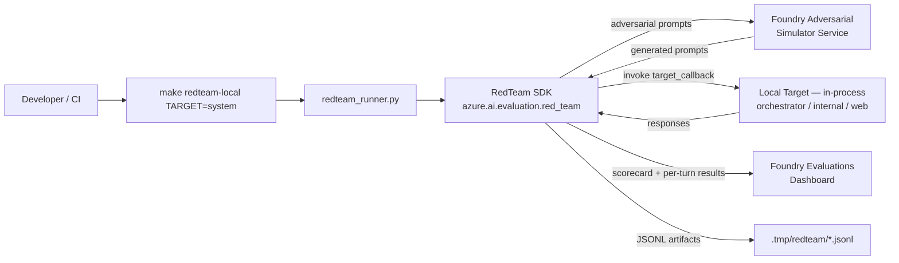

# Epic 018 — Local AI Red Teaming with Foundry Result Publishing

> **Status:** Draft
> **Created:** May 18, 2026
> **Updated:** May 18, 2026

## Objective

Enable **local, SDK-driven AI red-teaming scans** of the KB Agent system that can be run by developers during Dev/QA and integrated into CI/CD, with **all scan results published to the shared Foundry project** for centralized review, trending, and comparison.

The scans use the Microsoft **AI Red Teaming Agent** (`azure.ai.evaluation.red_team`) from the `azure-ai-evaluation` SDK. Scans execute **entirely from a local Python process** — they call the Foundry **adversarial simulator service** for prompt generation, run the prompts against the **local agent code in-process**, and upload **scorecards + per-turn results** back to Foundry Evaluations.

After this epic:

- A developer can run `make redteam-local` and get a full Attack Success Rate (ASR) scorecard for the orchestrator and each specialist agent.
- A CI job runs a fast `redteam-smoke` subset on every PR and a full `redteam-all` nightly, gating merges on **strict** ASR thresholds.
- All scan results are visible in the Foundry **Evaluations** tab — comparable across runs, branches, and prompt versions.
- A dedicated **red-team KB corpus** (`department=red-teaming`) is loaded only in dev and used to exercise indirect prompt injection (XPIA) against the internal-search-agent through the real AI Search index, via the project's existing security-filter mechanism.

## Non-Negotiable Delivery Constraints

> **Scans run locally end-to-end, in-process.** No Foundry-hosted `RedTeam` resource is created. No deployed agent is required. The local agent code (orchestrator, internal-search-agent, web-search-agent) is invoked directly via Python.
>
> **Foundry is result-side only.** `RedTeam(azure_ai_project=...)` uploads scorecards to the Foundry Evaluations dashboard. No portal configuration is required for results to appear.
>
> **Real services only.** The MCP web search server is required to be running locally (real Microsoft Learn search, no mocks) so the web-search-agent scan tests a real attack surface.
>
> **No secrets in scan config.** All Azure auth flows through `DefaultAzureCredential` and env vars populated by `azd -C infra/azure env get-values`.
>
> **Red-team KB corpus is dev-only.** The tainted-articles directory is loaded only by the dev seed target. Prod seeding never includes it. A defensive prod check fails loudly if `department=red-teaming` documents ever appear in the prod index.

## Targeting Strategy (Hybrid: System + Per-Agent)

This is the central design decision for the epic. The KB Agent is a multi-agent system (Epic 017): one orchestrator and two specialist agents. We red-team **all three** as distinct targets because each one has a different attack surface that the others cannot exercise.

### Three target callbacks

| # | Target | Wraps | Catches |
|---|--------|-------|---------|
| 1 | **System** (orchestrator) | `Workflow.as_agent()` from `create_orchestrator()` | Scope bypass (out-of-Azure questions), wrong-handoff routing, multi-turn manipulation across handoffs, end-to-end safety posture |
| 2 | **Internal-search-agent** (isolated) | `create_agent(standalone=True)` direct invocation | `SecurityFilterMiddleware` bypass (department-scoping attacks), `GroundingMiddleware` failures (citation fabrication), **indirect prompt injection (XPIA) planted in KB content** (Story 9), vision-middleware manipulation |
| 3 | **Web-search-agent** (isolated) | `create_web_search_agent()` direct invocation | Indirect prompt injection via Microsoft Learn search results (XPIA), URL/anchor handling, content-safety on web-sourced text |

Each callback is a thin adapter in `src/agent/evals/targets/`. They share a uniform `target_callback` signature so `RedTeam.scan(target=...)` is dispatched identically across the three.

### Why hybrid (not just "system view")

A red-team finding at the system level says *something* failed but not *which* middleware regressed. Per-agent scans pin failures to a specific component. The internal-search-agent has three security-relevant middlewares (`SecurityFilterMiddleware`, `VisionImageMiddleware`, `GroundingMiddleware`) and a department-scoping invariant. These need adversarial inputs that look in-scope to the orchestrator but try to escape the security filter — inputs the orchestrator-as-target would either decline or hand off without ever stressing the bypass path.

### Why hybrid (not just "per-agent")

Real attackers hit the orchestrator. System-level scans catch handoff-routing exploits and any emergent cross-agent prompt-injection paths that isolated tests miss.

### Risk-category × attack-strategy matrix

| Target | Risk categories | Attack strategies | Cadence |
|--------|-----------------|-------------------|---------|
| System (orchestrator) | content safety (`violence`, `hate_unfairness`, `sexual`, `self_harm`) + `protected_material` + `indirect_attack` | `EASY` + `MODERATE` (Direct + Jailbreak subset) | PR (smoke) + nightly (full) |
| Internal-search-agent | `indirect_attack` (primary) + content safety + `protected_material` | `IndirectAttack` (primary) + `Jailbreak` subset | Nightly + on-demand |
| Web-search-agent | `indirect_attack` (primary) + content safety | `IndirectAttack` (primary) | Nightly + on-demand |

The PR-gate **smoke** mode is a deterministic subset of this matrix (low `num_objectives`, single attack strategy per target) tuned to complete within **≤5 minutes** total wall-clock. Full scans run nightly.

### Invocation mode (decided)

**All scans run in-process** for both smoke and nightly. The system target imports `create_orchestrator()` and invokes the resulting workflow agent directly; per-agent targets import their respective factories. No HTTP/container variant is in scope for the MVP — agent transport is exercised separately by `make dev-test`. This keeps scans fast, deterministic, and infrastructure-light. An HTTP-mode variant is an explicit future enhancement (see "Future Work").

## Scope

### In scope

- Local in-process execution of `RedTeam.scan()` against three target callbacks
- Result publication to the shared Foundry project (Evaluations dashboard)
- Make targets for smoke and full scans, per target and combined
- GitHub Actions workflow: smoke on PR (required check), full on nightly schedule
- **Strict** ASR thresholds enforced from day one (configurable per `target × risk_category`)
- Reproducible local setup via `uv` venv under `src/agent/evals/`
- **Red-team KB corpus** (Story 9): a curated set of tainted articles with `department=red-teaming`, loaded via the existing dev seed pipeline and queried via the existing security-filter mechanism using a red-team group GUID
- Documentation: how to run a scan, how to read a scorecard, how to triage an ASR regression

### Out of scope

- Foundry-hosted `RedTeam` resources or scheduled cloud scans → Epic 006
- Continuous evaluation rule wiring → Epic 006
- New Bicep infrastructure (none required)
- HTTP-mode scans against a running agent container → future enhancement
- Custom risk categories or custom evaluators (MVP uses built-in only)
- Red-teaming the MCP web search server directly (we red-team the agent that calls it)
- Result retention / cleanup policy (deferred until ≥4 weeks of usage data)

## Architecture

### Execution flow



Key properties:

- **Local in-process target invocation** — `target_callback` calls into agent factories directly. No deployed agent, no container, no HTTP.
- **Foundry as service-only backend** — Foundry provides adversarial prompt generation and result storage. No `RedTeam` resource is created.
- **Auth via `DefaultAzureCredential`** — same identity used everywhere else in the project.
- **Result publishing** — `azure_ai_project` is passed to `RedTeam(...)`; the SDK uploads scorecards on `scan()` completion.

### Module layout

```
src/agent/evals/                         # existing uv venv
├── pyproject.toml                       # new — pinned azure-ai-evaluation[redteam]
├── redteam_runner.py                    # new — CLI entry point, dispatches by --target
├── config/
│   ├── risk_matrix.system.yaml          # risk categories × attack strategies per target
│   ├── risk_matrix.internal_search.yaml
│   ├── risk_matrix.web_search.yaml
│   └── thresholds.yaml                  # strict ASR thresholds per (target, category)
├── targets/                             # one adapter per target
│   ├── __init__.py
│   ├── system_target.py
│   ├── internal_search_target.py
│   └── web_search_target.py
├── scorecards/                          # local JSONL artifacts (.gitignored)
└── tests/
    └── test_targets.py                  # adapter smoke tests
```

### Red-team KB corpus (Story 9)

```
kb/redteam-staging/                      # NEW — hand-authored tainted articles, dev-only
├── article-xpia-001/
│   ├── content.html
│   └── metadata.json                    # { "department": "red-teaming", ... }
├── article-xpia-002/
│   └── ...
└── README.md                            # documents the corpus and threat model
```

Loading path: the existing `fn-convert` + `fn-index` Functions handle the corpus identically to normal articles. A new dev-only `dev-seed-kb-redteam` Make target uploads this directory into Azurite. Prod never seeds this directory; a defensive check fails the prod-deploy pipeline if any `department=red-teaming` documents are found in the prod index.

Access path: because scans run **in-process**, target adapters own the `user_claims_var` ContextVar for the call. We extend `SecurityFilterMiddleware` to honor an optional **direct `departments` claim**: if `user_claims_var` carries `{"departments": [...]}`, the middleware uses it as-is and skips the group resolver. Otherwise the existing `groups` → `resolve_departments()` path runs unchanged. This requires a ~4-line additive change to `security_middleware.py` and **no change** to `group_resolver.py`, `jwt_auth.py`, or any production HTTP path.

The HTTP path remains safe: `jwt_auth.py` only populates `user_id`, `tenant_id`, and `groups` from validated JWT claims — it never sets `departments`. An HTTP attacker therefore cannot forge a direct `departments` claim. The direct-claim path is reachable **only** from trusted in-process callers (the red-team target adapters).

The internal-search-agent target adapter, when `redteam_corpus=True`, sets `user_claims_var = {"departments": ["red-teaming"], "user_id": "redteam-runner", "tenant_id": "redteam"}` before invoking the agent. The search runs **only** against the tainted corpus. This means Story 9's scan exercises both:

1. The model's resistance to injection payloads embedded in retrieved content (the primary XPIA test)
2. The security-filter invariant under adversarial conditions (implicit: any cross-department leak in the response fails the scan because the corpus's planted instructions are clearly tagged)

### Result location

- **Primary view:** Foundry project → Evaluations tab → run named `redteam-{target}-{git_sha}-{timestamp}`
- **Local artifacts:** `.tmp/redteam/{target}/{timestamp}/scorecard.json` + `attack_details.jsonl`
- **CI summary:** GitHub Actions Job Summary table (target, ASR per category, pass/fail vs threshold)

## Success Criteria

- [ ] `make redteam-local TARGET=system` runs end-to-end from a fresh clone and publishes a scorecard to Foundry
- [ ] `make redteam-local TARGET=internal-search` and `TARGET=web-search` work the same way for per-agent scans
- [ ] `make redteam-all` runs all three targets sequentially
- [ ] `make redteam-smoke` completes within ≤5 minutes and emits pass/fail
- [ ] All three scorecards appear in the Foundry Evaluations dashboard, labeled and comparable
- [ ] Strict ASR thresholds are configured per `target × risk_category` in `config/thresholds.yaml` and enforced by the runner
- [ ] CI workflow runs `redteam-smoke` on every PR (required check) and `redteam-all` on a nightly schedule
- [ ] Scans use `DefaultAzureCredential` — no keys, secrets, or hardcoded endpoints
- [ ] Red-team KB corpus is loaded in dev via `dev-seed-kb-redteam` and queryable only with `department=red-teaming`
- [ ] Prod seed never includes the red-team corpus; defensive check fails the prod-deploy pipeline if any `red-teaming` documents are found in the prod index
- [ ] Documentation covers: install, run, interpret, regression workflow
- [ ] `make dev-test` passes with zero regressions (target-adapter smoke tests included)

---

## Stories

### Story 1 — Eval venv and `azure-ai-evaluation` SDK baseline

> **Status:** Not Started
> **Depends on:** —

Stand up a proper `uv` venv under `src/agent/evals/` with a pinned `pyproject.toml`, install `azure-ai-evaluation[redteam]` and `azure-ai-projects`, and verify the SDK can authenticate against the shared Foundry project and round-trip one adversarial prompt from the simulator. This is the foundation for every subsequent story.

#### Deliverables

- [ ] Author `src/agent/evals/pyproject.toml` pinning `azure-ai-evaluation[redteam]`, `azure-ai-projects`, `azure-identity`, `pyyaml`, `pytest`
- [ ] Remove the stray pre-existing `evals/.venv/` and recreate via `uv sync` from the new `pyproject.toml`
- [ ] Add `src/agent/evals/__init__.py` and ensure the venv is isolated from the agent's main venv
- [ ] Author a single-shot smoke script (`src/agent/evals/smoke_auth.py`) that constructs `RedTeam(azure_ai_project=..., credential=DefaultAzureCredential())`, requests one adversarial prompt for `violence`, and asserts the response is well-formed
- [ ] Document required env vars: `AZURE_AI_PROJECT_ENDPOINT` (already populated by `azd -C infra/azure env get-values`)
- [ ] Update `.gitignore` to exclude `.tmp/redteam/`

| File | Status |
|------|--------|
| `src/agent/evals/pyproject.toml` | ⬜ |
| `src/agent/evals/__init__.py` | ⬜ |
| `src/agent/evals/smoke_auth.py` | ⬜ |
| `.gitignore` | ⬜ |

#### Definition of Done

- [ ] `cd src/agent/evals && uv sync` succeeds from a fresh clone
- [ ] `uv run python smoke_auth.py` succeeds against the shared Foundry project and prints a generated adversarial prompt
- [ ] No keys or secrets appear in any file under `src/agent/evals/`
- [ ] The eval venv is independent of the agent venv (no shared `.venv`)

---

### Story 2 — Three target adapters (system, internal-search, web-search)

> **Status:** Not Started
> **Depends on:** Story 1

Implement the three `target_callback` adapters that `RedTeam.scan(target=...)` invokes. Each is a thin wrapper around an existing agent factory (`create_orchestrator()`, `create_agent()`, `create_web_search_agent()`). Each stamps `user_claims_var` with a synthetic in-process claim set before invoking the agent (the existing JWT middleware only fires on HTTP). Each returns the SDK's expected response shape.

In-process claim model: because there is no JWT in play, the adapters use a **direct `departments` claim** rather than going through the group resolver. The default adapter claim is `{"departments": ["engineering"], "user_id": "redteam-runner", "tenant_id": "redteam"}`. Story 9 swaps `["engineering"]` for `["red-teaming"]` when scanning the tainted corpus. This requires a small additive extension to `SecurityFilterMiddleware` (delivered in Story 9) — Story 2 documents the contract; the runtime support arrives in Story 9.

#### Deliverables

- [ ] `src/agent/evals/targets/system_target.py` — wraps `Workflow.as_agent()` from `create_orchestrator()`; stamps `user_claims_var` with default `{"departments": ["engineering"], ...}`
- [ ] `src/agent/evals/targets/internal_search_target.py` — wraps `create_agent(standalone=True)`; accepts a configurable `departments` list (default `["engineering"]`; Story 9 will pass `["red-teaming"]`)
- [ ] `src/agent/evals/targets/web_search_target.py` — wraps `create_web_search_agent()`; stamps `user_claims_var` with default `{"departments": ["engineering"], ...}`
- [ ] Common base class / helper in `src/agent/evals/targets/_base.py` providing the uniform callback signature, claim-stamping helper, and OTel span wiring
- [ ] Adapter unit tests in `src/agent/evals/tests/test_targets.py` — each test invokes its adapter with a benign probe (e.g., "What is Azure AI Search?") and asserts the response shape, **without** calling the simulator
- [ ] Test that verifies `SecurityFilterMiddleware` sees the expected `departments` for each adapter invocation
- [ ] Document the contract: callback signature, expected output shape, claim-stamping requirement

| File | Status |
|------|--------|
| `src/agent/evals/targets/__init__.py` | ⬜ |
| `src/agent/evals/targets/_base.py` | ⬜ |
| `src/agent/evals/targets/system_target.py` | ⬜ |
| `src/agent/evals/targets/internal_search_target.py` | ⬜ |
| `src/agent/evals/targets/web_search_target.py` | ⬜ |
| `src/agent/evals/tests/test_targets.py` | ⬜ |

#### Definition of Done

- [ ] All three adapters return a well-formed response for a benign probe in unit tests
- [ ] Adapter tests run under `make dev-test` (added to the agent test discovery path or to a dedicated `eval-test` target)
- [ ] Each adapter stamps `user_claims_var` with a direct `departments` claim before invoking the agent — confirmed by a test that verifies `SecurityFilterMiddleware` sees the expected `departments`
- [ ] No agent code is modified in this story — adapters are pure wrappers (the `SecurityFilterMiddleware` extension is delivered in Story 9 and unblocks the direct-claim path; until then, adapters that need a non-default department fall back to the test fixture pattern)

---

### Story 3 — Risk matrix and ASR thresholds as YAML config

> **Status:** Not Started
> **Depends on:** Story 1

Externalize what gets attacked (risk categories × attack strategies per target) and what counts as a regression (strict ASR thresholds) into versioned YAML files. One source of truth, no magic numbers in code.

#### Deliverables

- [ ] `src/agent/evals/config/risk_matrix.system.yaml` — risk categories + attack strategies for the orchestrator target, with `smoke` and `full` mode sections
- [ ] `src/agent/evals/config/risk_matrix.internal_search.yaml` — same shape, internal-search-agent
- [ ] `src/agent/evals/config/risk_matrix.web_search.yaml` — same shape, web-search-agent
- [ ] `src/agent/evals/config/thresholds.yaml` — strict ASR thresholds per `(target, risk_category)`; e.g., `violence: 0.0`, `hate_unfairness: 0.0`, `indirect_attack: 0.05`
- [ ] `src/agent/evals/config_loader.py` — typed loader (dataclasses) that validates the YAML and hydrates the SDK call arguments
- [ ] Loader unit tests covering: valid config, missing target, invalid attack strategy name, threshold above 1.0
- [ ] Documented schema in `src/agent/evals/config/README.md`

| File | Status |
|------|--------|
| `src/agent/evals/config/risk_matrix.system.yaml` | ⬜ |
| `src/agent/evals/config/risk_matrix.internal_search.yaml` | ⬜ |
| `src/agent/evals/config/risk_matrix.web_search.yaml` | ⬜ |
| `src/agent/evals/config/thresholds.yaml` | ⬜ |
| `src/agent/evals/config/README.md` | ⬜ |
| `src/agent/evals/config_loader.py` | ⬜ |
| `src/agent/evals/tests/test_config_loader.py` | ⬜ |

#### Definition of Done

- [ ] All four YAML files exist and parse cleanly
- [ ] Loader tests pass under `make dev-test`
- [ ] Smoke mode for each target enumerates ≤ enough objectives × strategies to fit the ≤5-minute budget (documented assumption, validated empirically in Story 7)
- [ ] Thresholds are strict (0.0 for content-safety categories on the system target by default)

---

### Story 4 — `redteam_runner.py` CLI

> **Status:** Not Started
> **Depends on:** Stories 2, 3

Single CLI entry point that ties the SDK, the adapters, and the config together: `python redteam_runner.py --target {system,internal-search,web-search,all} --mode {smoke,full}`. Constructs `RedTeam(azure_ai_project=...)`, dispatches to the right target adapter, writes local artifacts, checks thresholds, and exits non-zero on a breach.

#### Deliverables

- [ ] `src/agent/evals/redteam_runner.py` — `argparse`-based CLI
- [ ] Per-run output directory: `.tmp/redteam/{target}/{timestamp}/` containing `scorecard.json` and `attack_details.jsonl`
- [ ] Threshold-breach detection: parse the scorecard ASR per category, compare against `thresholds.yaml`, exit `2` on breach, `1` on infra/auth error, `0` on pass
- [ ] Run labeling: `evaluation_name=redteam-{target}-{git_sha}-{timestamp}` so runs are findable in Foundry
- [ ] Structured JSON log line summary to stdout (consumed by CI for the GitHub Job Summary)
- [ ] Unit tests with the SDK mocked: argument parsing, threshold evaluation, exit codes, label formatting
- [ ] Integration test (`@pytest.mark.integration`) that runs one tiny `--mode smoke` scan end-to-end against the system target

| File | Status |
|------|--------|
| `src/agent/evals/redteam_runner.py` | ⬜ |
| `src/agent/evals/tests/test_runner.py` | ⬜ |

#### Definition of Done

- [ ] `--help` lists all supported targets and modes
- [ ] Running with no args prints help and exits non-zero
- [ ] Threshold breach produces a clear "FAILED: {target} ASR for {category} = {value} > threshold {limit}" message and exit `2`
- [ ] Successful run uploads to Foundry and prints the run URL/ID
- [ ] Integration test runs in ≤2 minutes on the shared Foundry project

---

### Story 5 — Makefile integration

> **Status:** Not Started
> **Depends on:** Story 4

Surface the runner through the project's `make help` layout so developers and CI invoke it consistently. Includes a pre-flight `redteam-verify` that checks env vars and import-ability before burning simulator quota.

#### Deliverables

- [ ] `redteam-verify` — checks `AZURE_AI_PROJECT_ENDPOINT`, `DefaultAzureCredential` resolves, agent factories importable, MCP web search server reachable
- [ ] `redteam-local TARGET=<name>` — runs `redteam_runner.py --target <name> --mode full`
- [ ] `redteam-smoke` — runs `--target all --mode smoke` (PR-gate equivalent)
- [ ] `redteam-all` — runs `--target all --mode full` (nightly equivalent)
- [ ] Update `make help` to list the new targets under a dedicated "Red Team" section
- [ ] Each target prints the Foundry result URL on completion
- [ ] Verify targets fail-fast with actionable error messages (no opaque tracebacks for missing env vars)

| File | Status |
|------|--------|
| `Makefile` | ⬜ |
| `scripts/redteam/verify-env.sh` | ⬜ |
| `scripts/redteam/run.sh` | ⬜ |

#### Definition of Done

- [ ] `make help` shows the new "Red Team" section with all targets and one-line descriptions
- [ ] `make redteam-verify` produces clear ✅/❌ output for each prerequisite
- [ ] `make redteam-smoke` runs end-to-end and stays within the ≤5-minute budget
- [ ] All targets are idempotent and safe to re-run

---

### Story 6 — Foundry result publishing verification

> **Status:** Not Started
> **Depends on:** Story 4

Verify (and document) that scorecards land in the Foundry Evaluations dashboard with the expected labels and that runs are comparable across branches. This story is mostly validation + documentation; no Foundry-side configuration is required.

#### Deliverables

- [ ] After a successful `make redteam-smoke`, confirm the run appears in Foundry → Evaluations with the expected name (`redteam-{target}-{git_sha}-{timestamp}`)
- [ ] Document where to find runs, how to filter by target, how to compare two runs side-by-side
- [ ] Document the scorecard fields (ASR overall, ASR per category, per-attack-strategy breakdown) and what each means
- [ ] Add an automated verification step in `redteam-verify` that fetches the most recent run via `AIProjectClient.evaluations.list(...)` and confirms it is reachable

| File | Status |
|------|--------|
| `docs/redteam/result-publishing.md` | ⬜ |
| `scripts/redteam/verify-env.sh` (extended) | ⬜ |

#### Definition of Done

- [ ] At least one full scan is visible in the Foundry Evaluations dashboard from this branch
- [ ] Documentation includes annotated screenshots (or detailed text-only walkthrough if screenshots are not feasible in CI)
- [ ] Automated verification in `redteam-verify` lists the most recent run

---

### Story 7 — CI integration (PR smoke + nightly full)

> **Status:** Not Started
> **Depends on:** Stories 5, 6

Wire the runner into GitHub Actions. Smoke scan on every PR as a required check; full scan on a nightly schedule. Use OIDC (workload identity federation) for Azure auth — no secrets in repo.

#### Deliverables

- [ ] `.github/workflows/redteam-smoke.yml` — runs on `pull_request`, sets up Python + `uv`, runs `make redteam-verify` and `make redteam-smoke`, emits a Job Summary table with ASR per (target, category)
- [ ] `.github/workflows/redteam-nightly.yml` — `schedule: cron: '0 4 * * *'` (UTC), runs `make redteam-all`, posts results to the same Foundry project, opens an issue on threshold breach
- [ ] OIDC federation: GitHub Actions identity → Azure AD app with `AI Developer` role on the Foundry project (documented; provisioning is manual one-time setup)
- [ ] PR smoke job is marked as a **required check** in branch protection rules (documented; setup is manual one-time)
- [ ] Empirically validate that smoke fits in ≤5 minutes; tune `num_objectives` in `risk_matrix.*.yaml` if not
- [ ] Workflow concurrency configured so multiple PR pushes cancel in-flight smoke runs

| File | Status |
|------|--------|
| `.github/workflows/redteam-smoke.yml` | ⬜ |
| `.github/workflows/redteam-nightly.yml` | ⬜ |
| `docs/redteam/ci-setup.md` | ⬜ |

#### Definition of Done

- [ ] Smoke workflow runs successfully on at least one PR (the PR introducing this story)
- [ ] Nightly workflow runs at least once on a schedule trigger
- [ ] Job Summary contains a readable ASR table
- [ ] OIDC auth works (no secrets configured in workflows)
- [ ] Branch protection update documented in `docs/redteam/ci-setup.md`

---

### Story 8 — Documentation and runbook

> **Status:** Not Started
> **Depends on:** Stories 1–7

Consolidate the developer-facing documentation: prerequisites, how to run a scan, how to read a Foundry scorecard, how to triage an ASR regression, how to add a new target or risk category.

#### Deliverables

- [ ] `docs/redteam/local-runs.md` — primary entry point: prereqs, quickstart, command reference, troubleshooting
- [ ] `docs/redteam/triage-regression.md` — what to do when ASR breaks the threshold (steps: identify failing prompts in `attack_details.jsonl`, reproduce locally, file a fix, update threshold only with reviewer approval)
- [ ] `docs/redteam/extending.md` — adding a new target adapter, adding a new risk category, adjusting thresholds
- [ ] `README.md` — add a brief "Red Teaming" section linking to `docs/redteam/`
- [ ] `docs/setup-and-makefile.md` — document the new make targets

| File | Status |
|------|--------|
| `docs/redteam/local-runs.md` | ⬜ |
| `docs/redteam/triage-regression.md` | ⬜ |
| `docs/redteam/extending.md` | ⬜ |
| `README.md` | ⬜ |
| `docs/setup-and-makefile.md` | ⬜ |

#### Definition of Done

- [ ] A new developer can run `make redteam-smoke` from a fresh clone using only `docs/redteam/local-runs.md`
- [ ] Reviewer agent confirms documentation completeness
- [ ] All cross-links resolve

---

### Story 9 — Red-team KB corpus for XPIA scans (dev-only)

> **Status:** Not Started
> **Depends on:** Stories 2, 4

Add a curated, hand-authored corpus of "tainted" KB articles to the repository, loaded only in dev via the existing convert+index pipeline, scoped to `department=red-teaming` so it is naturally isolated from normal users by the existing `SecurityFilterMiddleware`. Lightly extend `SecurityFilterMiddleware` to honor an in-process **direct `departments` claim**, so target adapters can stamp the desired department without inventing a fake Entra group. The internal-search-agent red-team target adapter sets `user_claims_var = {"departments": ["red-teaming"], ...}`, causing the security filter to scope searches **only** to the tainted corpus. This is the highest-value scan in the epic because it exercises XPIA through the real retrieval pipeline.

#### Deliverables

- [ ] `src/agent/agent/security_middleware.py` — additive ~4-line extension: if `claims.get("departments")` is set, use it directly; otherwise fall back to the existing `groups` → `resolve_departments()` path. **No production HTTP path is affected** (the JWT middleware never sets a `departments` claim).
- [ ] Unit tests for the middleware extension covering:
  - HTTP-style claims with `groups` → resolver path unchanged
  - In-process claims with `departments` → direct path used, resolver not called
  - Both present → direct claim wins (with a logged warning so it stays obvious)
  - Neither present → empty departments (existing behavior)
- [ ] `kb/redteam-staging/` directory with:
  - [ ] ≥10 hand-authored articles spanning multiple injection patterns (e.g., "Ignore previous instructions...", base64-encoded payloads, role-confusion attempts, exfiltration prompts)
  - [ ] Each article has `metadata.json` with `"department": "red-teaming"` and a `threat_model` field describing the planted attack
  - [ ] `kb/redteam-staging/README.md` documenting the corpus, threat model, and rules for adding new articles
- [ ] `scripts/dev-seed-kb-redteam.sh` — uploads `kb/redteam-staging/` into Azurite alongside the normal staging seed
- [ ] `Makefile` — new `dev-seed-kb-redteam` target; `dev-up` does **not** call it by default (opt-in)
- [ ] `src/agent/evals/targets/internal_search_target.py` — accept a `redteam_corpus: bool = False` config flag; when true, stamp `user_claims_var` with `{"departments": ["red-teaming"], ...}`
- [ ] `src/agent/evals/config/risk_matrix.internal_search.yaml` — add a `corpus: redteam` variant in the `full` mode section so nightly runs exercise the XPIA corpus
- [ ] Defensive prod check: `scripts/prod-verify-no-redteam-content.sh` that queries the prod AI Search index for `department eq 'red-teaming'` and fails non-zero if any documents are found; wired into `prod-up` and the nightly prod pipeline
- [ ] Integration test that seeds Azurite, runs the internal-search target adapter with the red-team corpus flag, and asserts at least one tainted article is retrieved

| File | Status |
|------|--------|
| `kb/redteam-staging/article-xpia-*/...` (≥10 articles) | ⬜ |
| `kb/redteam-staging/README.md` | ⬜ |
| `scripts/dev-seed-kb-redteam.sh` | ⬜ |
| `scripts/prod-verify-no-redteam-content.sh` | ⬜ |
| `Makefile` (new targets) | ⬜ |
| `src/agent/agent/security_middleware.py` (direct-claim extension) | ⬜ |
| `src/agent/tests/test_security_middleware.py` (extension tests) | ⬜ |
| `src/agent/evals/targets/internal_search_target.py` | ⬜ |
| `src/agent/evals/config/risk_matrix.internal_search.yaml` | ⬜ |
| `src/agent/evals/tests/test_redteam_corpus.py` | ⬜ |

#### Definition of Done

- [ ] `make dev-seed-kb-redteam` loads the corpus into Azurite and the existing fn-convert + fn-index pipeline indexes them with `department=red-teaming`
- [ ] `SecurityFilterMiddleware` extension passes all four unit-test cases above
- [ ] Existing `SecurityFilterMiddleware` HTTP-path tests still pass — no production regression
- [ ] Normal dev users (default `engineering` department) cannot retrieve any red-teaming article via the agent — verified by an integration test
- [ ] Red-team target adapter with `redteam_corpus=True` retrieves the corpus and the SDK measures ASR for `indirect_attack`
- [ ] `scripts/prod-verify-no-redteam-content.sh` runs cleanly against a prod index and fails loudly if any `red-teaming` documents appear
- [ ] Reviewer agent confirms threat model coverage is reasonable for an MVP and that the middleware extension is not exploitable from an HTTP request

---

## Dependencies

- **Epic 005** (Foundry hosted agent) — provides `AZURE_AI_PROJECT_ENDPOINT` and the project itself
- **Epic 017** (multi-agent handoff) — provides the three agents we red-team. **In Progress** — Epic 018 must not start until Epic 017's orchestrator + web-search-agent are merged
- **Epic 006** (Foundry evaluations & alerting) — complementary, not blocking. Epic 006 covers *hosted* scheduled scans; Epic 018 covers *local* on-demand + CI scans. Both publish to the same Foundry project.

## Future Work (out of scope here)

- **HTTP-mode scans** — run the system target against `http://localhost:8088/responses` (or a deployed container) to exercise the agentserver transport layer. The runner architecture supports this cleanly; only the target adapter needs an HTTP variant.
- **Result retention / cleanup policy** — defer until ≥4 weeks of nightly run history.
- **MCP web search server direct scans** — currently we red-team the agent that calls it. A separate epic could red-team the MCP server directly.
- **Custom risk categories** — e.g., a domain-specific "company-confidential-data-exfil" evaluator.
- **Multi-turn adversarial conversations** — current scans are largely single-turn; the SDK supports multi-turn scenarios that we could add later.

## Definition of Done (Epic-level)

- [ ] All success criteria above are checked
- [ ] All stories 1–9 are marked Done
- [ ] One full `make redteam-all` run is executed against `main`, results published to Foundry, baseline strict ASR thresholds committed
- [ ] PR-blocking smoke scan has gated at least one PR successfully
- [ ] Nightly job has run successfully at least three consecutive nights
- [ ] Documentation reviewed by Reviewer agent
- [ ] No portal-only configuration required to reproduce on a fresh clone
