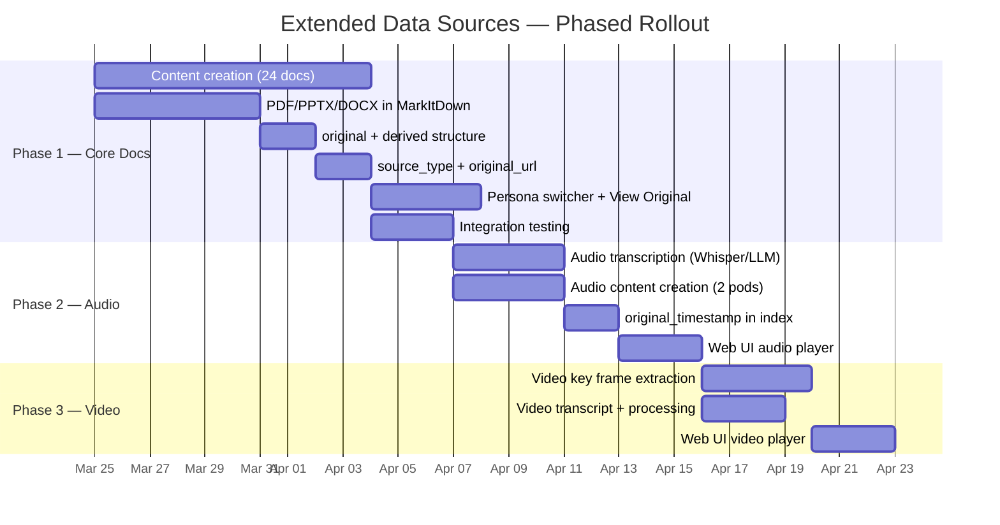

# Research 007: Extended Data Sources — Multi-Department, Multi-Format KB

> **Date:** 2026-03-19
> **Status:** Draft — Proposal for Discussion (Rev 5)

---

## 1. Context & Motivation

### Current State

The KB pipeline processes **3 HTML documents** in a single `engineering` department. While this is sufficient to validate the two-stage architecture (convert → index), it does not demonstrate the platform's potential for real-world enterprise use cases where diverse document types flow through a unified ingestion pipeline.

**Current pipeline capabilities:**

| Component | Current | Notes |
|-----------|---------|-------|
| Staging layout | `kb/staging/{department}/{document-id}/` | Supports multi-department already (Epic 011) |
| Convert backends | CU, Mistral Doc AI, MarkItDown | All produce identical output |
| Source formats | HTML + embedded images only | All 3 backends are HTML-specialized |
| Serving contract | `document.md` + `images/` + `metadata.json` | Extensible |
| Index schema | `department` filterable field | Department-scoped search works |
| Document count | 3 documents | Minimal dataset |
| Vision middleware | Injects images into LLM prompts | Works for any images in `images/` folder |

### Why Extend?

1. **Showcase convert generalization** — The architecture's key claim is that "future source types only require new `fn-convert` variants." We should prove this with PDF, PPTX, DOCX, audio, and video sources.
2. **Richer RAG demonstrations** — 3 documents on unrelated Azure topics provide limited cross-document question-answering potential. A coherent domain with well-cross-referenced documents enables compelling multi-hop queries.
3. **Multi-modal artifact references** — The serving layer can carry references to original documents, audio clips, and video segments — enabling richer UI experiences beyond text + images.
4. **Department-scoped demo experience** — With 3 departments and a persona switcher in the UI, we can demonstrate how the same question yields different results depending on the user's department — showcasing contextual tool filtering in action.
5. **Image injection from diverse sources** — PDFs and PPTXs contain embedded diagrams and schematics that are just as valuable as HTML images for vision-grounded reasoning.

### What MarkItDown Already Supports

The MarkItDown library ([microsoft/markitdown](https://github.com/microsoft/markitdown)) — already integrated as `fn_convert_markitdown` — natively handles a wide range of file types:

| Format | MarkItDown Support | Image Extraction | Notes |
|--------|-------------------|------------------|-------|
| HTML | ✅ Native | ✅ References extracted | Current primary input |
| PDF | ✅ Native | ✅ Via `pdfminer.six` | Text + layout preserved; images extractable with additional libraries |
| DOCX | ✅ Native | ✅ Embedded images extracted | Tables, headings, lists preserved |
| PPTX | ✅ Native | ✅ Slide images extracted | Slides → sections, speaker notes included |
| XLSX | ✅ Native | ❌ N/A | Spreadsheet → Markdown tables |
| CSV | ✅ Native | ❌ N/A | Tabular data |
| Images (PNG, JPG) | ✅ Via LLM vision | N/A | Generates description from image content |
| Audio (MP3, WAV) | ✅ Via speech-to-text | ❌ N/A | Transcription → Markdown |
| ZIP archives | ✅ Recurse into contents | Varies | Process contained files individually |

**Key insight:** MarkItDown is the natural converter for the extended data sources effort. It already handles most target formats. For audio transcription specifically, we can also leverage multi-modal LLMs (e.g., GPT-4o audio, Whisper) that support diarization and rich transcripts natively — simpler than setting up Azure Speech Services infrastructure.

---

## 2. Unified Company Theme: Contoso Robotics

### Why a Unified Theme Matters

Disconnected topics (e.g., Azure Search + random PDFs + unrelated audio) produce a fragmented demo that doesn't illustrate real enterprise value. A unified theme across all three departments enables:

- **Cross-department queries** — "What's the CoBot Pro's max payload?" can surface results from Engineering (spec sheet), Support (installation guide weight limits), and Marketing (product brief).
- **Coherent demo narrative** — A single company story is more compelling than a patchwork of unrelated documents.
- **Natural document diversity** — Each department produces different types of content about the same product, which is exactly how real enterprises work.
- **Persona-based demo** — Switching between Support, Engineering, and Marketing personas shows how department filtering changes the answer to the same question.

### Company Profile

> **Contoso Robotics** is a fictional manufacturer of collaborative industrial robots ("cobots"). Their flagship product, the **CoBot Pro**, is designed for manufacturing and logistics environments where robots work safely alongside human operators.

We deliberately keep the product line **simple** — one core robot with accessories — to reduce content creation scope while maintaining cross-department relevance.

**Product:**

| Product | Description | Use Case |
|---------|-------------|----------|
| CoBot Pro | Collaborative robot arm, 12 kg payload, 1300 mm reach | Welding, palletizing, machine tending, pick-and-place |
| CoBot Vision Module | Add-on 3D camera + AI perception system | Object detection, bin picking, quality inspection |
| CoBot Safety Controller | Certified safety monitoring unit (ISO 10218, ISO/TS 15066) | Speed/force limiting, zone monitoring |

This focused product scope provides:
- **Visual richness** — architecture diagrams, wiring schematics, sensor placement diagrams, robot arm kinematics
- **Technical depth** — ROS 2 software architecture, force-torque sensor calibration, trajectory planning algorithms
- **Cross-department overlap** — the same product is documented by Engineering (specs), sold by Marketing (brochures), and supported by Support (troubleshooting guides)
- **Fewer documents with deeper cross-references** — better demo scenarios than a broad but shallow catalog

### Why Collaborative Robotics?

| Criterion | Fit |
|-----------|-----|
| **Visual content** | Excellent — robots are inherently visual; architecture diagrams, schematics, installation photos, UI screenshots |
| **Technical depth** | Excellent — software (ROS 2, control systems), hardware (actuators, sensors), safety standards |
| **Public content availability** | Good — ROS 2 docs are open-source (Apache 2.0), Universal Robots publishes extensive KB, ISO safety standards are well-documented |
| **Document type diversity** | Excellent — specs (PDF), presentations (PPTX), manuals (HTML), recordings (audio), demos (video) |
| **Cross-dept overlap** | Excellent — a single product appears across all department documentation |
| **Demo appeal** | High — robotics is tangible and engaging for any audience |

### Replacing Existing Content

The current 3 Azure documents under `engineering` will be **replaced**, not moved. The new `support` department will contain Contoso Robotics customer documentation instead. This trade-off is deliberate:

- **Benefit:** A unified theme enables cross-department queries that would be impossible with mixed Azure + robotics content
- **Cost:** We lose Azure-specific content (but those 3 documents were always just sample data, not production content)
- **Migration:** The old documents remain in `kb_snapshot/` as reference. The pipeline itself is format-agnostic — it will process the new content identically.

---

## 3. Department Definitions & Document Types

The focus is on **fewer documents with higher quality and rich cross-references** rather than volume. Each document should reference at least 1–2 documents from other departments.

### Department: Support (~10 documents)

**Role:** Customer-facing documentation — installation, configuration, troubleshooting, and maintenance guides for the CoBot Pro.

**Primary file types:** HTML with embedded images (consistent with current pipeline)

| # | Document | Format | Content Summary | Cross-refs |
|---|----------|--------|-----------------|------------|
| 1 | CoBot Pro — Quick Start Guide | HTML | Unboxing, physical setup, first power-on, teach pendant basics | → Eng: System Architecture |
| 2 | CoBot Pro — Installation Manual | HTML | Mounting, wiring, pneumatic connections, safety zone configuration | → Eng: Electrical Schematics, Safety Controller Firmware |
| 3 | CoBot Vision Module — Setup Guide | HTML | Camera mounting, calibration, connectivity, first scan | → Eng: Perception Pipeline, Mktg: Vision Module Brief |
| 4 | CoBot Safety Controller — Configuration Guide | HTML | Zone setup, speed/force limit programming, e-stop wiring | → Eng: Safety Controller Firmware |
| 5 | Troubleshooting — Joint Errors and Faults | HTML | Error codes E001–E050, diagnostic LEDs, recovery procedures | → Eng: Force-Torque Sensor Spec |
| 6 | Troubleshooting — Vision System Issues | HTML | Camera calibration drift, lighting compensation, occlusion handling | → Eng: Perception Pipeline |
| 7 | Firmware Update Procedure | HTML | Update via teach pendant, USB, network; rollback procedures | → Eng: Release Notes |
| 8 | Preventive Maintenance Schedule | HTML | Lubrication intervals, cable inspection, brake testing, encoder calibration | → Eng: Electrical Schematics |
| 9 | ROS 2 Integration Guide for CoBot Pro | HTML | ROS 2 Humble setup, URDF models, MoveIt configuration, topic reference | → Eng: ROS 2 Node Reference |
| 10 | Safety Standards Compliance Overview | HTML | ISO 10218-1/2, ISO/TS 15066, CE marking, risk assessment methodology | → Eng: Safety Controller Firmware, Mktg: Safety Infographic |

**Source strategy:** Create as authored HTML documents with embedded screenshots and diagrams. Content adapted from publicly available collaborative robotics documentation patterns (Universal Robots Academy, ROS 2 docs) — rebranded for Contoso Robotics. Key priority: **every document references at least one Engineering or Marketing doc**.

### Department: Marketing (~8 documents)

**Role:** Go-to-market materials — product presentations, analyst briefings, customer success stories, podcast interviews.

**Primary file types:** PDF, PPTX, audio (MP3)

| # | Document | Format | Content Summary | Cross-refs |
|---|----------|--------|-----------------|------------|
| 1 | CoBot Pro — Product Overview Brochure | PDF | 6-page brochure with photos, specs summary, use case highlights | → Eng: System Architecture, Support: Quick Start |
| 2 | CoBot Pro — Launch Presentation | PPTX | 15-slide deck: market positioning, features, competitive comparison | → Eng: Force-Torque Sensor Spec, System Architecture |
| 3 | CoBot Vision Module — Technical Brief | PDF | 4-page whitepaper: AI perception pipeline, accuracy benchmarks, ROI | → Eng: Perception Pipeline, Support: Vision Setup |
| 4 | Customer Success: Meridian Auto Parts | DOCX | Case study: 40% efficiency gain deploying CoBot Pro for bin picking | → Support: Vision Module Setup, Installation Manual |
| 5 | Competitive Landscape Analysis | PDF | Comparison matrix: Contoso vs. Universal Robots vs. FANUC vs. ABB | → Eng: EtherCAT Comm Stack, Force-Torque Sensor Spec |
| 6 | CoBot Pro Safety Certification Factsheet | PDF | Single-page visual: ISO certifications, safety testing, compliance badges | → Eng: Safety Controller Firmware, Support: Safety Compliance |
| 7 | "Inside Contoso Robotics" Podcast — Ep. 12 | MP3 | 12-min interview with CTO on force-torque sensor design innovations | → Eng: Force-Torque Sensor Spec |
| 8 | "Inside Contoso Robotics" Podcast — Ep. 15 | MP3 | 10-min interview with Head of Support on deployment best practices | → Support: Installation Manual, Quick Start Guide |

**Source strategy:** **Create all content synthetically.** These are fictional Contoso Robotics materials:

- **PDFs** — Create in Google Docs / LibreOffice Writer, export to PDF. Include charts, tables, product images (from Creative Commons robotics imagery on Unsplash/Pexels)
- **PPTX** — Create in LibreOffice Impress or Google Slides. Include diagrams, product photos, data charts on slides. Speaker notes contain important context.
- **Audio (MP3)** — Generate interview-style audio from scripted dialogues using multi-modal LLMs with TTS capabilities or dedicated TTS services. Two voices for interviewer/guest. Scripts should reference specific Engineering specs and Support procedures.

### Department: Engineering (~8 documents)

**Role:** Technical specifications — software architecture, hardware design, sensor integration, control systems.

**Primary file types:** PDF (specs), HTML (API docs/release notes)

| # | Document | Format | Content Summary | Cross-refs |
|---|----------|--------|-----------------|------------|
| 1 | CoBot Pro — System Architecture Overview | PDF | Software stack diagram: ROS 2 nodes, controller layers, safety monitor, HMI | → Support: ROS 2 Integration, Mktg: Launch Presentation |
| 2 | Force-Torque Sensor — Hardware Specification | PDF | Sensor datasheet: measurement ranges, accuracy, wiring, signal conditioning | → Support: Troubleshooting Joint Errors, Mktg: Podcast Ep. 12 |
| 3 | CoBot Vision Module — Perception Pipeline Design | PDF | ML model architecture, preprocessing, inference engine, point cloud processing | → Support: Vision Setup, Mktg: Vision Technical Brief |
| 4 | Safety Controller — Firmware Architecture | PDF | Real-time safety loop, watchdog timers, redundant channel design, ASIL-D | → Support: Safety Controller Config, Safety Compliance |
| 5 | EtherCAT Communication Stack — Technical Spec | PDF | EtherCAT master implementation, cycle time, PDO/SDO mapping, error handling | → Mktg: Competitive Analysis |
| 6 | CoBot Pro ROS 2 Node Reference | HTML | Complete ROS 2 node API: topics, services, actions, parameters | → Support: ROS 2 Integration Guide |
| 7 | Electrical Schematics — CoBot Pro | PDF | Wiring diagrams: power distribution, motor drives, I/O boards, safety circuits | → Support: Installation Manual, Preventive Maintenance |
| 8 | Release Notes — Firmware v4.2.0 | HTML | What's new, breaking changes, migration guide, known issues | → Support: Firmware Update Procedure |

**Source strategy:** Mix of created content and adapted open-source references:

- **Architecture docs** — Create with realistic system diagrams (Mermaid/draw.io, exported to PDF). Inspired by ROS 2 design documents (CC BY 4.0) but rebranded for Contoso.
- **Spec sheets** — Create PDF spec sheets with technical diagrams. Include realistic measurement data and wiring diagrams.
- **Schematics** — Create simplified wiring/block diagrams using draw.io. These don't need to be electrically correct — they need to be visually representative.
- **ROS 2 HTML docs** — Adapt from ROS 2 Iron/Humble documentation structure, rebranded for CoBot Pro nodes.

---

## 4. Content Sourcing Strategy

### Principles

1. **Fewer, better docs** — ~26 documents total (down from ~42). Each document should be rich enough to generate multiple meaningful search chunks with images.
2. **Cross-reference heavily** — Every document references at least 1–2 documents from other departments. This creates the multi-hop query paths that make the demo compelling.
3. **Image-rich** — Every document should contain at least 2–3 images (diagrams, photos, screenshots, charts). This maximizes the value of the vision middleware.
4. **Create > Source** — Creating fictional but realistic documents gives us full control over cross-referencing and image quality.

### Concrete Sources for Adaptation

| Source | License | Use For |
|--------|---------|---------|
| [ROS 2 Documentation](https://docs.ros.org/en/humble/) | Apache 2.0 | Support integration guides, Engineering ROS 2 node docs |
| [Universal Robots support articles](https://www.universal-robots.com/articles/) | Public reference | Structural patterns for Support troubleshooting articles (rewrite, don't copy) |
| [Open Robotics design docs](https://design.ros2.org/) | CC BY 4.0 | Engineering architecture doc patterns |
| [Unsplash](https://unsplash.com/) / [Pexels](https://www.pexels.com/) | Free commercial use | Product photos for Marketing materials |
| [draw.io](https://app.diagrams.net/) | MIT (tool) | Architecture diagrams, schematics, flowcharts for all departments |

### Content Creation Workflow

```
1. Write content outline (titles, sections, key cross-references per document)
2. Create text content (Markdown drafts → convert to final format)
3. Create/source images (draw.io diagrams, Unsplash photos, AI-generated graphics)
4. Embed cross-references (explicit mentions of other department docs)
5. Assemble final documents (HTML pages, PDFs, PPTX decks)
6. Generate audio content (script dialogues → LLM TTS → MP3)
7. Place in kb/staging/{department}/{document-id}/
8. Run pipeline: make convert → make index
9. Validate: search queries return expected cross-department results
10. Test demo scenarios end-to-end with persona switcher
```

---

## 5. Serving Format Evolution

### Current Serving Format

```
serving/{document-id}/
  ├── document.md          # Core content in Markdown
  ├── metadata.json        # {"department": "engineering", ...}
  └── images/              # Extracted/referenced images
        ├── image1.png
        └── image2.png
```

### Rethinking the Folder Structure: `original/` + `derived/`

The current `images/` folder is actually a "derived artifacts" folder — it contains images *extracted* from the original source document. When we extend to PDFs, PPTXs, and audio, we need to think about artifacts more clearly:

- An **original** is the source document and all its constituent files: the HTML file + its images, the PDF, the PPTX, the MP3 podcast
- A **derived artifact** is something extracted or generated from the original during conversion: images, transcripts, diagram descriptions

The current `images/` folder is a specific case of derived artifacts (images extracted from HTML). Rather than adding `media/` and `original/` as separate sibling folders (which confuses the taxonomy — a podcast MP3 is both an "original" and a "media" file), we use a cleaner two-folder model:

```
serving/{document-id}/
  ├── document.md          # Core content — always Markdown
  ├── metadata.json        # Metadata contract between convert and index
  ├── original/            # Source document — complete copy from staging
  │     └── source.pdf     # or presentation.pptx, demo-video.mp4, index.html + images
  └── derived/             # Artifacts extracted/generated during conversion
        ├── images/        # Images extracted from PDF/PPTX, or key frames from video
        │     ├── diagram1.png
        │     └── keyframe-0732.png
        └── transcript.vtt # Timestamped transcript (from audio or video)
```

The `original/` folder is **singular** — each document has exactly one original source. For single-file formats (PDF, PPTX, MP3), `original/` contains just that file. For HTML sources, `original/` contains the full HTML document and all its constituent files (images, stylesheets) — everything that was in the staging folder. This preserves the complete source for reference.

**HTML image handling:** When the source is HTML with embedded images, the images exist in `original/` as part of the source document. The converter **copies** these images into `derived/images/` so the delivery pipeline always reads images from one consistent location. This is a simple copy, not a move — `original/` stays intact as the complete source reference.

#### Why `original/` + `derived/`?

| Concern | `images/` + `original/` + `media/` | `original/` + `derived/` |
|---------|--------------------------------------|---------------------------|
| "Where does the source PDF go?" | `original/` | `original/` ✓ |
| "Where does an extracted image go?" | `images/` | `derived/images/` ✓ |
| "Where does the podcast MP3 go?" | Both `original/` AND `media/`? | `original/` ✓ (it's the source) |
| "Where do video key frames go?" | `images/`? `media/`? | `derived/images/` ✓ (extracted from original) |
| "Where does a VTT transcript go?" | `media/`? | `derived/transcript.vtt` ✓ |
| "Where are HTML source images?" | `images/`? `original/`? | Both: `original/` (source) + `derived/images/` (copy for pipeline) ✓ |

The `original/` + `derived/` model has a clear rule: **original is the input (complete source); derived contains outputs of the convert step.** The pipeline always reads from `derived/` — never directly from `original/`.

Since we are rebuilding all sources from scratch (the existing 3 Azure documents are being replaced entirely), there is no legacy data to accommodate. We adopt the `original/` + `derived/` structure from day one — no migration, no backward compatibility concerns.

### Phased Evolution

#### Phase 1 — Core Document Types (HTML, PDF, PPTX, DOCX)

The full `original/` + `derived/` structure is in place from the start:

**HTML source (with images):**

```
serving/{document-id}/
  ├── document.md
  ├── metadata.json
  ├── original/
  │     ├── index.html       # Complete HTML source
  │     ├── diagram1.png     # Images that are part of the HTML document
  │     └── chart2.png
  └── derived/
        └── images/
              ├── diagram1.png   # Copied from original/ for consistent pipeline
              └── chart2.png
```

**PDF source:**

```
serving/{document-id}/
  ├── document.md
  ├── metadata.json
  ├── original/
  │     └── system-architecture.pdf
  └── derived/
        └── images/
              ├── diagram1.png   # Extracted from PDF pages
              └── chart2.png
```

`metadata.json` includes **required** fields from the start:

```json
{
  "department": "support",
  "source_type": "html",
  "original": "index.html"
}
```

```json
{
  "department": "engineering",
  "source_type": "pdf",
  "original": "system-architecture.pdf"
}
```

The `original` field is the **filename** of the primary source document within `original/`. The code knows to look it up under `original/` — no need to include the path prefix. There is **no default fallback** for `source_type` — it is required in every `metadata.json` written by `fn-convert`.

Vision middleware reads images from `derived/images/`. The indexer reads `original` to construct the `original_url` index field (blob path to `original/{filename}`).

#### Phase 2 — Audio

```
serving/{document-id}/
  ├── document.md          # Contains transcript text (chunked and indexed normally)
  ├── metadata.json        # + "duration_sec": 720
  ├── original/
  │     └── podcast.mp3    # Source audio — the original
  └── derived/
        └── transcript.vtt # Timestamped transcript for UI seek
```

An MP3 produces no derived images — only a transcript. `document.md` has the plain-text transcript for indexing. Each chunk gets an `original_timestamp` value (e.g., `"07:32"`) so the UI can seek to the relevant position.

#### Phase 3 — Video

```
serving/{document-id}/
  ├── document.md          # Contains transcript + key frame descriptions (indexed)
  ├── metadata.json        # + "duration_sec": 180
  ├── original/
  │     └── demo-video.mp4 # Source video — the original
  └── derived/
        ├── images/        # Key frames extracted from the video
        │     ├── keyframe-0015.png
        │     ├── keyframe-0047.png
        │     └── keyframe-0132.png
        └── transcript.vtt # Timestamped transcript for UI seek
```

A video produces **both** derived images (key frames sampled at scene changes or fixed intervals) **and** a transcript. The key frame images flow through the existing vision middleware — the LLM can see what was shown in the video at each point. Each chunk gets an `original_timestamp` for seek, just like audio.

---

## 6. Architecture Changes

### 6.1 Terminology Rename: `article` → `document`

With the KB expanding beyond HTML articles to include PDFs, presentations, audio files, and videos, the term "article" is too narrow. We rename to **"document"** throughout — a podcast MP3 or a product demo video is as much a "document" in the knowledge base as an HTML page or a PDF spec.

This is a cross-cutting rename that touches every layer:

| Layer | Current | New |
|-------|---------|-----|
| **Staging path** | `kb/staging/{dept}/{article-id}/` | `kb/staging/{dept}/{document-id}/` |
| **Serving path** | `kb/serving/{article-id}/` | `kb/serving/{document-id}/` |
| **Markdown file** | `article.md` | `document.md` |
| **Index name** | `kb-articles` | `kb-documents` |
| **Index field** | `article_id` | `document_id` |
| **Python code** | `article_id`, `article_dir`, `list_articles()`, `download_article()`, `upload_article()` | `document_id`, `document_dir`, `list_documents()`, `download_document()`, `upload_document()` |
| **Chunker** | `chunk_article()` | `chunk_document()` |
| **Image service** | `download_image(article_id, ...)` | `download_image(document_id, ...)` |
| **API routes** | `/api/images/{article_id}/...` | `/api/images/{document_id}/...` |
| **Blob prefix** | `kb-{article_id}-` (temp dirs) | `kb-{document_id}-` (temp dirs) |

**Affected files:**

| Service | Files |
|---------|-------|
| Shared | `src/functions/shared/blob_storage.py` — `list_articles()`, `download_article()`, `upload_article()` |
| Index | `src/functions/fn_index/indexer.py` — `kb-articles` index name, `article_id` field |
| Index | `src/functions/fn_index/chunker.py` — `chunk_article()`, `article_title` |
| Convert (all) | `src/functions/fn_convert_*/function_app.py` — variable names, log messages |
| Agent | `src/agent/agent/image_service.py` — `download_image(article_id, ...)`, URL routes |
| Web app | `src/web-app/app/image_service.py` — same as agent image service |
| Tests | All corresponding test files |

**Timing:** This rename is part of Phase 1 — since we're rebuilding all content and recreating the index from scratch, there's no migration needed. The AI Search index `kb-documents` is created fresh by `make index`.

### 6.2 Converter Supported Formats

**Current:** Each `fn_convert_*` backend assumes HTML input. The staging folder contains `index.html` + images.

**Proposed:** Each converter declares its **supported formats**. When processing a document, it detects the source file type. If the type is in its supported list, it processes it. If not, it **skips the document with a WARNING log** and moves on.

```python
# Each converter declares its capabilities
SUPPORTED_FORMATS = {"html"}  # CU and Mistral — HTML only
SUPPORTED_FORMATS = {"html", "pdf", "pptx", "docx", "mp3", "wav", "mp4"}  # MarkItDown
```

**Processing logic per converter:**

```python
def detect_source_type(document_dir: Path) -> str | None:
    """Detect the primary source file in a document staging directory."""
    for ext, source_type in [
        (".html", "html"),
        (".pdf", "pdf"),
        (".pptx", "pptx"),
        (".docx", "docx"),
        (".mp3", "audio"),
        (".wav", "audio"),
        (".mp4", "video"),
    ]:
        if list(document_dir.glob(f"*{ext}")):
            return source_type
    return None

# In the converter's main loop:
source_type = detect_source_type(document_dir)
if source_type not in SUPPORTED_FORMATS:
    logger.warning(
        "Skipping %s — source type '%s' not supported by this converter "
        "(supported: %s)",
        document_id, source_type, SUPPORTED_FORMATS,
    )
    continue
```

**Key design decisions:**

- **No central dispatcher** — each converter owns its format support list. The existing processing loop stays the same; it just checks format before processing.
- **CU and Mistral stay HTML-only** — they already work well for HTML. No reason to extend them.
- **MarkItDown becomes the multi-format converter** — it already handles PDF, PPTX, DOCX natively. Audio support via LLM or speech-to-text.
- **Graceful skip on unsupported format** — a converter encountering a PDF when it only supports HTML logs a WARNING and continues to the next document. No errors, no failures.

### 6.3 Image Extraction from Non-HTML Sources

**PDFs:** MarkItDown extracts text but doesn't independently extract embedded images. We need a complementary step:

1. Use `pdfminer.six` or `PyMuPDF` (`fitz`) to extract images from PDF pages
2. Run GPT-4.1 vision on each extracted image (same pipeline as HTML images)
3. Insert image description blocks into the Markdown at approximate page positions
4. Copy extracted images to `derived/images/`

**PPTX:** MarkItDown already extracts slide content. For images:

1. Use `python-pptx` to extract embedded images from slides
2. Map images to slide numbers (for positional insertion in Markdown)
3. Run GPT-4.1 vision for descriptions
4. Copy to `derived/images/`

**Key insight:** The vision middleware reads images from `derived/images/` regardless of the original source format. The only new work is *extracting* images from non-HTML formats and placing them in the `derived/images/` folder. Once there, the full vision pipeline (search → middleware → LLM injection) works unchanged.

### 6.4 Audio Transcription: LLM-Based Approach

Rather than requiring Azure Speech Services infrastructure (new Bicep module, RBAC, endpoint config), we can leverage **multi-modal LLMs** that support audio input for transcription:

| Approach | Pros | Cons |
|----------|------|------|
| **GPT-4o audio** (Azure OpenAI) | Already deployed via AI Services; supports audio input natively; may support speaker identification | May not have fine-grained diarization; token cost for long audio |
| **Whisper** (Azure OpenAI or open-source) | Purpose-built for transcription; excellent accuracy; fast | No diarization built-in; needs a deployment |
| **Azure Speech Services** | Best diarization; enterprise accuracy; real-time and batch | New infrastructure; additional RBAC; MarkItDown-specific config |
| **MarkItDown built-in** | Zero code; just pass MP3 to MarkItDown | Depends on Azure Speech under the hood; less control over diarization |

**Recommendation:** Start with **Whisper** (available as an Azure OpenAI deployment) for transcription — it's accurate, fast, and needs no new infrastructure beyond what's already deployed. For diarization (identifying speakers in podcast interviews), evaluate GPT-4o audio capabilities or a post-processing LLM step that labels speakers from the raw transcript.

This avoids adding Azure Speech Services to the Bicep infrastructure. If Whisper proves insufficient for diarization, we can add it later.

### 6.5 Index Schema Evolution

The index is renamed from `kb-articles` to **`kb-documents`**, and `article_id` becomes **`document_id`** (see Section 6.1). The schema uses a clean separation: **images are special** (they get injected into LLM prompts by the vision middleware), while **original file references** and **timestamps** handle the link back to the source document for UI actions.

| Field | Type | Phase | Purpose |
|-------|------|-------|---------|
| `document_id` | `Edm.String`, filterable | 1 (rename) | Document folder name. Renamed from `article_id`. |
| `image_urls` | `Collection(Edm.String)` | existing | Blob paths to extracted images — **injected into LLM** by vision middleware. Many images per chunk. |
| `source_type` | `Edm.String`, filterable, required | 1 | Document format (html, pdf, pptx, docx, audio, video). Always set by `fn-convert`. |
| `original_url` | `Edm.String` | 1 | Blob path to the primary source file in `original/`. For "View Original" (PDF/PPTX) or "Play" (audio/video) in UI. One per document. |
| `original_timestamp` | `Edm.String` | 2 | Seek position in the source audio/video for this chunk (e.g., `"07:32"`). Null for non-media documents. One value per chunk. |

**Design rationale:**

- **`image_urls`** (collection) — A chunk can reference many extracted images. These are the only artifacts that get injected into the LLM conversation by the vision middleware. Images come from HTML pages, PDF diagrams, PPTX slides, or video key frames — all land in `derived/images/` and flow through the same pipeline.
- **`original_url`** (single string) — Every document has exactly one primary source file. The UI uses this for "View Original" (opens/downloads PDF/PPTX), "Play" (audio player), or "Watch" (video player). Constructed by the indexer from `metadata.json`'s `original` field: `{document-id}/original/{filename}`. This replaces any need for a separate media URL field — the original IS the playable/viewable file.
- **`original_timestamp`** (single string) — For audio/video chunks only. Each chunk corresponds to a segment of the source media. The UI uses this to seek to the relevant position when the user clicks a citation. Null for HTML/PDF/PPTX/DOCX chunks.

**Why not `media_urls` (collection)?** A chunk relates to at most one audio or video file (its source). There's no scenario where a single chunk references multiple media files. A single `original_url` + `original_timestamp` pair cleanly handles all cases: "View Original PDF", "Play podcast at 7:32", "Watch demo at 1:15".

**`source_type` as a facet:** Beyond filtering, `source_type` enables faceted search in the UI — users could see "3 results from PDFs, 5 from HTML, 1 from audio" and filter accordingly.

### 6.6 Vision Middleware — Path Update Only

The vision middleware intercepts search tool results, looks for `image_urls` in the response JSON, and downloads/injects images into the LLM conversation. The only change is updating the image path from `images/` to `derived/images/` — the middleware logic is otherwise identical regardless of whether the images came from an HTML page, a PDF, a PPTX, or video key frames.

### 6.7 Web UI: Persona Switcher

To demonstrate department-scoped search without requiring separate user accounts and Azure AD group assignments, we add a **persona switcher** to the web UI:

**Implementation:** A 3-option toggle in the Chainlit header/sidebar that lets the demo operator switch between personas:

| Persona | Label | Department Filter | Use Case |
|---------|-------|-------------------|----------|
| 🔧 Support | "Sam (Support)" | `department=support` | Troubleshooting, installation, maintenance |
| 📊 Marketing | "Jordan (Marketing)" | `department=marketing` | Product briefs, competitive intel, presentations |
| ⚙️ Engineering | "Casey (Engineering)" | `department=engineering` | Technical specs, architecture, schematics |

**How it works:**
1. The persona toggle sits in the Chainlit UI (e.g., a `cl.Action` group or custom header element)
2. Selecting a persona sends the department as a custom header or request parameter to the agent
3. The agent's `SecurityFilterMiddleware` uses this value (in dev mode) to scope search results
4. Same question, different persona → different search results → different answer

**Demo flow:**
1. Ask "What are the safety certifications for the CoBot Pro?" as Support → get installation-focused safety procedures
2. Switch to Engineering → get firmware architecture and ISO compliance implementation details
3. Switch to Marketing → get certification infographic and competitive positioning
4. Ask without persona filter → get results from all departments

**Integration with existing contextual filtering (Epic 011):** The persona switcher is a **dev/demo mode** complement to the real contextual filtering. In production, the department comes from JWT group claims. In demo mode, it comes from the persona toggle. The middleware already supports both paths (`REQUIRE_AUTH=false` uses default dev claims — we just make those configurable from the UI).

### 6.8 Web UI: Additional Enhancements

| Phase | Enhancement | Details |
|-------|-------------|---------|
| 1 | Source type badge | Show "PDF", "HTML", "PPTX", "DOCX" badge on search result citations |
| 1 | Persona switcher | 3-option toggle for department selection (see above) |
| 1 | Original document link | "View Original" button using `original_url` — downloads/opens the source PDF or PPTX |
| 1 | PDF inline viewer | Embed PDF.js for in-browser viewing from the citation panel |
| 2 | Audio player | HTML5 audio player in citation panel with "jump to timestamp" using `original_timestamp` |
| 3 | Video player | Embedded video player with seek-to-timestamp from `original_timestamp` |

---

## 7. Three-Phase Roadmap

### Phase 1: Core Document Types (HTML, PDF, PPTX, DOCX)

**Goal:** Rebuild the KB from scratch with ~24 documents across 3 departments. Full `original/` + `derived/` serving structure from day one. All core document types supported. Persona switcher for demo.

**Scope:**

| Item | Details |
|------|---------|
| **Support** (10 docs) | All HTML + images, covering CoBot Pro product line |
| **Marketing** (6 docs) | PDFs (brochure, tech brief, competitive analysis, safety factsheet) + PPTX (launch deck) + DOCX (case study) |
| **Engineering** (8 docs) | PDFs (architecture, specs, schematics, perception pipeline, EtherCAT, safety firmware) + 2 HTML (ROS 2 ref, release notes) |
| **fn-convert changes** | Supported-formats declaration; PDF/PPTX/DOCX text + image extraction in MarkItDown |
| **Terminology rename** | `article` → `document` across all code, paths, index fields, and API routes (see Section 6.1) |
| **Serving format** | Full `original/` + `derived/images/` structure; `source_type` + `original` in `metadata.json` |
| **Index changes** | Rename index to `kb-documents`; rename `article_id` → `document_id`; add `source_type` + `original_url` fields |
| **Web UI changes** | Source type badge; persona switcher; "View Original" button; PDF.js inline viewer |
| **Content creation** | ~24 documents with deliberate cross-references and 2–3 images each |

**Definition of Done:**
- `make convert analyzer=markitdown` processes all documents (HTML, PDF, PPTX, DOCX); CU/Mistral skip non-HTML with WARNING
- `make index` indexes all documents with correct `department`, `source_type`, and `original_url` fields in the `kb-documents` index
- `article` → `document` rename complete across all code, paths, fields, and tests
- Serving folder uses `original/` + `derived/images/` structure for all documents
- Persona switcher in UI lets demo operator toggle between Support/Engineering/Marketing
- Agent answers cross-department questions differently per persona
- Vision middleware injects images from `derived/images/` for all source formats
- "View Original" button opens/downloads the source document
- All existing tests pass; new tests for multi-format conversion and persona switcher added

### Phase 2: Audio

**Goal:** Add audio transcription support. Build audio player UI with seek-to-timestamp.

**Scope:**

| Item | Details |
|------|---------|
| **Marketing additions** (+2 docs) | MP3 podcast episodes (Ep. 12 + Ep. 15) |
| **fn-convert changes** | Audio transcription via Whisper (Azure OpenAI) or LLM; optional diarization post-processing |
| **Serving format** | Add `derived/transcript.vtt` for timestamped transcript; audio file in `original/` |
| **Index changes** | Add `original_timestamp` field for chunk-level seek position |
| **Web UI changes** | HTML5 audio player with "jump to timestamp" using `original_timestamp` |
| **Audio content** | Script 2 interview dialogues; generate via TTS; produce 2 MP3 files (~10–12 min each) |

**Definition of Done:**
- Audio files are transcribed and indexed; search returns relevant transcript chunks
- Each audio chunk has `original_timestamp` for UI seek
- Web UI plays audio and jumps to timestamp when clicking a citation
- All tests pass; new tests for audio transcription added

### Phase 3: Video

**Goal:** Add video support with key frame extraction and transcript. Build video player UI.

**Scope:**

| Item | Details |
|------|---------|
| **Content** | Product demo video(s) — can be sourced or generated |
| **fn-convert changes** | Video key frame extraction (scene detection or fixed intervals); transcript via Whisper |
| **Serving format** | Key frames in `derived/images/`, transcript in `derived/transcript.vtt`, video in `original/` |
| **Index changes** | `original_timestamp` already exists from Phase 2; video key frame images flow through `image_urls` |
| **Web UI changes** | Embedded video player with seek-to-timestamp from `original_timestamp` |

**Definition of Done:**
- Video files are processed with key frames extracted and transcribed
- Key frame images appear in vision middleware (LLM can "see" video content)
- Video player in UI with seek-to-timestamp from citations
- All tests pass; new tests for video processing added

### Phase Summary



---

## 8. Demo Scenarios

The following scenarios demonstrate the value of a multi-department, multi-format knowledge base with persona switching. Each scenario highlights cross-department and cross-format value.

### Scenario 1: Same Question, Three Perspectives

> **User (as Support):** "What are the safety certifications for the CoBot Pro?"
> **User (as Engineering):** (same question)
> **User (as Marketing):** (same question)

**Expected behavior:**
- **As Support** → Installation-focused: how to configure safety zones, e-stop wiring, compliance checklist for customer deployment
- **As Engineering** → Firmware-focused: real-time safety loop architecture, ASIL-D compliance details, redundant channel design
- **As Marketing** → Positioning-focused: certification infographic, competitive safety comparison, ISO badge for sales materials

**Why this matters:** The exact same question returns fundamentally different answers depending on the user's role. This is the core value proposition of contextual tool filtering + department-scoped search.

### Scenario 2: Technical Deep Dive with Diagrams

> **User (as Engineering):** "Explain the force-torque sensor calibration process."

**Expected results:**
- **Engineering** (PDF spec) — Sensor hardware specification with wiring diagram, measurement accuracy tables
- **Support** (HTML guide) — Step-by-step calibration procedure with UI screenshots (cross-dept hit because the filter includes Engineering's own docs + cross-referenced support content)

**Why this matters:** The vision middleware injects the wiring diagram from the PDF spec and the calibration UI screenshot from the HTML guide into the LLM, enabling visually grounded instructions.

### Scenario 3: Business + Technical Synthesis

> **User (no persona / all departments):** "Prepare a brief on the CoBot Vision Module for a potential customer."

**Expected results:**
- **Marketing** (PDF technical brief) — Value proposition, accuracy benchmarks, ROI calculator
- **Engineering** (PDF design doc) — Perception pipeline architecture, supported sensors, latency specs
- **Support** (HTML setup guide) — Installation overview, what's included in the box

**Why this matters:** With no persona filter (or an "all departments" option), the agent assembles a comprehensive brief from all three departments.

### Scenario 4: Audio-Grounded Q&A (Phase 3)

> **User (as Marketing):** "What did the CTO say about the force-torque sensor redesign?"

**Expected results:**
- **Marketing** (podcast transcript) — Specific segment where the CTO discusses the redesigned sensor
- **Citation:** "Listen to the full answer in Podcast Ep. 12 at 7:32" with play button

**Why this matters:** The agent grounds its answer in a spoken interview transcript. The web UI offers a "play from timestamp" button so the user can hear the original source.

### Scenario 5: Troubleshooting with Schematics

> **User (as Support):** "My CoBot Pro shows error E023 and the force sensor LED is blinking red."

**Expected results:**
- **Support** (HTML troubleshooting guide) — Error E023 description, diagnostic steps, resolution
- **Engineering** (PDF schematic) — Wiring diagram showing the force sensor connection to the safety controller (cross-dept enrichment)

**Why this matters:** The vision middleware injects the schematic into the LLM prompt, enabling it to say "Check the connection at connector J14 on the safety controller board (shown in the diagram)."

---

## 9. Open Questions & Risks

### Open Questions

| # | Question | Impact | Proposed Resolution |
|---|----------|--------|---------------------|
| 1 | **PDF image extraction quality** — How well does MarkItDown + `pdfminer` extract embedded images from PDFs? Are extracted images high enough quality for GPT-4.1 vision? | Phase 1 blocker if images are low quality | Spike: test MarkItDown PDF conversion on a sample PDF with embedded diagrams. If poor, evaluate PyMuPDF (`fitz`) as alternative. |
| 2 | **LLM audio transcription quality** — How well does Whisper / GPT-4o handle technical robotics terminology in podcast-style audio? | Phase 2 quality | Spike: transcribe a sample technical audio clip. Evaluate accuracy on domain terms ("EtherCAT", "ISO/TS 15066", "force-torque"). |
| 3 | **PPTX speaker notes** — Does MarkItDown include speaker notes in the Markdown output? These often contain the most valuable content in a presentation. | Phase 1 content quality | Test with a sample PPTX. If notes are excluded, extend the converter to extract them via `python-pptx`. |
| 4 | **Content creation effort** — Creating ~26 realistic documents is significant. How do we balance quality vs. speed? | All phases | Use AI-assisted content generation for initial drafts with deliberate cross-references, then human review for plausibility. |
| 5 | **Persona switcher implementation in Chainlit** — Does Chainlit support a persistent toggle/dropdown in the header? | Phase 1 UI | Research Chainlit's `cl.ChatSettings`, `cl.Action`, or custom header elements. Worst case: use a chat command like `/persona support`. |

### Risks

| # | Risk | Likelihood | Impact | Mitigation |
|---|------|-----------|--------|------------|
| 1 | **Content quality undermines demo** — If documents feel obviously fake, the demo loses credibility | Medium | High | Focus on cross-references over volume. Use realistic terminology and formatting. Fewer, better docs. |
| 2 | **PDF image extraction produces artifacts** — Rasterized images from PDFs may be lower quality than source images | Medium | Medium | If MarkItDown extraction is poor, store source images in the staging folder alongside the PDF as a fallback. |
| 3 | **Scope creep across phases** — Phase 1 expands to include Phase 2/3 work | Medium | Medium | Strict phase gates. Phase 1 is done when HTML + PDF + PPTX + DOCX + persona switcher work. Audio/video deferred to Phase 2/3. |
| 4 | **MarkItDown library limitations** — May not handle all edge cases (complex PPTX animations, encrypted PDFs) | Low | Medium | Accept limitations for the demo. Document unsupported cases. |
| 5 | **Persona switcher UX** — Chainlit may not support the desired toggle cleanly | Medium | Low | Fall back to chat command (`/persona support`) or settings panel if header toggle isn't feasible. |

---

## 10. Recommendation

### Proceed with Phase 1 as the next Epic

Phase 1 delivers the bulk of the value in a single push:
- **3 departments, 4 formats** — from 1 department / 3 documents to 3 departments / ~24 documents (HTML, PDF, PPTX, DOCX)
- **Clean serving structure from day one** — `original/` + `derived/images/` with no migration debt
- **Persona switcher** — immediate, tangible demo of department-scoped search
- **Cross-format vision** — images from PDFs and PPTXs injected into LLM alongside HTML images
- **View Original** — users can open/download the source document directly
- **Each converter declares supported formats** — clean extension model, no dispatcher
- **Moderate architectural risk** — MarkItDown already handles all target formats; serving structure is new but simple

### Minimum Viable Phase 1

If content creation proves too time-consuming:

| Department | Docs | Formats |
|-----------|------|---------|
| Support | 5 HTML | HTML + images |
| Marketing | 3 (2 PDF + 1 PPTX) | PDF with images + PPTX with slides (DOCX deferred to full scope) |
| Engineering | 3 (2 PDF + 1 HTML) | PDF with diagrams + HTML |
| **Total** | **11** | **HTML + PDF + PPTX** |

This is enough to demonstrate persona switching, cross-department search, multi-format vision, and "View Original".

### Next Steps

The following epics have been created to execute this research proposal:

1. **[Epic 012 — Contoso Robotics Content Creation](../epics/012-contoso-robotics-content-creation.md)** — Create all ~24 documents across 3 departments with cross-references and images. Must complete before pipeline can process the new content.
2. **[Epic 013 — PDF/PPTX Conversion Quality Spike](../epics/013-pdf-pptx-conversion-spike.md)** — Validate MarkItDown conversion quality for PDF and PPTX, focusing on image extraction and speaker notes. De-risks Phase 1 implementation.
3. **[Epic 014 — Extended Data Sources: Phase 1](../epics/014-extended-data-sources-phase1.md)** — Full implementation: `article` → `document` rename, `original/` + `derived/` serving format, multi-format converter support, index schema upgrade, persona switcher, vision middleware path update, "View Original" UI.

**Execution order:** Epic 012 (content) and Epic 013 (spike) can proceed in parallel. Epic 014 (implementation) depends on both.

---

## Appendix A: Document Cross-Reference Map

Each row represents a deliberate cross-reference between documents in different departments. These cross-references create the multi-hop query paths that make the demo compelling.

| Source Document | References | Cross-Reference Topic |
|----------------|------------|----------------------|
| Support: Safety Standards Compliance | Eng: Safety Controller Firmware | ISO 10218 compliance → firmware implementation |
| Support: Troubleshooting Joint Errors | Eng: Force-Torque Sensor Spec | Error codes → sensor hardware specs |
| Support: Vision Module Setup | Eng: Perception Pipeline Design | Camera calibration → ML pipeline architecture |
| Support: Installation Manual | Eng: Electrical Schematics | Wiring instructions → full schematic reference |
| Support: ROS 2 Integration Guide | Eng: ROS 2 Node Reference | Usage guide → API reference |
| Support: Firmware Update Procedure | Eng: Release Notes v4.2.0 | Update steps → changelog |
| Marketing: Product Overview | Eng: System Architecture | Feature claims → technical architecture |
| Marketing: Launch Presentation | Eng: Force-Torque Sensor Spec | Sales pitch → sensor innovation details |
| Marketing: Vision Technical Brief | Eng: Perception Pipeline, Support: Vision Setup | Marketing claims → technical design + setup steps |
| Marketing: Customer Success (Meridian) | Support: Vision Module Setup, Installation Manual | Deployment story → actual procedures |
| Marketing: Competitive Analysis | Eng: EtherCAT Comm Stack | Competitive advantage → technical differentiator |
| Marketing: Podcast Ep. 12 | Eng: Force-Torque Sensor Spec | CTO explains spec in layperson terms |
| Marketing: Podcast Ep. 15 | Support: Installation Manual, Quick Start | Head of Support discusses common deployment patterns |
| Marketing: Safety Factsheet | Eng: Safety Controller Firmware, Support: Safety Compliance | Certification badges → implementation detail → procedures |

## Appendix B: MarkItDown Format Support Detail

### HTML (Current — Validated)
- **Text extraction:** Headings, paragraphs, lists, tables, code blocks — all preserved
- **Links:** Preserved natively (unlike CU and Mistral which lose them)
- **Images:** References extracted as `[](src)` — stems mapped to files
- **Quality:** Comparable to CU and Mistral (validated in Spike 003)

### PDF (Phase 1 — To Be Validated via Spike)
- **Text extraction:** Via `pdfminer.six` backend — handles multi-column, headers, footers
- **Tables:** Detected and converted to Markdown tables
- **Images:** In-page image references detected; separate extraction step needed (PyMuPDF recommended)
- **OCR fallback:** Not built-in — for scanned PDFs, need Mistral Doc AI or external OCR
- **Spike required:** Test with a representative engineering spec PDF with diagrams

### PPTX (Phase 1 — To Be Validated via Spike)
- **Slides → sections:** Each slide becomes a Markdown section with heading
- **Speaker notes:** Included in output (to be confirmed via spike)
- **Images:** Slide images detected; `python-pptx` needed for full extraction
- **Charts:** Content of charts may be text-only (no graphical reproduction)

### DOCX (Phase 1 — To Be Validated via Spike)
- **Text extraction:** Headings, paragraphs, lists, tables, footnotes — all preserved
- **Images:** Embedded images extracted and referenced
- **Complex formatting:** Advanced features (text boxes, SmartArt) may be lost

### Audio — MP3/WAV (Phase 2 — To Be Validated)
- **Transcription approach:** Whisper (Azure OpenAI deployment) for base transcription; LLM post-processing for speaker labeling
- **Speaker diarization:** Not built into Whisper; achievable via GPT-4o audio or post-processing step
- **Timestamps:** Whisper provides word-level timestamps; these can feed the `.vtt` transcript file
- **Key limitation:** Technical terminology accuracy depends on model; may need custom vocabulary hints
- **Spike required:** Test Whisper on a sample technical dialogue
