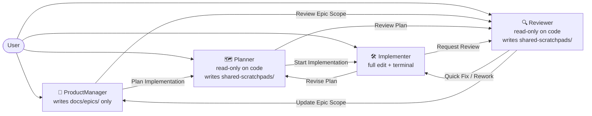
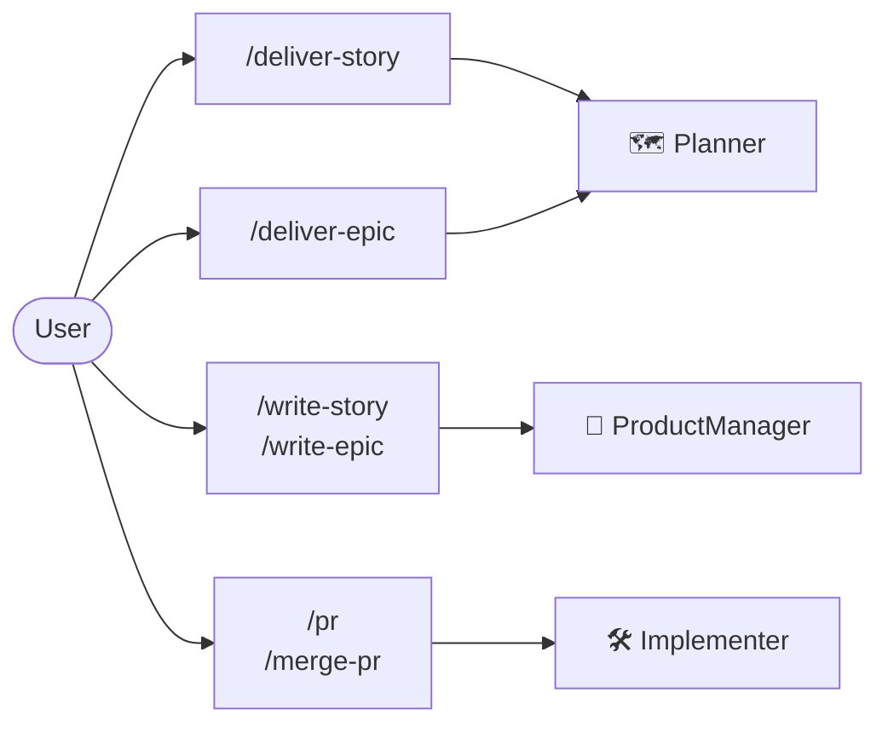
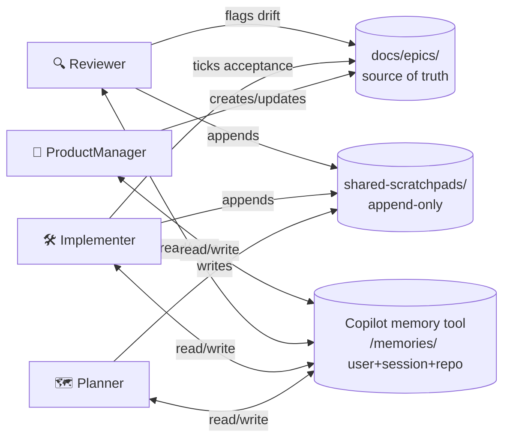
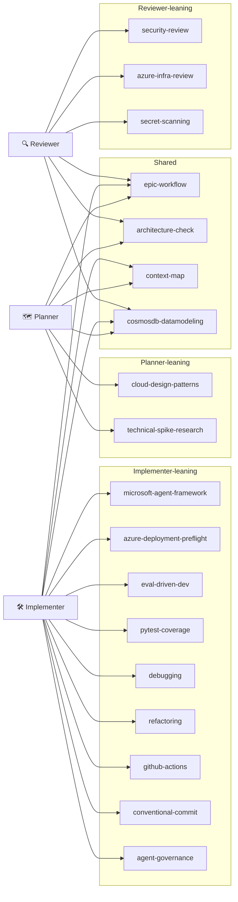
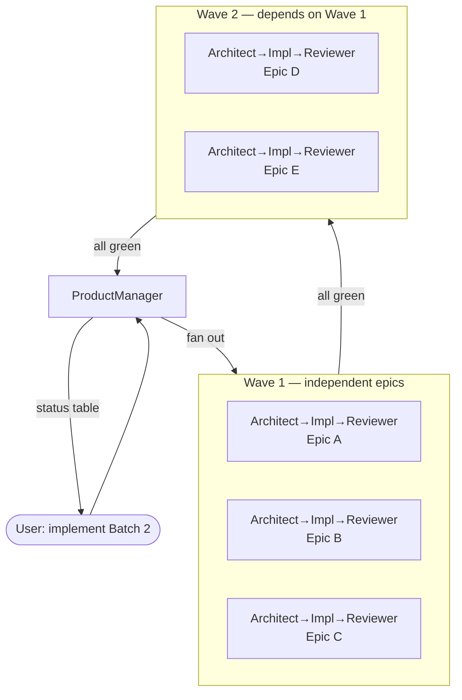
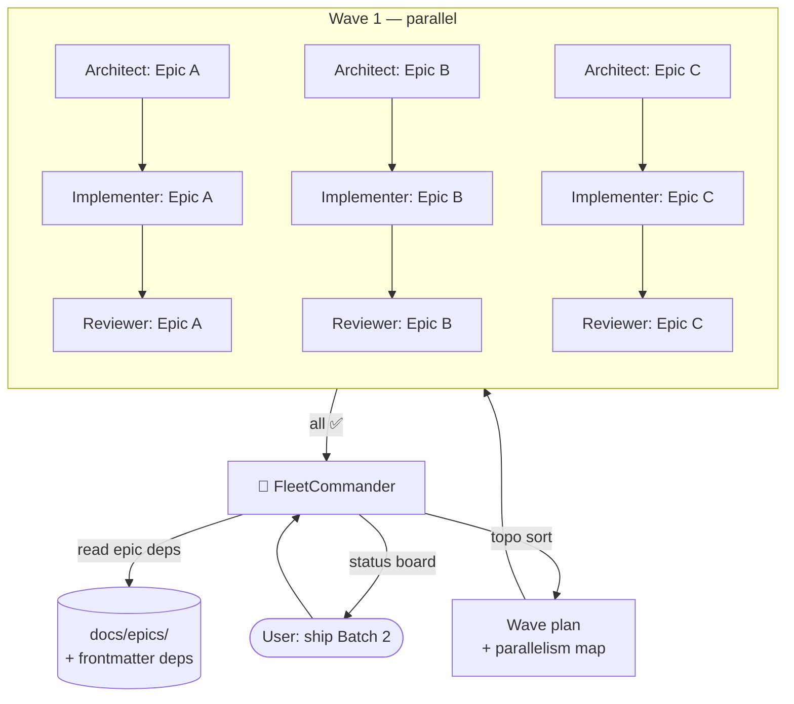
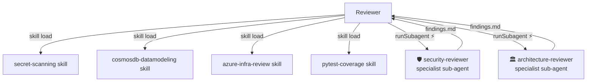
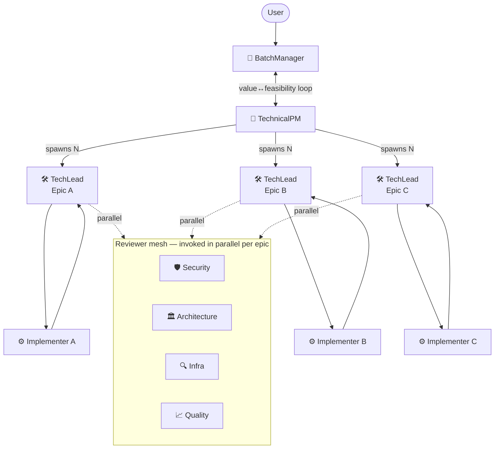

# Agentic SDLC v2 — Current State Audit & Redesign Workspace

This document is split into two parts:

1. **Part A — Current State** captures what the `.github/` setup looks like today: agents, skills, instructions, prompts, memory protocols, and how they compose at runtime.
2. **Part B — Desired State** is reserved for the redesigned workflow we will define together. It is intentionally empty for now — we will fill it in iteratively.

> **Note on baseline.** The current repo has three persona agents under `.github/agents/` (Planner, Implementer, Reviewer). A **ProductManager** persona is being added as a fourth alongside them; Part A treats the four-agent setup as the baseline. The ProductManager file (`product-manager.agent.md`) is in-flight at the time of writing.

If a decision lands from this document, it will be promoted into an ARD under [docs/ards/](../ards/).

---

## Part A — Current State

### A.1 Inventory

#### Agents (4) — `.github/agents/`

| Agent | Write scope | Purpose |
|---|---|---|
| **ProductManager** *(in-flight)* | `docs/epics/` only | Owns roadmap/sequencing and epic definitions. Defines WHAT, not HOW. Initiates ARDs when scope demands a recorded decision. |
| **Planner** | `shared-scratchpads/` only | Research-first. Reads codebase, produces a high-level plan + `#todos`. Forbidden from writing code. |
| **Implementer** | Full repo (code + tests + epic doc updates) | Writes production code, runs `make dev-test`, updates epic acceptance criteria, keeps Bicep/AZD infra in sync. |
| **Reviewer** | `shared-scratchpads/` only | Read-only on code. Architecture / security / test-coverage / quality review. Returns ✅ Approve, Quick Fix, Rework, or Re-plan. |

Notable agent properties:
- All persona agents declare **explicit handoffs** in their YAML frontmatter (e.g., Planner → Implementer "Start Implementation", Reviewer → Implementer "Quick Fix").
- Tool permissions are **implicit through write-scope**: only the Implementer has `runInTerminal` + write access outside `shared-scratchpads/`.
- Sub-agents (`Explore`, plus the persona agents themselves, plus several Azure-focused custom agents like `DeployToAzure`, `Azure_function_codegen_and_deployment`, `MCP AppService Builder`) exist as `runSubagent` capabilities but are **not promoted in any persona's prompt** as a parallelization step.

#### Skills (19) — `.github/skills/`

| Skill | Primary consumer(s) today |
|---|---|
| `epic-workflow` | Planner, Implementer, Reviewer |
| `architecture-check` | Planner, Reviewer |
| `security-review` | Reviewer |
| `azure-infra-review` | Reviewer |
| `azure-deployment-preflight` | Implementer |
| `cosmosdb-datamodeling` | Planner, Implementer, Reviewer (data-touching work) |
| `microsoft-agent-framework` | Implementer (when modifying `src/agent/`) |
| `agent-governance` | Planner, Implementer (Foundry + APIM AI Gateway) |
| `eval-driven-dev` | Implementer (LLM evaluations) |
| `pytest-coverage` | Implementer |
| `debugging` | Implementer |
| `refactoring` | Implementer |
| `context-map` | Planner, Implementer (pre-change impact mapping) |
| `cloud-design-patterns` | Planner |
| `technical-spike-research` | Planner (for `docs/spikes/`) |
| `github-actions` | Implementer (CI/CD workflows) |
| `github-issues` | Any agent managing GH issues |
| `conventional-commit` | Implementer |
| `secret-scanning` | Reviewer, Implementer |

Skills are **passive documents**: an agent must decide to read them. There is no router that activates a skill based on file path or task type.

#### Instructions (12) — `.github/instructions/`

Auto-applied via `applyTo` glob:

| File | Glob | Effect |
|---|---|---|
| `python-standards.instructions.md` | `src/**/*.py` | Python 3.12+, uv, Azure SDK, code style |
| `testing.instructions.md` | `**/tests/**` | pytest tier rules, fixtures, mocking |
| `security.instructions.md` | `**` | Secrets, auth, network, input validation |
| `secure-coding-owasp.instructions.md` | `**` | OWASP Top 10 secure coding |
| `context-engineering.instructions.md` | `**` | Copilot-friendly code organization |
| `azure-infra.instructions.md` | `infra/azure/**` | Bicep modules, AZD, naming, RBAC |
| `epic-tracking.instructions.md` | `docs/epics/**` | Epic lifecycle, doc-code consistency |
| `shared-scratchpad.instructions.md` | `shared-scratchpads/**` | Append-only protocol for cross-agent log |
| `web-app.instructions.md` | `src/web-app/**` | Next.js + CopilotKit conventions |
| `docker.instructions.md` | `**/Dockerfile,**/Dockerfile.*,**/*.dockerfile` | Container image best practices |
| `shell-scripting.instructions.md` | `**/*.sh` | Bash scripting standards |
| `makefile.instructions.md` | `**/Makefile,**/makefile,**/*.mk` | GNU Make authoring |

Triggering is **path-based, not task-based**: an instruction loads when the matching file is opened/edited. Two agents touching the same file load the same instructions.

#### Prompts (6) — `.github/prompts/`

User-invoked workflow shortcuts. Some pin to a specific agent via `agent:` frontmatter, most do not.

| Prompt | Pins to | Purpose |
|---|---|---|
| `deliver-story` | Planner | Plan a single story, then hand off to Implementer + Reviewer |
| `deliver-epic` | Planner | Loop `deliver-story` per remaining story in an epic |
| `write-story` | (any) | Draft a story inside an epic |
| `write-epic` | (any) | Draft a new epic |
| `pr` | (any) | Open PR against main |
| `merge-pr` | (any) | Merge open PR + switch back to main |

#### Root: `.github/copilot-instructions.md`

Always-loaded global rules. Currently encodes:
- Project description and stack pointer
- Solution structure (`src/agent/`, `src/functions/`, `src/web-app/`, `infra/azure/`, `infra/docker/`, `docs/epics/`, `scripts/`)
- Key conventions (IaC only, managed identity everywhere, env-driven config, `uv` for Python, tests before commit, docs match code)
- **Failure policy** — no implicit degraded mode; required dependencies fail fast unless an epic/spec/ARD explicitly says otherwise
- 3-agent handoff model overview (with PM being added as the fourth)
- Skills, instructions, and prompts indexes

### A.2 Cross-agent persistence

| Mechanism | Lifecycle | Owner |
|---|---|---|
| `shared-scratchpads/<task>.md` | Per task; append-only; created by Planner; archived at completion | Planner creates, Implementer + Reviewer append |
| `docs/epics/<NNN>-<slug>.md` | Permanent epic source-of-truth; status updated as stories complete | ProductManager creates; Implementer ticks off acceptance criteria; Reviewer flags drift |
| Copilot `memory` tool (`/memories/`, `/memories/session/`, `/memories/repo/`) | Built-in; cross-conversation; user/session/repo scopes | Any agent, on demand |

`shared-scratchpads/` is the only ad-hoc cross-agent surface today. The Copilot `memory` tool is also available; a couple of repo-scope notes exist (`/memories/repo/deployment-notes.md`, `/memories/repo/epic-011-exploration.md`) but it is otherwise lightly used.

### A.3 Workflow Diagrams (current)

The runtime composition has four loosely-coupled axes: **agent handoffs**, **user-invoked entry points (prompts)**, **cross-agent persistence**, and **skill usage per agent**. Each is shown separately below; instructions are flat path→file mappings and are listed as a table rather than a diagram.

#### A.3.1 Agent handoffs

The four personas and the explicit handoff transitions they declare in their YAML frontmatter.



#### A.3.2 User-invoked prompts → agents

Prompts (`.github/prompts/*.prompt.md`) are typed by the user as `/<name>` and route to a default agent.



#### A.3.3 Cross-agent persistence

Three persistence surfaces; each agent has a specific read/write relationship.



#### A.3.4 Skills usage per agent

Skills (`.github/skills/*/SKILL.md`) are pulled in on demand. Today's usage:



#### A.3.5 Instructions (auto-applied by file path)

Instructions are not a routing concern — they attach automatically when a file matching `applyTo` is in context.

| `applyTo` glob | Instruction file |
|---|---|
| `**` | `context-engineering.instructions.md`, `secure-coding-owasp.instructions.md`, `security.instructions.md` |
| `src/**/*.py` | `python-standards.instructions.md` |
| `**/tests/**` | `testing.instructions.md` |
| `infra/azure/**` | `azure-infra.instructions.md` |
| `docs/epics/**` | `epic-tracking.instructions.md` |
| `shared-scratchpads/**` | `shared-scratchpad.instructions.md` |
| `src/web-app/**` | `web-app.instructions.md` |
| `**/Dockerfile`, `**/*.dockerfile` | `docker.instructions.md` |
| `**/*.sh` | `shell-scripting.instructions.md` |
| `**/Makefile`, `**/*.mk` | `makefile.instructions.md` |

### A.4 Composition rules (today)

| Layer | Activation | Authoring effort | Runtime cost |
|---|---|---|---|
| `copilot-instructions.md` | Always loaded | Heavy (global) | Always-on tokens |
| Agent persona | When that agent is invoked | Medium | One persona at a time |
| Instructions (`applyTo`) | Auto when matching file in context | Low per file | Pulled in per file touched |
| Skills (`SKILL.md`) | Agent decides to read | Low | Only if invoked |
| Prompts (`*.prompt.md`) | User types `/<name>` | Low | Replaces user prompt |
| `shared-scratchpads/` | Mandatory in Planner→Impl→Rev chain | Protocol overhead | Appended every handoff |
| Copilot `memory` tool | Optional, currently lightly used | Zero (built-in) | Auto-loads first 200 lines of `/memories/` |

### A.5 Canonical flows

**1. Linear story implementation** (most common today, via `/deliver-story`)
```
User /deliver-story
  → Planner creates shared-scratchpads/<epic>-story-<N>.md
  → produces plan + #todos
  → handoff to Implementer
       → reads epic in docs/epics/<NNN>-<slug>.md
       → writes code + tests (instructions auto-apply per file)
       → make dev-test
       → updates epic doc (epic-workflow skill)
       → handoff to Reviewer
            → architecture-check + security-review + azure-infra-review
            → ✅ Approve  OR  Quick Fix back to Implementer
```

**2. Plan-first feature (larger work, via direct Planner invocation)**
```
User → Planner
  → MANDATORY shared-scratchpads/<name>.md
  → produces plan + #todos (no code, no signatures)
  → handoff to Implementer
       → reads scratchpad, ticks off TODOs
       → handoff to Reviewer
```

**3. Product-led**
```
User → ProductManager
  → updates / writes epic in docs/epics/
  → handoff to Planner → Implementer → Reviewer → "Update Epic Scope" back to PM
```

### A.6 Observed friction points

The following are concrete observations about the current setup that should inform the redesign. They are not yet decisions — just symptoms.

1. **Single Implementer persona** carries Python services (agent, functions, web-app), Bicep infra, container builds, GitHub Actions, and evaluations. No specialization, no parallelism within an implementation step.
2. **Planner is single-threaded** — it does both discovery (research) and synthesis (plan-writing) in one pass. Discovery is naturally parallelizable; synthesis is not.
3. **Sub-agents (`Explore`, the various Azure-focused custom agents) are not promoted** in any persona's prompt as a first-class step. The `runSubagent` capability exists but is invisible to users and to the persona agents themselves.
4. **Reviewer is monolithic** — it sequentially runs architecture / security / infra / secret-scanning skills. These are inherently parallelizable as independent passes producing scoped findings.
5. **Skills are passive documents** — nothing routes a task to a skill or measures whether the right skills were consulted. No skill telemetry.
6. **Prompts duplicate agent behaviour** — `/deliver-story` and `/deliver-epic` largely encode what the Planner agent should do by default. Two ways to do the same thing.
7. **No QA / Test Engineer persona** — testing is bolted onto Implementer. No persona owns test strategy, fixtures, coverage gates, or evaluation suites as a primary responsibility.
8. **No frontend / UX specialist** — `src/web-app/` (Next.js + CopilotKit) routes to the same Implementer that writes Python and Bicep. UI conventions live only in scoped instructions.
9. **No infra / deploy persona** — Bicep authoring, AZD orchestration, RBAC wiring, and deployment cutover all live on the Implementer. `azure-deployment-preflight` is a skill, not a persona.
10. **No domain specialists** (Foundry agents, Azure AI Search, Cosmos data modeling, evaluations) — domain depth is captured in specs, ARDs, and skills, but no persona is the named owner.
11. **No research / spike persona** — `docs/research/` and `docs/spikes/` exist but are unattributed in the agent model. Currently the user must drive research manually.
12. **No "scout" or "discovery" step before Planner** — Planner is expected to discover and plan in one pass, even when the search space is large.
13. **Reviewer's "approval" loop ends in chat, not in CI** — there is no automated gate that mirrors the Reviewer's checks; the Reviewer is the only enforcer.
14. **The PM has no notion of estimation, prioritization signal, or velocity** — epic sequencing comes from dependency analysis only.

### A.7 Inventory of ground-truth references the agents share

These are the documents an agent must be able to find and trust. Any redesign must keep them as the single source of truth and not duplicate them inside agent personas.

- [docs/specs/architecture.md](../specs/architecture.md) — service/layer architecture
- [docs/specs/infrastructure.md](../specs/infrastructure.md) — Azure infra topology
- [docs/specs/agent-session.md](../specs/agent-session.md) — agent session model
- [docs/specs/conversation-state-model.md](../specs/conversation-state-model.md) — conversation state
- [docs/specs/contextual-tool-filtering.md](../specs/contextual-tool-filtering.md) — tool filtering rules
- [docs/specs/environments-setup.md](../specs/environments-setup.md) — env/setup canonical flow
- ARDs in [docs/ards/](../ards/) — locked decisions
- Epic files in [docs/epics/](../epics/)
- Research notes and spikes in [docs/research/](../research/) and [docs/spikes/](../spikes/)

---

## Part B — Desired State

### B.1 Design constraints (from the user)

These constraints frame every proposal below. They are not negotiable within Part B; they define what "better" means.

1. **Kill prompts as a layer.** `/deliver-story`, `/deliver-epic`, `/write-story`, etc. become either *skills* (reusable know-how a generalist agent reads on demand) or get folded into a *specialist agent's own definition*. There is no third bucket called "prompt".
2. **Generic-by-default agents.** Personas are defined in software-industry terms (PM, Architect, Implementer, Reviewer, etc.), not KB-Agent-domain terms (no "FoundryAgentSpecialist", no "AzureSearchExpert"). Project-specific knowledge lives in **instructions** (auto-attached by file path) and **skills** (pulled on demand). The agent roster must be portable to a different repo by swapping instruction/skill content.
3. **Aggressive context-window reduction via sub-agents.** The "main thread" talking to the user holds only what the human needs to make the next decision. Anything else — research dives, security passes, coverage analysis, exploration — is delegated to a sub-agent that returns a *distilled finding*, not a transcript. This applies to every persona, including the PM mid-conversation.
4. **Parallelize wherever the work is independent.** A Reviewer running architecture / security / coverage / infra in series is leaving wall-clock on the floor. Same for Planner doing discovery + synthesis in one pass. Parallel sub-agents are the default execution mode for any review, audit, or multi-axis discovery.
5. **Fleet-scale execution.** The user must be able to hand the system *an entire epic batch* (or a release-equivalent grouping of epics) and walk away. The system decomposes the batch into independent epics (using the dependency hints captured in epic frontmatter / `docs/epics/`), launches parallel implementation paths per independent epic, and only serializes where dependencies force it. Each parallel path runs its own implementer / reviewer loop. The user sees an aggregate progress view, not N parallel chats.
6. **Question conventional personas.** Borrow from software-org reality but feel free to break it. A "PM who is technical enough to make architecture trade-offs" may obsolete the classic PM↔Architect ping-pong. A "Tech Lead" who owns both planning and code-review handoff may obsolete the Planner/Reviewer split. The proposals below explore different cuts of this.
7. **Open question to resolve per proposal:** when a review concern is specialized (security, infra, data-modeling, architecture), is it a *skill loaded by a generic Reviewer agent*, or is it its own *Reviewer-Security agent* spawned as a sub-agent? Each proposal takes a clear stance.
8. **Specs and docs are first-class outputs of every epic.** Code is not "done" until the change has been digested back into the relevant `docs/` artifact (spec, ARD, epic, batch trace). The intent: a future agent (or human) reasoning about the codebase reads compact, curated context — not a pile of code, not a deleted scratchpad. Scratchpads are the *work trace*; docs are the *durable context*. Every proposal must specify who closes that loop.

### B.2 Cross-cutting concern: Knowledge curation lifecycle

This concern is shared by all three proposals. Each takes a different stance on *who* owns the digest step (B.2.4), but the lifecycle itself is the same.

#### B.2.1 The two memory tiers

| Tier | Where | Lifecycle | Audience |
|---|---|---|---|
| **Work trace** | `shared-scratchpads/<task>.md` | Lives during work; deleted (or archived) after digest | Active agents in this task |
| **Durable context** | `docs/specs/`, `docs/ards/`, `docs/epics/`, `docs/research/`, `docs/spikes/` (and a proposed `docs/batches/`) | Permanent | All future agents and humans |

The bet: scratchpads are noisy, chronological, full of dead-ends. Specs are compact, curated, current. Future tasks should never need to read a scratchpad to understand the system — they read specs. Scratchpads only exist to support the agents *currently* doing the work.

#### B.2.2 The `docs/` taxonomy (what already exists, plus one addition)

The KB Agent repo already has most of the right buckets:

- `docs/epics/<NNN>-<slug>.md` — epic specs and acceptance criteria (per-epic source of truth)
- `docs/ards/ARD-<NNN>-<slug>.md` — locked architecture decisions (immutable once accepted)
- `docs/specs/` — system contracts (architecture, infrastructure, agent-session, conversation-state-model, contextual-tool-filtering, environments-setup) — kept *current*
- `docs/research/` — investigation notes (this file lives here)
- `docs/spikes/` — completed spikes
- `docs/setup-and-makefile.md` — setup/automation surface

Proposed addition:

- `docs/batches/batch-N.md` — a thin per-batch **implementation trace**. ~1–2 pages. For each shipped epic in the batch: 1-line summary, the specs/ARDs that changed, the rationale for any non-obvious decision, and a pointer back to the (now-deleted) scratchpad's most important findings. This is the "how we got to batch X and why" archive without rehydrating every chronological log. (Naming — `batches/` vs `releases/` vs `waves/` — is open and can be revisited; the concept is what matters.)

#### B.2.3 The digest step

When a unit of work completes (story → epic → batch, scoped per proposal), a **digest** runs:

1. **Inputs:** scratchpad, completed epic doc (acceptance criteria as shipped), code diff, list of touched files.
2. **Determine targets:** which existing `docs/` artifacts must change?
   - Touched Cosmos DB schema or container layout → update `docs/specs/conversation-state-model.md` (or the relevant data-modeling spec)
   - Touched agent session contracts → update `docs/specs/agent-session.md`
   - Touched architecture or infrastructure topology → update `docs/specs/architecture.md` and/or `docs/specs/infrastructure.md`
   - Locked a non-trivial decision → write a new ARD under `docs/ards/`
   - Added env vars / Make targets / setup steps → update `docs/setup-and-makefile.md` and `docs/specs/environments-setup.md`
   - Always → append to `docs/batches/batch-N.md` and tick the epic doc to ✅
3. **Update them in place.** Specs are the source of truth — they get *replaced* with current state, not appended to.
4. **Delete (or archive) the scratchpad.** Once the digest has landed, the scratchpad has served its purpose.

The digest is **not** a free-form summary — it's a checklist. The output is mechanical: "these N files were updated, here's the diff."

#### B.2.4 Who owns the digest? (decided per proposal)

This is the open variable each proposal answers differently:

| Proposal | Owner of digest | Trigger |
|---|---|---|
| P1 (Lean) | `knowledge-digest` skill loaded by the **PM** at epic close | After Reviewer ✅ |
| P2 (Fleet) | `knowledge-digest` skill called by the **FleetCommander** at end of each chain; batch-trace consolidation at end of last wave | After each chain ✅ + at batch close |
| P3 (Mesh) | Dedicated **Archivist** specialist agent invoked by the TechLead after Reviewer mesh ✅; TechnicalPM for batch-trace consolidation | After per-epic Reviewer mesh ✅ |

#### B.2.5 What this means for ongoing process commitment

For this to actually work, three things must be true regardless of proposal:

1. **The digest is a Definition of Done item, not optional.** An epic without an updated spec is not done.
2. **A `docs-currency-check` enforces it.** A skill (or specialist sub-agent) compares "files touched in diff" against "specs that should have changed" and flags mismatches before Reviewer can approve.
3. **Specs stay short.** A spec that grows unbounded becomes useless. The digest step prunes as much as it adds.

### B.3 Three proposals

The proposals are deliberately different along three axes: **roster size**, **how specialization is expressed** (skill vs sub-agent), and **how fleet-scale execution is orchestrated** (implicit vs explicit orchestrator). They also each take a different stance on **who curates docs** (B.2.4).

| Axis | Proposal 1: Lean Generalists | Proposal 2: Fleet Orchestrator | Proposal 3: Role-Split Mesh |
|---|---|---|---|
| Persona count | 4 (smallest) | 5 (incl. Orchestrator) | 8–9 (largest, incl. Archivist) |
| Specialization via | **Skills** loaded by generalists | **Skills** + a few specialist sub-agents | **Specialist agents** as first-class citizens |
| Prompts | Deleted, all → skills | Deleted, all → skills | Deleted, all → agents |
| Sub-agents for parallelism | Implicit ("fan out N security passes") | Explicit Orchestrator persona drives all fan-out | Specialist agents *are* the parallel units |
| Fleet-scale execution | "Implementer can spawn N implementers" | Dedicated **Fleet Commander** persona | Tech-PM decomposes; multiple Tech-Leads run in parallel |
| Knowledge curation | `knowledge-digest` **skill** on PM at epic close | `knowledge-digest` **skill** on FleetCommander per chain | Dedicated **Archivist agent** invoked per epic |
| Risk | Loses specialist depth; PM is digest bottleneck | Orchestrator becomes a single point of complexity | Coordination overhead between many personas |
| Best fit | Small/medium repos, single human user | Large autonomous releases, "set and forget" | Complex repos with strong domain segmentation |

---

### B.4 Proposal 1 — Lean Generalists with Skill-Driven Specialization

#### B.4.1 Core idea

Keep the persona count *small* and push **all** specialization down into skills. A Reviewer is a Reviewer; whether it does a security pass, a perf pass, or a db-migration pass is determined by which skills it loads. Parallelization happens by the same generalist agent **fanning itself out** as N parallel sub-agent invocations of itself, each scoped to one skill or one file set.

The bet: modern LLMs are strong enough that "load the right skill" beats "spawn the right specialist persona" on most tasks, *and* it's much cheaper to maintain (one persona definition, many skills).

#### B.4.2 Roster (4 generalist agents)

| Agent | Owns | How it specializes |
|---|---|---|
| **ProductManager** | Product strategy, epic sequencing, batch composition, *and* enough technical literacy to vet feasibility itself by spawning Architect-pass sub-agents | Skills: `epic-workflow`, `cloud-design-patterns`, `architecture-check`, `technical-spike-research` |
| **Architect** *(replaces Planner)* | Implementation plans, ARDs, cross-cutting design, dependency graphs, scratchpad ownership | Skills: `epic-workflow`, `architecture-check`, `cosmosdb-datamodeling`, `agent-governance`, `microsoft-agent-framework`, `azure-infra-review`, `context-map` |
| **Implementer** | Code + tests + epic-doc updates. Can spawn N copies of itself for parallel file-scoped work | Instructions auto-attach (`python-standards`, `web-app`, `azure-infra`, etc.); skills: `microsoft-agent-framework`, `azure-deployment-preflight`, `pytest-coverage`, `eval-driven-dev`, `debugging`, `refactoring`, `github-actions`, `conventional-commit` |
| **Reviewer** | All review concerns, executed as **parallel skill-passes** | Skills: `security-review`, `architecture-check`, `azure-infra-review`, `cosmosdb-datamodeling`, `secret-scanning`, `pytest-coverage`, `epic-workflow` |

#### B.4.3 How specialization works (the key bet)

The Reviewer's "review a PR" workflow becomes:

```
Reviewer receives a change set
  ↓
Reviewer reads PR diff + scratchpad summary  [main thread, small context]
  ↓
Reviewer fans out N parallel sub-agent calls TO ITSELF, each loaded with ONE skill:
   ├─ sub-Reviewer + security-review skill        → returns: 0–5 findings
   ├─ sub-Reviewer + architecture-check skill     → returns: 0–5 findings
   ├─ sub-Reviewer + azure-infra-review skill     → returns: 0–5 findings
   ├─ sub-Reviewer + cosmosdb-datamodeling skill  → returns: 0–5 findings
   ├─ sub-Reviewer + secret-scanning skill        → returns: 0–5 findings
   └─ sub-Reviewer + pytest-coverage skill        → returns: 0–5 findings
  ↓
Reviewer (main thread) merges findings → ✅ Approve / Quick Fix / Rework
```

Same pattern for the PM: when the user is scoping a batch and asks "is feature X feasible?", the PM spawns a sub-PM-with-`architecture-pass`-skill that produces a 5-line feasibility note and returns. The PM main thread never holds the codebase exploration tokens.

#### B.4.4 Fleet-scale execution

There is no Orchestrator agent. Instead, the **PM gains a `batch-fleet-execution` skill** that knows how to:

1. Read the dependency hints captured in `docs/epics/` and per-epic frontmatter
2. Topologically sort epics into wave 1 (independent), wave 2 (depends on wave 1), etc.
3. For each wave: spawn one Architect→Implementer→Reviewer chain *per epic*, **in parallel**
4. Wait for the wave to complete (all epics ✅), then launch the next wave
5. Stream a flat status table back to the user, not the inner chats



#### B.4.5 Prompts → ?

All current prompts disappear. Mapping:

| Prompt today | Becomes | Owner |
|---|---|---|
| `/deliver-story` | Architect→Implementer→Reviewer chain default behaviour (no prompt needed) | Architect agent definition |
| `/deliver-epic` | `epic-execution` skill | Architect (kicks off chain per remaining story) |
| `/write-story`, `/write-epic` | `epic-authoring` skill | ProductManager |
| `/pr`, `/merge-pr` | `git-workflow` skill (alongside the existing `conventional-commit` skill) | Implementer |

#### B.4.6 Memory model

Collapse `shared-scratchpads/` into a **structured per-task workspace**:

```
.agent-workspace/<task>/
  ├─ plan.md          ← Architect's plan, mutable
  ├─ log.md           ← append-only chronological handoff log
  ├─ findings/        ← one file per parallel review pass
  └─ status.json      ← machine-readable: in-progress / done / blocked
```

The `findings/` directory is what makes parallel reviews scalable: each sub-Reviewer writes one file, the main Reviewer merges them.

#### B.4.7 Knowledge curation

A `knowledge-digest` skill is added to the **PM**. After Reviewer ✅, the PM loads the skill, runs the digest checklist (B.2.3), updates specs/ARDs/setup docs/batch-trace, and deletes the scratchpad. A separate `docs-currency-check` skill on the **Reviewer** enforces it as part of the standard fan-out: the Reviewer rejects a change set whose touched files don't have matching spec/ARD updates.

This is one more skill on an already skill-heavy persona — no new agent.

✅ Cheapest. Same persona that owns the epic (PM created it) closes the loop.
⚠️ Risk: PM becomes a serialization point at batch-close. If the PM is mid-conversation about Batch N+1, the digest of Batch N stalls.
⚠️ Skill discipline only — nothing structural prevents PM from skipping the digest if `docs-currency-check` is itself skipped.

#### B.4.8 Trade-offs

✅ Smallest persona surface, easiest to maintain, easiest to port to another repo.
✅ Specialization is *data* (skills), not *code* (personas) — adding a new review concern is just a new `.skill.md` file.
⚠️ Generalist personas may produce shallower output than dedicated specialists for genuinely deep concerns (e.g., a real cryptography review).
⚠️ Fan-out pattern depends entirely on the agent reliably remembering to spawn parallel sub-agents — no orchestrator enforces it.
⚠️ Fleet execution lives inside one PM skill — if it fails mid-flight, recovery is manual.

---

### B.5 Proposal 2 — Fleet Orchestrator with Hybrid Specialists

#### B.5.1 Core idea

Add **one** new persona — the **Fleet Commander** — whose entire job is *orchestration*. It does not write code, does not write product, does not review. It decomposes work, spawns parallel sub-agent chains, monitors progress, manages cross-stream dependencies, and reports status. Everything else stays mostly generalist, but a small number of high-value review concerns get promoted to **specialist sub-agents** that the Reviewer (or Fleet Commander directly) can spawn.

The bet: explicit orchestration is more reliable than implicit fan-out, *and* a few targeted specialist sub-agents (security, architecture) are worth their maintenance cost because their findings have outsized impact.

#### B.5.2 Roster (5 agents + 2 specialist sub-agents)

| Agent | Type | Owns |
|---|---|---|
| **ProductManager** | Generalist | Product strategy, epics, batch scoping. Spawns sub-agents for technical feasibility passes. |
| **Architect** | Generalist | Implementation plans, ARDs. Replaces Planner. |
| **Implementer** | Generalist | Code + tests + epic doc. |
| **Reviewer** | Generalist | PR-level review coordinator. Fans out to specialist sub-agents below for deep passes. |
| **🆕 FleetCommander** | Orchestrator | Decomposes batches/epics into parallel chains; monitors; reports. Never writes code or product. |
| **`security-reviewer`** | Specialist sub-agent only | Deep security pass. Callable by Reviewer or FleetCommander. Returns scoped findings only. |
| **`architecture-reviewer`** | Specialist sub-agent only | Deep architecture/boundary/coupling pass. Callable by Architect *during* planning, by Reviewer *after* implementation. |

The two specialist sub-agents are **not** in the user's agent picker. They exist only as `runSubagent` targets. This is the answer to the user's open question: **specialization that is high-leverage and high-recurrence becomes a sub-agent; everything else stays a skill.**

Heuristic for promoting a skill → specialist sub-agent:
- Used by ≥2 different parent agents (security applies during planning AND review)
- Produces structured findings that benefit from a clean context window
- Has its own deep ground-truth (OWASP, ARDs, threat models) that bloats parent context

By that test, today only **security** and **architecture** clear the bar. Cosmos data-modeling / coverage / infra-review / secret-scanning stay as skills loaded by Reviewer.

#### B.5.3 Fleet Commander in detail



The FleetCommander has these explicit responsibilities:
1. **Decomposition** — parse `docs/epics/` (and per-epic dependency frontmatter), build wave plan
2. **Spawning** — `runSubagent` for each parallel chain
3. **Coordination** — when Epic B's Architect needs an answer about Epic A's API contract (cross-epic dependency in same wave), broker the question
4. **Failure handling** — if Reviewer rejects Epic B, decide: rework in-place vs pull Epic B out of the wave
5. **Status streaming** — single status table to the user, never inner chat transcripts
6. **Memory** — owns `.agent-workspace/batch-N/` with one subdirectory per chain

#### B.5.4 Reviewer with specialist sub-agents



Skills are read **inline** by the Reviewer (cheap, fast). Specialist sub-agents are spawned with **clean context** (only the diff + ground-truth), produce findings, exit. The Reviewer merges everything into a verdict.

#### B.5.5 Prompts → ?

Same as Proposal 1 — all prompts deleted. The new addition: `/batch` becomes the FleetCommander's invocation, replacing what would otherwise be a manual hand-off chain.

#### B.5.6 Knowledge curation

The FleetCommander triggers a `knowledge-digest` skill **at the end of each Architect→Impl→Reviewer chain**. The skill targets only the artifacts touched by that chain's epic — incremental, scoped to one epic. At the end of the last wave, the FleetCommander runs a separate `batch-trace-consolidation` skill that rolls per-epic digests up into `docs/batches/batch-N.md`.

A `docs-currency-check` skill is one of the parallel passes the Reviewer fans out, same as in P1.

Optional: promote `knowledge-digest` to a dedicated `archivist` sub-agent if the digest grows complex enough to deserve its own context window (same heuristic as `security-reviewer` and `architecture-reviewer` in B.5.4).

✅ Digest happens in lock-step with the parallel chains — no end-of-batch crunch.
✅ Batch-trace consolidation is a clean step the FleetCommander already does (it has the wave plan).
⚠️ Adds a third responsibility to FleetCommander on top of coordination + spawning + monitoring. Risks turning the orchestrator into a kitchen-sink agent.

#### B.5.7 Trade-offs

✅ Explicit orchestration is auditable, restartable, and produces a clear status board.
✅ Specialist sub-agents protect the Reviewer's context window from heavy ground-truth (OWASP, ARDs).
✅ FleetCommander is *generic* — it reads epic-dependency-shaped data; portable to any repo with a similar dependency model.
⚠️ Five personas + two sub-agents = more maintenance than Proposal 1.
⚠️ FleetCommander becomes a coordination bottleneck if it fails or gets confused.
⚠️ The "is this a skill or a sub-agent?" decision becomes a recurring design question.

---

### B.6 Proposal 3 — Role-Split Mesh (PM/Tech-PM, Tech-Lead, Specialist Reviewers)

#### B.6.1 Core idea

Lean *into* the unconventional persona idea. Split the classic PM into two — a non-technical **BatchManager** focused purely on user value, and a **TechnicalPM** who owns feasibility, scoping with architecture awareness, and decomposition into epics. Replace the Architect/Planner with a **TechLead** persona that owns both per-epic design *and* the implementer/reviewer handoff for that epic. Make every review concern its own first-class agent. Fleet-scale execution emerges from spawning multiple TechLeads in parallel, one per independent epic.

The bet: powerful LLMs make the PM↔Architect ping-pong a waste. Collapsing it (TechPM) saves a handoff. And making review concerns first-class agents (rather than skills) gives them their own memory, their own ground-truth-loading patterns, and their own handoff protocols — which matters at scale.

#### B.6.2 Roster (8–9 agents)

| Agent | Owns |
|---|---|
| **🎯 BatchManager** | User-value framing, batch narratives, "why this batch". Does **not** decompose into epics. |
| **🧠 TechnicalPM** | Feasibility validation, decomposition into epics, dependency mapping, ARD initiation when scope demands. Bridges BatchManager and TechLeads. |
| **🛠️ TechLead** | Per-epic owner. Spawns one Implementer + coordinates Reviewer set. Owns the epic-level scratchpad. Multiple TechLeads run in parallel. |
| **⚙️ Implementer** | Pure execution: code + tests + epic-doc ticks. No planning, no review. |
| **🛡️ SecurityReviewer** | Specialist agent. OWASP, auth, secrets, injection, secret-scanning. |
| **🏛️ ArchitectureReviewer** | Specialist agent. Boundary checks (`src/agent/` ↔ `src/functions/` ↔ `src/web-app/`), coupling, ARD conformance. |
| **🔍 InfraReviewer** | Specialist agent. Bicep modules, RBAC wiring, AZD conventions, deployment preflight. |
| **📈 QualityReviewer** | Specialist agent. Test coverage, CI readiness, evaluation suites, flaky tests. |
| **📚 Archivist** | Specialist agent. Owns the digest step (B.2.3): updates specs, ARDs, setup docs, writes the batch-trace entry, deletes the scratchpad. |

`shared-scratchpads/` becomes per-epic and per-batch workspace folders (same as Proposal 1's `.agent-workspace/` model).

#### B.6.3 Why this is structurally different

In Proposals 1 and 2, "review" is a single agent that fans out. In Proposal 3, the **fan-out is the architecture**: there is no single Reviewer. The TechLead invokes the four specialist Reviewers in parallel as sub-agents and merges their verdicts.



#### B.6.4 Fleet-scale execution

There is no FleetCommander persona. **The TechnicalPM *is* the orchestrator** — but for cross-epic concerns only. Within a single epic, the TechLead orchestrates. The split is:

- **TechnicalPM** — "wave 1 = Epics A, B, C in parallel; wait; then wave 2 = Epic D"
- **TechLead** (per epic) — "design → implement → invoke 4 specialist reviewers in parallel → merge → tick epic doc"

This is the deepest parallelism of the three proposals: at any moment you may have ~3 TechLeads × 4 specialist Reviewers = 12 concurrent sub-agent invocations.

#### B.6.5 Prompts → ?

All prompts deleted. Each was either redundant with an agent's default behaviour or becomes that agent's `agent.md`. Repo-specific helpers become `.github/skills/`.

#### B.6.6 The "agent vs skill" answer

Proposal 3 takes the opposite stance from Proposal 1. **Every recurring specialization that produces a verdict is its own agent.** A skill is reserved for *know-how a generalist needs to do its own job*, not for *a perspective another agent should produce*.

By this rule:
- `azure-deployment-preflight` → stays a skill (Implementer's job, Implementer needs the recipe)
- `security-review` → becomes the SecurityReviewer agent (it produces a verdict; it's a perspective)
- `epic-workflow` → stays a skill (every agent uses it, no verdict)
- `azure-infra-review` → becomes the InfraReviewer agent
- `architecture-check` → split: a *check* skill for TechLead's self-use during planning; the *reviewer* perspective lives in ArchitectureReviewer
- `cosmosdb-datamodeling` → stays a skill (TechLead's job during design); a deeper review variant could be folded into InfraReviewer or ArchitectureReviewer

#### B.6.7 Knowledge curation

Curation gets its own first-class agent: **📚 Archivist**. The TechLead invokes the Archivist after the per-epic Reviewer mesh ✅ as one more parallel sub-agent invocation alongside the four Reviewers. The Archivist's only job is the digest checklist — read scratchpad, update specs/ARDs/setup docs, write the batch-trace entry, delete the scratchpad. The TechnicalPM invokes the Archivist a second time at end-of-batch to consolidate per-epic traces into `docs/batches/batch-N.md`.

This makes Archivist the 9th agent, but it's the most *structurally* aligned to the proposal's stance (B.6.6): every recurring specialization that produces an output is its own agent. Curation is unambiguously a verdict-producing perspective — "these specs are now current" — so by the proposal's own rule it must be an agent.

The `docs-currency-check` becomes a sub-skill *of* the Archivist: the Archivist verifies its own output before signaling done.

✅ Fully decoupled from coordination roles. Maximum parallelism preserved.
✅ Archivist agent's prompt encodes the docs taxonomy itself, so the rule "specs are source of truth, scratchpads are deleted" is enforced by persona, not skill discipline.
⚠️ 9 personas. The maintenance overhead grows.
⚠️ Risk of Archivist drifting from the rest of the agent fleet's tone/format — must share a common base template with the four Reviewer agents.

#### B.6.8 Trade-offs

✅ Maximum parallelism, both inter-epic (TechLeads) and intra-epic (specialist reviewers).
✅ Each specialist agent has its own memory, ground-truth-loading discipline, and handoff format — cleaner at scale.
✅ The PM split mirrors how LLM-native orgs may actually want to operate: separate the user-value voice from the feasibility voice.
✅ TechLead is a familiar industry role; portable to any repo.
⚠️ 9 personas is a lot to maintain.
⚠️ Coordination overhead — TechnicalPM has to broker between BatchManager and N TechLeads.
⚠️ Risk of specialist agents drifting in tone/format unless their `agent.md` files share a common template.
⚠️ Most expensive in tokens: more personas = more system prompts loaded across the fleet.

---

### B.7 Recommendation framework (not a decision)

The three proposals span a clear spectrum. To choose, the user should answer:

| Question | Pulls toward |
|---|---|
| How important is portability to other repos vs depth on this repo? | Portability → P1 / P2; Depth → P3 |
| How much of the workflow do you want to "set and forget"? | Set-and-forget → P2 / P3 |
| How much do you trust generalist agents to fan themselves out reliably without an orchestrator? | High trust → P1; Low trust → P2 |
| How comfortable are you maintaining 7–9 agent definitions? | Low → P1; High → P3 |
| Is "the user-value voice" structurally different from "the feasibility voice" enough to deserve two personas? | Yes → P3; No → P1 / P2 |
| Should knowledge curation be visible/auditable as its own role, or absorbed into existing roles? | Visible role → P3; Absorbed → P1 / P2 |

A pragmatic path that may emerge from this: **start with P1 to ground the model and prove sub-agent fan-out works, then graduate to P2 by adding only the FleetCommander and the two highest-leverage specialist sub-agents (security + architecture)**. P3 stays as a north-star for if/when the codebase or team scale demands it.

### B.8 Open Questions

_(filled in as proposals are evaluated)_
