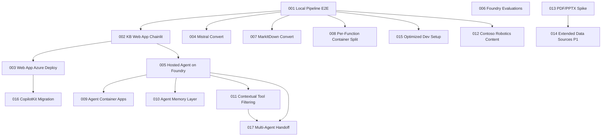

# Roadmap — Context Aware & Vision Grounded KB Agent

> Owned by the **ProductManager** agent. See [`.github/agents/product-manager.agent.md`](../.github/agents/product-manager.agent.md).

This roadmap tracks the product epics that make up each release. It is the single index for "what is built, what is in flight, what is next, and how it all fits together." Epic files under [epics/](epics/) are the source of truth for individual scope and acceptance criteria; the **Status** column here mirrors the `Status:` line at the top of each epic file.

| Legend |   |
|---|---|
| ✅ | Done |
| 🟡 | In Progress |
| 📝 | Draft |
| ❄️ | Deferred |

---

## Themes

Themes are a lightweight grouping for navigation only. They are not a status surface — only the epic file's `Status:` line and the release tables below carry status.

| Theme | Scope |
|---|---|
| **Pipeline & Conversion** | HTML/PDF/PPTX/DOCX → Markdown convert paths, AI Search indexer |
| **Agent Runtime** | Foundry hosting, Container Apps migration, memory layer, contextual tool filtering, multi-agent handoff |
| **Web Experience** | KB chat web app, Entra auth, CopilotKit / AG-UI |
| **Quality & Evaluations** | Eval suites, alerting, governance |
| **Content & Data Sources** | Sample content, extended source types |
| **Developer Experience** | Local dev setup, automation, dependency management |

### Theme → Epic map

| Epic | Title | Theme |
|---|---|---|
| [001](epics/001-local-pipeline-e2e.md) | Local Pipeline End-to-End | Pipeline & Conversion |
| [002](epics/002-kb-search-web-app.md) | KB Search Web App (Chainlit + Agent Framework) | Web Experience |
| [003](epics/003-web-app-azure-deployment.md) | Web App Azure Deployment (Container Apps + Entra) | Web Experience |
| [004](epics/004-mistral-doc-ai-for-convert.md) | Mistral Document AI Convert | Pipeline & Conversion |
| [005](epics/005-hosted-agent-foundry.md) | Hosted Agent on Foundry + Conversation History | Agent Runtime |
| [006](epics/006-foundry-agent-evaluations.md) | Foundry Hosted Agent Evaluations & Alerting | Quality & Evaluations |
| [007](epics/007-markitdown-for-convert.md) | MarkItDown Convert | Pipeline & Conversion |
| [008](epics/008-per-function-container-split.md) | Per-Function Container Split | Pipeline & Conversion |
| [009](epics/009-agent-container-apps.md) | Agent Container Apps Migration | Agent Runtime |
| [010](epics/010-agent-memory-layer.md) | Agent Memory Layer | Agent Runtime |
| [011](epics/011-contextual-tool-filtering.md) | Contextual Tool Filtering | Agent Runtime |
| [012](epics/012-contoso-robotics-content-creation.md) | Contoso Robotics Content Creation | Content & Data Sources |
| [013](epics/013-pdf-pptx-conversion-spike.md) | PDF/PPTX Conversion Quality Spike | Pipeline & Conversion |
| [014](epics/014-extended-data-sources-phase1.md) | Extended Data Sources: Phase 1 (HTML, PDF, PPTX, DOCX) | Pipeline & Conversion · Content & Data Sources |
| [015](epics/015-optimized-dev-setup.md) | Optimized Dev Setup (Zero Azure Cloud Dependency) | Developer Experience |
| [016](epics/016-copilotkit-migration.md) | CopilotKit Migration with AG-UI Protocol | Web Experience |
| [017](epics/017-multi-agent-handoff.md) | Multi-Agent Handoff Orchestration | Agent Runtime |

---

## Dependencies

High-level epic dependency graph. An epic listed in a release must have all of its dependencies either already shipped or also in the same release.

> Dependencies are derived from epic content and ARDs. Update this graph whenever an epic's dependencies change.

---

## Release 1 — Foundational Pipeline & Hosted Agent  ✅ *Shipped*

**Announcement:** A working knowledge-base agent backed by an HTML→Markdown→AI-Search pipeline, hosted on Microsoft Foundry, deployed on Azure Container Apps with Entra-protected web access, with three pluggable convert paths and a fully local dev loop.

**Why this release:**
- Prove the end-to-end pipeline works on real content and real Azure services
- Land a hostable agent runtime with conversation history, memory, and contextual tool filtering
- Ship a deployable web app with Entra-based auth so internal users can try it
- Validate three convert strategies (Content Understanding, Mistral, MarkItDown) so we can pick a winner
- Get the developer loop fast and Azure-independent so contributors can iterate without burning cloud cost

| Epic | Title | Status |
|---|---|---|
| [001](epics/001-local-pipeline-e2e.md) | Local Pipeline End-to-End | ✅ |
| [002](epics/002-kb-search-web-app.md) | KB Search Web App (Chainlit + Agent Framework) | ✅ |
| [003](epics/003-web-app-azure-deployment.md) | Web App Azure Deployment (Container Apps + Entra Auth) | ✅ |
| [004](epics/004-mistral-doc-ai-for-convert.md) | Mistral Document AI Convert | ✅ |
| [005](epics/005-hosted-agent-foundry.md) | Hosted Agent on Foundry + Conversation History | ✅ |
| [007](epics/007-markitdown-for-convert.md) | MarkItDown Convert | ✅ |
| [008](epics/008-per-function-container-split.md) | Per-Function Container Split | ✅ |
| [009](epics/009-agent-container-apps.md) | Agent Container Apps Migration | ✅ |
| [010](epics/010-agent-memory-layer.md) | Agent Memory Layer | ✅ |
| [011](epics/011-contextual-tool-filtering.md) | Contextual Tool Filtering | ✅ |
| [015](epics/015-optimized-dev-setup.md) | Optimized Dev Setup (Zero Azure Cloud Dependency) | ✅ |

---

## Release 2 — *To Be Defined*

> Scope is open. The candidate pool below lists every epic that is currently `In Progress` or `Draft` in the repo. The ProductManager and the user will jointly select which of these belong in Release 2 vs. a later release, guided by the dependency graph above.

### Candidate epics

| Epic | Title | Status | Theme |
|---|---|---|---|
| [016](epics/016-copilotkit-migration.md) | CopilotKit Migration with AG-UI Protocol | 🟡 | Web Experience |
| [017](epics/017-multi-agent-handoff.md) | Multi-Agent Handoff Orchestration | 🟡 | Agent Runtime |
| [006](epics/006-foundry-agent-evaluations.md) | Foundry Hosted Agent Evaluations & Alerting | 📝 | Quality & Evaluations |
| [012](epics/012-contoso-robotics-content-creation.md) | Contoso Robotics Content Creation | 📝 | Content & Data Sources |
| [013](epics/013-pdf-pptx-conversion-spike.md) | PDF/PPTX Conversion Quality Spike | 📝 | Pipeline & Conversion |
| [014](epics/014-extended-data-sources-phase1.md) | Extended Data Sources: Phase 1 (HTML, PDF, PPTX, DOCX) | 📝 | Pipeline & Conversion |

### Open questions for Release 2 scoping

- Which of `016` (CopilotKit) and `017` (Multi-Agent Handoff) ships first, and do they ship together or sequentially?
- Does `013` (spike) need to land before `014` (extended data sources), or can `014` proceed on assumed defaults?
- Is `006` (evaluations) a Release 2 hard requirement (ship-blocker for new agent capabilities) or a Release 3 follow-up?
- Where does `012` (Contoso content) belong — alongside `014` to validate it on real data, or earlier as a Release 2 acceptance corpus?

The ProductManager will revisit these once the user signals priority.
