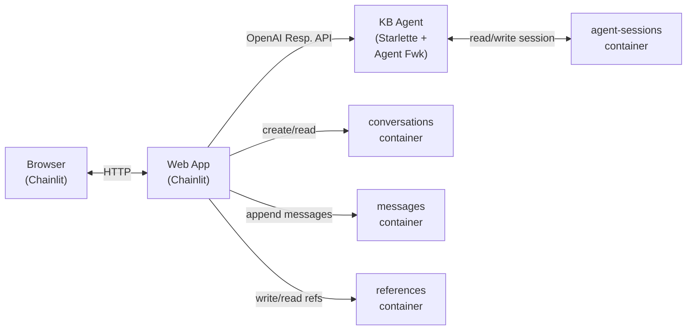

# Agent Memory — Conversation Persistence

> **Status:** Sections 1–8 describe the target architecture (Epic 011, Story 7).
> The current implementation (Epic 010) uses a single shared `agent-sessions` container.
> Story 7 splits this into four containers with clean ownership boundaries.

## 1. Overview

The application separates **agent session state** from **conversation display data** using four Cosmos DB containers with distinct ownership:

- **`agent-sessions`** — owned exclusively by the agent. Stores LLM session state (message history with compaction). The agent reads and writes freely without risk of overwriting web app data.
- **`conversations`** — owned exclusively by the web app. One document per conversation (lightweight metadata: id, name, userId, timestamps). Powers the sidebar conversation list with a single-partition query — no cross-partition DISTINCT needed.
- **`messages`** — owned exclusively by the web app. One document per message (insert-only). The web app appends each user or assistant message as it streams.
- **`references`** — owned exclusively by the web app. One document per chunk reference (formerly "elements"). Written when the search tool returns results; read on demand when a user clicks a `[Ref #N]` tag.



**Key design decisions:**

- The **agent owns its session exclusively** — it persists and reloads session state via `CosmosAgentSessionRepository`, with compaction strategies that freely trim and exclude messages. No read-modify-write needed.
- The **web app owns conversation display data** — conversation metadata, messages (formerly "steps"), and references (formerly "elements") live in their own containers. No coupling to the agent's internal session format.
- **No shared documents** — each container has a single owner. Eliminates read-modify-write races and simplifies both services.
- **Sidebar is a single-partition read** — the `conversations` container is partitioned by `/userId`, so listing a user's conversations requires no cross-partition query.
- The **web app is a thin client** — it passes `conversation_id` via `extra_body` and does not build or trim conversation context.

---

## 2. Cosmos DB Schema

### Infrastructure

Deployed via Bicep (`infra/modules/cosmos-db.bicep`):

| Setting | Value |
|---|---|
| API | NoSQL |
| Capacity mode | Serverless |
| Consistency | Session |
| Database name | `kb-agent` |
| Local auth | Disabled (Entra-only via managed identity) |

### 2.1 `agent-sessions` Container

| Setting | Value |
|---|---|
| Container name | `agent-sessions` |
| Partition key | `/id` |
| TTL | `-1` (no expiry) |
| Owner | Agent (`CosmosAgentSessionRepository`) |

One document per conversation. Contains only agent session state — no web app fields.

```json
{
  "id": "<conversation-id (UUID)>",
  "session": {
    "state": {
      "messages": [
        { "role": "user", "content": "What is Content Understanding?" },
        { "role": "assistant", "content": "Azure Content Understanding is..." }
      ]
    }
  }
}
```

The agent fully owns this document. Compaction strategies mark older messages as excluded, and trimmed messages are never loaded back into context (`skip_excluded=True`).

### 2.2 `conversations` Container

| Setting | Value |
|---|---|
| Container name | `conversations` |
| Partition key | `/userId` |
| TTL | `-1` (no expiry) |
| Owner | Web app (`CosmosDataLayer`) |

One document per conversation. Lightweight metadata only — no message content. Powers the sidebar with a single-partition query by `userId`.

```json
{
  "id": "<conversation-id (UUID)>",
  "userId": "<user-identifier>",
  "name": "What is Content Understanding?",
  "createdAt": "2026-02-26T10:30:00+00:00",
  "updatedAt": "2026-02-26T10:35:12+00:00"
}
```

| Field | Purpose |
|---|---|
| `id` | Conversation identifier (UUID) — same ID used across all containers |
| `userId` | Partition key — groups all conversations for a user |
| `name` | Conversation title (auto-generated from first user message, truncated to 80 chars) |
| `createdAt` | When the conversation started |
| `updatedAt` | Last message timestamp — used for sidebar sort order |

**Access patterns:**
- **Create:** Insert one document when a new conversation starts. No read-before-write.
- **Update:** Upsert to update `updatedAt` when new messages arrive (single-partition point write).
- **List (sidebar):** Single-partition query by `userId`, ordered by `updatedAt` DESC. No cross-partition DISTINCT needed.
- **Delete:** Point delete by `{userId, conversationId}`.

### 2.3 `messages` Container

| Setting | Value |
|---|---|
| Container name | `messages` |
| Partition key | `/conversationId` |
| TTL | `-1` (no expiry) |
| Owner | Web app (`CosmosDataLayer`) |

One document per message. Insert-only — the web app never updates a message document after writing it.

```json
{
  "id": "<message-uuid>",
  "conversationId": "<conversation-id>",
  "role": "assistant",
  "content": "Azure Content Understanding is...",
  "refIds": ["<messageId>-ref-1", "<messageId>-ref-2"],
  "createdAt": "2026-02-26T10:30:05+00:00"
}
```

| Field | Purpose |
|---|---|
| `id` | Unique message identifier (UUID) |
| `conversationId` | Partition key — groups all messages in a conversation |
| `role` | `"user"` or `"assistant"` |
| `content` | Message text |
| `refIds` | Array of message-scoped reference IDs (e.g. `"{messageId}-ref-1"`). Scoped to the message so `[Ref #1]` in two different messages don't collide. |
| `createdAt` | ISO-8601 timestamp for ordering |

**Access patterns:**
- **Write:** Insert one document per message as it streams. No read-before-write.
- **Load conversation:** Single-partition query by `conversationId`, ordered by `createdAt` ASC.

### 2.4 `references` Container

| Setting | Value |
|---|---|
| Container name | `references` |
| Partition key | `/conversationId` |
| TTL | `-1` (no expiry) |
| Owner | Web app (`CosmosDataLayer`) |

One document per chunk reference. Stored when the search tool returns results. Contains the full chunk content at write time — no lazy loading or external cache needed.

```json
{
  "id": "<messageId>-ref-1",
  "conversationId": "<conversation-id>",
  "messageId": "<message-uuid>",
  "articleId": "<article-id>",
  "chunkIndex": 3,
  "indexedAt": "2026-03-15T08:00:00Z",
  "title": "Article Title",
  "sectionHeader": "Overview",
  "content": "Full chunk content for display...",
  "createdAt": "2026-02-26T10:30:05+00:00"
}
```

| Field | Purpose |
|---|---|
| `id` | Message-scoped reference identifier (`{messageId}-ref-{N}`). Unique within the conversation because it includes the message ID. Matches entries in the message's `refIds` array. |
| `conversationId` | Partition key — co-located with the conversation's messages |
| `messageId` | The message this reference belongs to |
| `articleId` | Source article in the KB index |
| `chunkIndex` | Chunk position within the article |
| `indexedAt` | Timestamp pinning the reference to a specific index version |
| `title` | Article title for display |
| `sectionHeader` | Section heading for display |
| `content` | Full chunk content — stored at write time, not fetched on demand |

**Access patterns:**
- **Write:** Insert one document per chunk reference when the assistant message is created. No read-before-write.
- **Read (user clicks `[Ref #N]`):** Direct point read by `{conversationId, messageId-ref-N}` — the cheapest Cosmos operation (single partition, single key).

### Container Layout

```
agent-sessions (PK: /id)          conversations (PK: /userId)
┌──────────────────────────┐      ┌──────────────────────────┐
│ id: conv-abc             │      │ id: conv-abc             │
│ session:                 │      │ userId: alice             │
│   state.messages: [...]  │      │ name: "What is…"         │
│                          │      │ updatedAt: ...            │
│ Agent-only.              │      ├──────────────────────────┤
│ Compaction-safe.         │      │ id: conv-def             │
└──────────────────────────┘      │ userId: alice             │
                                  │ name: "How do…"           │
                                  └──────────────────────────┘
                                  Sidebar: single-partition
                                  query by userId.
                                  No DISTINCT needed.

messages (PK: /conversationId)    references (PK: /conversationId)
┌──────────────────────────┐      ┌──────────────────────────────┐
│ id: msg-1                │      │ id: msg-2-ref-1              │
│ conversationId: conv-abc │      │ conversationId: conv-abc     │
│ role: user               │      │ messageId: msg-2             │
│ content: "What is…"      │      │ articleId: art-123           │
├──────────────────────────┤      │ content: "Full chunk…"       │
│ id: msg-2                │      ├──────────────────────────────┤
│ conversationId: conv-abc │      │ id: msg-2-ref-2              │
│ role: assistant          │      │ conversationId: conv-abc     │
│ content: "Azure CU is…" │      │ messageId: msg-2             │
│ refIds: [msg-2-ref-1,    │      │ articleId: art-456           │
│          msg-2-ref-2]    │      │ content: "Full chunk…"       │
└──────────────────────────┘      └──────────────────────────────┘
Insert-only.                      ID = {messageId}-ref-{N}.
One doc per message.              Scoped to message.
                                  Point read on click.
```

---

## 3. How the Agent Persists Sessions

The agent uses `CosmosAgentSessionRepository` (`src/agent/agent/session_repository.py`), which subclasses `SerializedAgentSessionRepository` from the Azure AI Agent Server SDK.

### Session Repository

```python
class CosmosAgentSessionRepository(SerializedAgentSessionRepository):
    """Persists serialized AgentSession dicts to Cosmos DB.

    The 'agent-sessions' container uses partition key '/id'.
    Each document has:
      - id: conversation_id (partition key)
      - session: serialized session dict from AgentSession.to_dict()
    
    The agent is the sole owner of this container — no read-modify-write
    needed. Documents contain only session state.
    """
```

### Key Methods

**`read_from_storage(conversation_id)`** — Point-reads the document by `id` and `partition_key`, returning the `session` field. Returns `None` for new conversations.

**`write_to_storage(conversation_id, serialized_session)`** — Direct upsert. The agent fully owns the document so there are no fields to preserve:

```python
async def write_to_storage(self, conversation_id, serialized_session):
    doc = {"id": conversation_id, "session": serialized_session}
    await container.upsert_item(doc)
```

### Session Compaction

The agent uses the Agent Framework's `CompactionProvider` (rc5) to keep the LLM context window bounded:

- **Before strategy — `SlidingWindowStrategy`** (keep last 3 turn groups): trims what the LLM sees on each turn, dropping the oldest conversation groups.
- **After strategy — `ToolResultCompactionStrategy`** (keep last 1 tool call group): after the LLM responds, marks older tool outputs as excluded. Only the most recent tool call group retains full content.

`InMemoryHistoryProvider` is configured with `skip_excluded=True` so excluded messages are never loaded back into context. This keeps follow-up response times bounded regardless of conversation length.

### Wiring in `main.py`

The `from_agent_framework()` adapter auto-loads sessions before each request and auto-saves after:

```python
session_repo = CosmosAgentSessionRepository(
    endpoint=config.cosmos_endpoint,
    database_name=config.cosmos_database_name,
)
server = from_agent_framework(agent, session_repository=session_repo)
```

The web app passes the `conversation_id` via the OpenAI `extra_body` parameter:

```python
response = client.responses.create(
    model="kb-agent",
    input=message.content,
    stream=True,
    extra_body={"conversation": {"id": thread_id}},
)
```

---

## 4. How the Web App Manages Conversations

`CosmosDataLayer` (`src/web-app/app/data_layer.py`) implements Chainlit's `BaseDataLayer` using three dedicated containers: `conversations` for conversation metadata, `messages` for message content, and `references` for chunk citations.

### Creating a Conversation

When a new chat starts, the web app inserts a lightweight document into `conversations`:

```python
async def create_conversation(self, conversation_id, user_id, name):
    doc = {
        "id": conversation_id,
        "userId": user_id,
        "name": name,
        "createdAt": datetime.now(timezone.utc).isoformat(),
        "updatedAt": datetime.now(timezone.utc).isoformat(),
    }
    self._conversations_container.create_item(doc)
```

### Writing Messages

`create_message()` inserts a single document into `messages`. No read-before-write — each message is its own document:

```python
async def create_message(self, conversation_id, role, content, ref_ids=None):
    message_id = str(uuid.uuid4())
    doc = {
        "id": message_id,
        "conversationId": conversation_id,
        "role": role,
        "content": content,
        "refIds": ref_ids or [],
        "createdAt": datetime.now(timezone.utc).isoformat(),
    }
    self._messages_container.create_item(doc)
    return message_id  # caller uses this to build ref IDs
```

After writing a message, the web app also touches the conversation's `updatedAt` to keep sidebar sort order current:

```python
async def _touch_conversation(self, conversation_id, user_id):
    doc = self._conversations_container.read_item(
        item=conversation_id, partition_key=user_id
    )
    doc["updatedAt"] = datetime.now(timezone.utc).isoformat()
    self._conversations_container.upsert_item(doc)
```

### Writing References

`create_reference()` inserts a chunk reference document into `references` when the assistant message includes citations:

```python
async def create_reference(self, conversation_id, message_id, ref_index, chunk_data):
    ref_id = f"{message_id}-ref-{ref_index}"
    doc = {
        "id": ref_id,
        "conversationId": conversation_id,
        "messageId": message_id,
        "articleId": chunk_data["article_id"],
        "chunkIndex": chunk_data["chunk_index"],
        "indexedAt": chunk_data["indexed_at"],
        "title": chunk_data["title"],
        "sectionHeader": chunk_data["section_header"],
        "content": chunk_data["content"],
        "createdAt": datetime.now(timezone.utc).isoformat(),
    }
    self._references_container.create_item(doc)
```

### Loading a Conversation (Messages)

`get_thread()` queries the `messages` container for all messages in a conversation, ordered by `createdAt`:

```python
query = (
    "SELECT * FROM c WHERE c.conversationId = @convId "
    "ORDER BY c.createdAt ASC"
)
```

This is a single-partition query — all messages share the same `conversationId` partition key. No synthesis fallback is needed — the web app reads its own data directly.

### Loading a Reference

When a user clicks `[Ref #N]`, the web app does a direct point read on the `references` container using the message-scoped ID:

```python
def get_reference(self, conversation_id, message_id, ref_index):
    ref_id = f"{message_id}-ref-{ref_index}"
    return self._references_container.read_item(
        item=ref_id, partition_key=conversation_id
    )
```

This is the cheapest possible Cosmos operation — a single-partition point read.

### Listing Conversations (Sidebar)

`list_threads()` queries the `conversations` container by `userId` partition:

```python
query = (
    "SELECT * FROM c WHERE c.userId = @userId "
    "ORDER BY c.updatedAt DESC"
)
```

Since `conversations` is partitioned by `/userId`, this is a **single-partition query** — no cross-partition scan, no DISTINCT. Each document is one conversation with its name and timestamps.

---

## 5. Conversation Resume Flow

When a user clicks a past conversation in the sidebar:

```
User clicks past conversation
       │
       ▼
┌─────────────────────────┐
│ Chainlit calls           │  data_layer.get_thread(conversation_id)
│ get_thread()             │  → queries messages container
└────────────┬────────────┘    (returns all messages, ordered)
             │
             ▼
┌─────────────────────────┐
│ on_chat_resume fires     │  Re-creates the agent client
└────────────┬────────────┘  (no local messages rebuild needed)
             │
             ▼
┌─────────────────────────┐
│ User sends a message     │  Web app passes conversation_id via extra_body
└────────────┬────────────┘  Web app appends message to messages container
             │
             ▼
┌─────────────────────────┐
│ Agent loads session      │  from_agent_framework auto-calls
│ from agent-sessions      │  read_from_storage(conversation_id)
└────────────┬────────────┘  → compacted history available for multi-turn
             │
             ▼
┌─────────────────────────┐
│ Agent responds           │  Web app appends assistant message +
│                          │  references to their containers
└──────────────────────────┘
```

The `on_chat_resume` handler is minimal — the agent owns the history:

```python
@cl.on_chat_resume
async def on_chat_resume(thread: ThreadDict) -> None:
    client = _create_agent_client()
    cl.user_session.set("client", client)
    cl.user_session.set("user_id", _get_user_id())
```

---

## 6. Graceful Degradation

Both the agent and web app handle a missing or unreachable Cosmos DB gracefully:

**Agent** — If `COSMOS_ENDPOINT` is not set, `session_repository` is `None` and the agent runs statelessly (no cross-session memory, but single-turn requests still work).

**Web App** — The `CosmosDataLayer` constructor catches connection failures and sets container references to `None`. All data layer methods return empty results when containers are unavailable. The conversation history sidebar is hidden, and in-session streaming still works.

```python
def _get_cosmos_client() -> CosmosClient | None:
    try:
        return CosmosClient(url=config.cosmos_endpoint, credential=DefaultAzureCredential())
    except Exception:
        logger.warning("Could not connect to Cosmos DB — running WITHOUT conversation persistence.")
        return None
```

---

## 7. Summary

| Concern | Implementation |
|---|---|
| **Agent session persistence** | Agent writes to `agent-sessions` container via `CosmosAgentSessionRepository` — sole owner, no shared fields |
| **Session compaction** | `CompactionProvider` with `SlidingWindowStrategy` (5 groups) + `ToolResultCompactionStrategy` (1 group) |
| **Conversation metadata** | Web app writes to `conversations` container — one doc per conversation (id, name, userId, timestamps) |
| **Conversation messages** | Web app writes to `messages` container — one doc per message, insert-only |
| **Chunk references** | Web app writes to `references` container — one doc per chunk, full content at write time |
| **Cosmos containers** | 4 containers: `agent-sessions` (PK `/id`), `conversations` (PK `/userId`), `messages` (PK `/conversationId`), `references` (PK `/conversationId`) |
| **Sidebar** | Single-partition query on `conversations` by `userId` — no cross-partition DISTINCT |
| **Multi-turn support** | Agent Framework auto-loads/saves via `from_agent_framework(session_repository=...)` |
| **Conversation ID passing** | Web app sends `extra_body={"conversation": {"id": thread_id}}` |
| **Resuming** | `on_chat_resume()` re-creates client; web app loads messages from `messages`; agent loads compacted session from `agent-sessions` |
| **Reference display** | User clicks `[Ref #N]` → point read on `references` by `{conversationId, messageId-ref-N}` — no AI Search dependency |
| **Auth** | Azure Easy Auth headers or `"local-user"` fallback |
| **Degradation** | Both agent and web app run without persistence if Cosmos DB is unavailable |

---

## 8. Migration from Single-Container Design

The previous design (Epic 010) used a single `agent-sessions` container with a shared document model:

| Aspect | Before (Epic 010) | After (Story 7) |
|--------|-------------------|-----------------|
| Containers | 1 (`agent-sessions`) | 4 (`agent-sessions`, `conversations`, `messages`, `references`) |
| Document model | One doc per conversation with mixed ownership (`session` + `steps` + `elements`) | Separate docs per concern — agent session, conversation metadata, message, reference |
| Agent writes | Read-modify-write to preserve web app fields | Direct upsert — agent is sole owner |
| Web app writes | Append to `steps`/`elements` arrays in shared doc (upsert) | Insert new document per message/reference (create) |
| Terminology | steps, elements | messages, references |
| Sidebar | Cross-partition query with `userId` filter on shared container | Single-partition query on `conversations` (PK `/userId`) |
| Concurrency | Read-modify-write races possible on shared document | No races — each container has a single writer |
| Session message synthesis | Fallback synthesizes steps from `session.state.messages` | Not needed — web app reads its own `messages` container |
| Compaction | None — full history replayed to LLM every turn | `SlidingWindowStrategy` + `ToolResultCompactionStrategy` bound context |
| Reference loading | Full content embedded in `elements` array | Point read on `references` container by `{conversationId, messageId-ref-N}` — message-scoped, no collisions |
