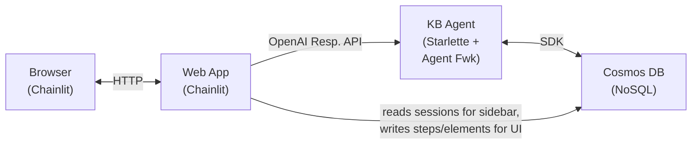

# Agent Memory — Conversation Persistence

## 1. Overview

The application implements an **agent-owned memory** pattern: the agent persists its own conversation history to Cosmos DB via the Microsoft Agent Framework's session persistence, and the web app acts as a thin client that reads from the same store.



**Key design decisions:**

- The **agent owns conversation memory** — it persists and reloads session state via `CosmosAgentSessionRepository`, which subclasses the Agent Framework's `SerializedAgentSessionRepository`.
- The **web app is a thin client** — it passes `conversation_id` via `extra_body` and does not build or trim conversation context.
- Both services share the **same Cosmos DB container** (`agent-sessions`). The agent writes the `session` field; the web app writes `steps`, `elements`, and `userId`.
- A **read-modify-write** pattern ensures neither service overwrites the other's fields.

---

## 2. Cosmos DB Schema

### Infrastructure

Deployed via Bicep (`infra/modules/cosmos-db.bicep`):

| Setting | Value |
|---|---|
| API | NoSQL |
| Capacity mode | Serverless |
| Consistency | Session |
| Database name | `kb-agent` |
| Container name | `agent-sessions` |
| Partition key | `/id` |
| TTL | `-1` (no expiry — sessions persist indefinitely) |
| Local auth | Disabled (Entra-only via managed identity) |

### Document Schema

Each conversation is stored as a single document, jointly owned by the agent and the web app:

```json
{
  "id": "<session-id (UUID)>",
  "userId": "<user-identifier>",
  "name": "<auto-generated title from first user message>",
  "createdAt": "2026-02-26T10:30:00+00:00",
  "updatedAt": "2026-02-26T10:35:12+00:00",
  "session": {
    "state": {
      "messages": [
        { "role": "user", "content": "What is Content Understanding?" },
        { "role": "assistant", "content": "Azure Content Understanding is..." }
      ]
    }
  },
  "steps": [
    {
      "id": "<step-uuid>",
      "threadId": "<thread-id>",
      "type": "user_message",
      "output": "What is Content Understanding?",
      "createdAt": "2026-02-26T10:30:01+00:00"
    },
    {
      "id": "<step-uuid>",
      "threadId": "<thread-id>",
      "type": "assistant_message",
      "output": "Azure Content Understanding is...",
      "createdAt": "2026-02-26T10:30:05+00:00"
    }
  ],
  "elements": [
    {
      "id": "<element-uuid>",
      "threadId": "<thread-id>",
      "type": "text",
      "name": "Ref #1",
      "content": "### Ref #1 — Article Title\n**Section:** ...",
      "display": "side"
    }
  ],
  "metadata": {},
  "tags": []
}
```

**Field ownership:**

| Field | Written by |
|---|---|
| `id` | First writer (agent or web app) |
| `session` | Agent (`CosmosAgentSessionRepository`) |
| `steps`, `elements` | Web app (`CosmosDataLayer`) |
| `userId`, `name`, `updatedAt` | Web app (`CosmosDataLayer`) |

```
┌──────────────────────── agent-sessions container ───────────────────────┐
│                                                                         │
│  Partition: id = "abc-123"                                              │
│  ┌───────────────────────────────────────────────────────┐              │
│  │  id: "abc-123"                                        │              │
│  │  session: { state: { messages: [...] } }  ← agent     │              │
│  │  steps: [ {user_message}, {assistant}, …] ← web app   │              │
│  │  elements: [ {Ref #1}, …]                 ← web app   │              │
│  └───────────────────────────────────────────────────────┘              │
│                                                                         │
└─────────────────────────────────────────────────────────────────────────┘
```

---

## 3. How the Agent Persists Sessions

The agent uses `CosmosAgentSessionRepository` (`src/agent/agent/session_repository.py`), which subclasses `SerializedAgentSessionRepository` from the Azure AI Agent Server SDK.

### Session Repository

```python
class CosmosAgentSessionRepository(SerializedAgentSessionRepository):
    """Persists serialized AgentSession dicts to Cosmos DB.

    The 'agent-sessions' container uses partition key '/id'.
    Each document has:
      - id: conversation_id (partition key)
      - session: serialized session dict from AgentSession.to_dict()
    """
```

### Key Methods

**`read_from_storage(conversation_id)`** — Point-reads the document by `id` and `partition_key`, returning the `session` field. Returns `None` for new conversations.

**`write_to_storage(conversation_id, serialized_session)`** — Uses read-modify-write to preserve fields written by the web app (`userId`, `steps`, `elements`):

```python
async def write_to_storage(self, conversation_id, serialized_session):
    try:
        doc = await container.read_item(
            item=conversation_id, partition_key=conversation_id
        )
    except CosmosResourceNotFoundError:
        doc = {"id": conversation_id}
    doc["session"] = serialized_session
    await container.upsert_item(doc)
```

### Wiring in `main.py`

The `from_agent_framework()` adapter auto-loads sessions before each request and auto-saves after:

```python
session_repo = CosmosAgentSessionRepository(
    endpoint=config.cosmos_endpoint,
    database_name=config.cosmos_database_name,
)
server = from_agent_framework(agent, session_repository=session_repo)
```

The web app passes the `conversation_id` via the OpenAI `extra_body` parameter:

```python
response = client.responses.create(
    model="kb-agent",
    input=message.content,
    stream=True,
    extra_body={"conversation": {"id": thread_id}},
)
```

---

## 4. How the Web App Reads Conversations

`CosmosDataLayer` (`src/web-app/app/data_layer.py`) implements Chainlit's `BaseDataLayer` backed by the same `agent-sessions` container.

### Point Reads

`_read_session_doc(thread_id)` performs a direct point read using `partition_key=thread_id` (since `id == thread_id`):

```python
def _read_session_doc(self, thread_id: str) -> dict | None:
    return self._container.read_item(item=thread_id, partition_key=thread_id)
```

### Listing Threads (Sidebar)

`list_threads()` runs a cross-partition query filtered by `userId`:

```python
query = (
    "SELECT c.id, c.createdAt, c.name, c.userId, c.tags, c.metadata "
    "FROM c WHERE c.userId IN (@cleanId, @prefixedId) "
    "ORDER BY c.updatedAt DESC"
)
```

### Session Message Synthesis

`get_thread()` includes a **fallback**: when no Chainlit steps exist but the agent has written a `session`, it synthesizes steps from the session's messages so earlier turns are visible in the UI:

```python
if not doc.get("steps") and doc.get("session"):
    session = doc["session"]
    state = session.get("state", {})
    messages = state.get("messages", [])
    steps = []
    for i, msg in enumerate(messages):
        role = msg.get("role", "unknown")
        step_type = "user_message" if role == "user" else "assistant_message"
        steps.append({
            "id": f"session-msg-{i}",
            "type": step_type,
            "output": content,
            "createdAt": doc.get("createdAt", ""),
        })
```

This handles the case where a conversation has agent-side history but the web app hasn't yet written Chainlit steps (e.g. after a fresh deployment or migration).

### Steps and Elements

`create_step()` and `create_element()` append to the document's `steps` and `elements` arrays respectively, using upsert. These are written during real-time streaming so the current session has full UI fidelity.

---

## 5. Conversation Resume Flow

When a user clicks a past conversation in the sidebar:

```
User clicks past conversation
       │
       ▼
┌─────────────────────────┐
│ Chainlit calls           │  data_layer.get_thread(thread_id)
│ get_thread()             │  → reads doc from Cosmos (with synthesis fallback)
└────────────┬────────────┘
             │
             ▼
┌─────────────────────────┐
│ on_chat_resume fires     │  Re-creates the agent client
└────────────┬────────────┘  (no local messages rebuild needed)
             │
             ▼
┌─────────────────────────┐
│ User sends a message     │  Web app passes conversation_id via extra_body
└────────────┬────────────┘
             │
             ▼
┌─────────────────────────┐
│ Agent loads session      │  from_agent_framework auto-calls
│ from Cosmos DB           │  read_from_storage(conversation_id)
└────────────┬────────────┘  → full history available for multi-turn
             │
             ▼
┌─────────────────────────┐
│ Agent responds with      │  Conversation context is already in the
│ full history context     │  agent's loaded session
└──────────────────────────┘
```

The `on_chat_resume` handler is minimal — the agent owns the history:

```python
@cl.on_chat_resume
async def on_chat_resume(thread: ThreadDict) -> None:
    client = _create_agent_client()
    cl.user_session.set("client", client)
    cl.user_session.set("user_id", _get_user_id())
```

---

## 6. Graceful Degradation

Both the agent and web app handle a missing or unreachable Cosmos DB gracefully:

**Agent** — If `COSMOS_ENDPOINT` is not set, `session_repository` is `None` and the agent runs statelessly (no cross-session memory, but single-turn requests still work).

**Web App** — The `CosmosDataLayer` constructor catches connection failures and sets `self._container = None`. All data layer methods return empty results when the container is unavailable. The conversation history sidebar is hidden, and in-session streaming still works.

```python
def _get_cosmos_client() -> CosmosClient | None:
    try:
        return CosmosClient(url=config.cosmos_endpoint, credential=DefaultAzureCredential())
    except Exception:
        logger.warning("Could not connect to Cosmos DB — running WITHOUT conversation persistence.")
        return None
```

---

## 7. Summary

| Concern | Implementation |
|---|---|
| **Session persistence** | Agent writes `session` field via `CosmosAgentSessionRepository` |
| **UI persistence** | Web app writes `steps` / `elements` via `CosmosDataLayer` |
| **Persistent storage** | Cosmos DB NoSQL, serverless, `agent-sessions` container |
| **Partition key** | `/id` (session UUID) |
| **Document model** | One document per thread — `session`, `steps`, `elements` coexist |
| **Multi-turn support** | Agent Framework auto-loads/saves via `from_agent_framework(session_repository=...)` |
| **Conversation ID passing** | Web app sends `extra_body={"conversation": {"id": thread_id}}` |
| **Resuming** | `on_chat_resume()` re-creates client; agent loads history from Cosmos on next message |
| **Synthesis fallback** | `get_thread()` synthesizes steps from `session.state.messages` when no stored steps exist |
| **Auth** | Azure Easy Auth headers or `"local-user"` fallback |
| **Degradation** | Both agent and web app run without persistence if Cosmos DB is unavailable |
