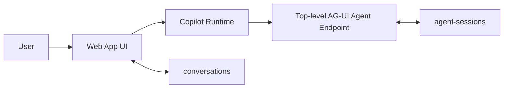
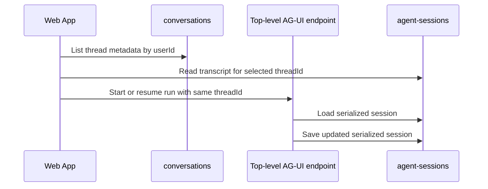

# Agent Sessions — Canonical Conversation Persistence

> **Status:** Current implementation reflects Epic 016.
> **Purpose:** Define the agent-owned persistence model for `agent-sessions`, the canonical transcript store for user-visible conversations.
> **Companion specs:** `docs/specs/conversations-state-model.md` defines ownership boundaries across the web app, AG-UI, workflows, and specialists. `docs/specs/infrastructure.md` defines the Cosmos DB provisioning.

## 1. Scope

This spec covers:

- the canonical role of `agent-sessions`
- the serialized session document owned by the top-level agent endpoint
- load/save behavior through `CosmosAgentSessionRepository`
- compaction and resume behavior
- the read-only hydration contract used by the web app
- the compact search-result contract used for resumed citation rendering

This spec does not cover:

- the full UI metadata model for `conversations`
- workflow checkpoint schemas
- deprecated legacy containers beyond noting that they are not part of the active runtime path

## 2. Current Model

The current application uses a single canonical transcript per user-visible conversation:

- one user-visible conversation maps to one AG-UI `threadId`
- the top-level AG-UI agent endpoint owns the canonical transcript for that thread
- `agent-sessions` is the authoritative store for the transcript and session state needed for resume and follow-up turns
- the web app owns only lightweight `conversations` metadata and may read stored transcript data through a read-only hydration route
- workflow runtimes may keep shared or specialist-local state, but that state is backend-internal and non-canonical



## 3. Active Stores

### 3.1 `agent-sessions`

| Setting | Value |
|---|---|
| Container name | `agent-sessions` |
| Partition key | `/id` |
| TTL | `-1` (no expiry) |
| Owner | Agent (`CosmosAgentSessionRepository`) |
| Canonical for resume | Yes |

One document represents the serialized session for one user-visible conversation.

```json
{
  "id": "<conversation-id>",
  "session": {
    "service_session_id": "<provider-session-id>",
    "state": {
      "messages": [
        { "role": "user", "content": "What is Content Understanding?" },
        { "role": "assistant", "content": "Azure Content Understanding is..." }
      ]
    }
  }
}
```

The exact serialized shape can vary by framework adapter or release. Readers that hydrate stored history must tolerate the supported message-bearing shapes that can appear in the serialized session, including:

- `session.messages`
- `session.state.messages`
- `session.state.in_memory.messages`

That flexibility is a read-model concern only. Ownership does not change: the agent still owns the canonical stored transcript.

### 3.1.1 Stored search tool results are compact by design

The live `search_knowledge_base` tool returns full chunk content so the agent can answer with grounded text and images during the active turn. Persisted transcript state is intentionally slimmer.

Before `CosmosAgentSessionRepository` upserts a serialized session, search tool messages are rewritten to a compact citation form that preserves:

- `ref_number`
- `chunk_id`
- `article_id`
- `chunk_index`
- `indexed_at`
- `title`
- `section_header`
- `summary`
- proxy-safe image metadata
- `content_source: "summary"`

The stored `content` field in that compact form is a summary-sized preview, not the original full chunk body.

Example compact stored row:

```json
{
  "ref_number": 1,
  "chunk_id": "azure-ai-search_3",
  "article_id": "azure-ai-search",
  "chunk_index": 3,
  "indexed_at": "2026-04-01T00:00:00Z",
  "title": "Azure AI Search overview",
  "section_header": "Agentic retrieval",
  "summary": "Agentic retrieval lets the system plan and refine search steps.",
  "content": "Agentic retrieval lets the system plan and refine search steps.",
  "content_source": "summary"
}
```

This keeps the canonical transcript resumable without forcing large raw search payloads to remain in long-term session storage.

### 3.2 `conversations` (related but non-canonical)

| Setting | Value |
|---|---|
| Container name | `conversations` |
| Partition key | `/userId` |
| Owner | Web app |
| Canonical for resume | No |

`conversations` stores sidebar metadata only. It is intentionally not a second transcript store.

## 4. Ownership Rules

The persistence boundary is strict:

- the agent is the sole write owner of `agent-sessions`
- the web app may read `agent-sessions` only through read-only hydration paths
- the web app owns only `conversations` metadata such as title, timestamps, and user ownership
- workflows may coordinate shared state and specialists may keep local state, but those stores do not become authoritative transcript stores for the same user-visible conversation
- no service may introduce a second durable transcript store that can drift from `agent-sessions`

## 5. Persistence Flow

### 5.1 New conversation

1. The web app creates or selects a `threadId`.
2. The web app creates a lightweight `conversations` record for sidebar metadata.
3. The Copilot Runtime sends the run to the AG-UI endpoint with the same `threadId`.
4. The agent loads any existing session from `agent-sessions`, executes the turn, and saves the updated serialized session back to `agent-sessions`.

### 5.2 Resume conversation

1. The web app lists conversations from `conversations`.
2. The web app reads stored transcript data for the selected `threadId` through a read-only route backed by `agent-sessions`.
3. The UI hydrates the structured transcript into CopilotKit.
4. Follow-up turns reuse the same `threadId`, so the agent resumes from the same canonical session.
5. If the user asks to inspect a cited source more closely, the web app can call a read-only proxy route that asks the agent to resolve the stored `chunk_id` for that thread and return the current chunk content when still available.



## 6. Session Repository and Compaction

The agent uses `CosmosAgentSessionRepository` in `src/agent/agent/session_repository.py`, a subclass of `SerializedAgentSessionRepository`.

Core behavior:

- `read_from_storage(conversation_id)` point-reads the document by `id`
- `write_to_storage(conversation_id, serialized_session)` compacts persisted search tool results, then directly upserts `{ "id": conversation_id, "session": serialized_session }`
- the repository does not preserve web-app-owned fields because none are stored in this container

The repository is wired through `from_agent_framework(agent, session_repository=...)`, so sessions auto-load before a request and auto-save after the turn completes.

The active compaction strategy keeps the LLM context bounded:

- `SlidingWindowStrategy` trims older turn groups before generation
- `ToolResultCompactionStrategy` excludes older tool outputs after generation
- `InMemoryHistoryProvider(skip_excluded=True)` prevents excluded content from being replayed into later turns

Compaction changes what the model sees during execution. It does not transfer transcript ownership to another store.

### 6.1 Citation enrichment after resume

Compact persisted search results are sufficient for canonical resume, but they are not always sufficient for rich source inspection in the UI.

To bridge that gap without creating a second transcript store:

- the web app reads compact search-result rows from `agent-sessions`
- the web app may call its own authenticated proxy route for a specific `threadId`, `toolCallId`, and `ref_number`
- that proxy calls an agent-owned citation lookup endpoint
- the agent resolves the stored compact row from the canonical transcript, re-applies the current department-scoped security filter, and reloads the chunk by `chunk_id`

This enrichment path is:

- read-only
- display-only
- thread-scoped
- non-canonical

If the chunk is missing or stale, the UI falls back to the stored summary already present in `agent-sessions`.

## 7. Workflow and Specialist State

This spec stays focused on `agent-sessions`, but the ownership rule remains important for future orchestrated workflows:

- the workflow-exposed top-level agent owns the canonical thread in `agent-sessions`
- the workflow runtime may maintain shared orchestration state
- specialist agents may keep optional local state or internal sessions if needed
- those specialist-local stores remain internal and non-canonical

For the full cross-surface model, see `docs/specs/conversations-state-model.md`.

## 8. Graceful Degradation

If the agent cannot connect to Cosmos DB or no session repository is configured, the agent can still serve stateless turns.

Effects:

- live requests still work
- multi-turn resume across requests is unavailable
- the UI may still show metadata from `conversations`, but canonical transcript recovery depends on `agent-sessions`

## 9. Summary

| Concern | Current rule |
|---|---|
| Canonical transcript owner | Top-level AG-UI agent endpoint |
| Canonical transcript store | `agent-sessions` |
| Web app durable ownership | `conversations` metadata only |
| Resume source of truth | Stored serialized session in `agent-sessions` |
| Stored search tool payload | Compact handles + summaries, not full chunk bodies |
| Full chunk inspection after resume | Agent-owned citation lookup via read-only proxy |
| Specialist-local state | Allowed internally, never canonical |
| Deprecated `messages` / `references` containers | Not part of the active runtime path |