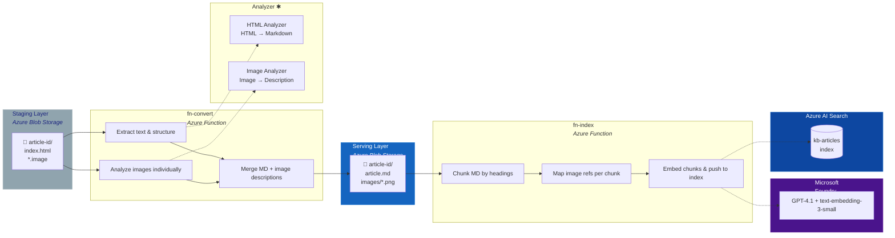
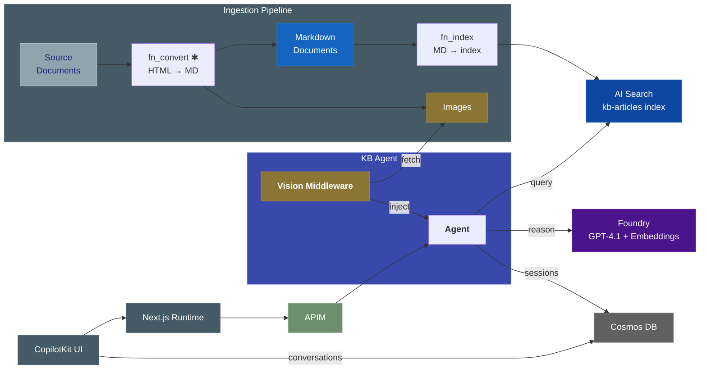
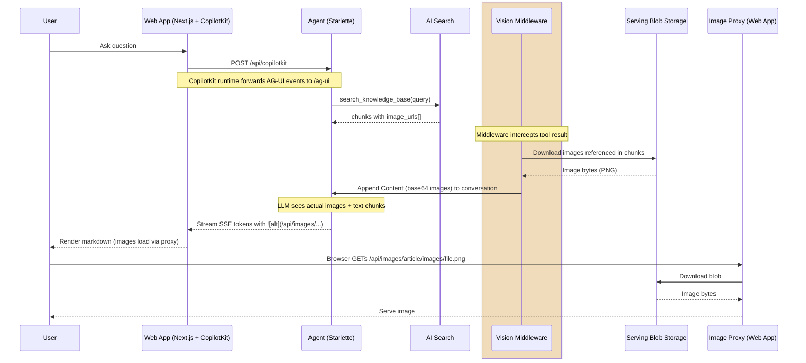

# Architecture

> **Status:** Updated — April 7, 2026

## Overview

The solution is a two-stage Azure Functions pipeline that transforms HTML knowledge base articles into an AI-searchable index with image support.

- **Stage 1 (`fn-convert`)** — Converts source articles (HTML + images) into clean Markdown with AI-generated image descriptions, outputting to a normalized serving layer. Three interchangeable backends are available: **Content Understanding** (`fn_convert_cu`), **Mistral Document AI** (`fn_convert_mistral`), and **MarkItDown** (`fn_convert_markitdown`), selected at runtime via the `analyzer=` Makefile argument.
- **Stage 2 (`fn-index`)** — Chunks the Markdown, embeds it, and pushes chunks + image references into Azure AI Search.

The two stages are decoupled by a **serving layer** (Blob Storage), making `fn-index` source-format agnostic. Future source types (PDF, audio, PowerPoint) only require new `fn-convert` variants — `fn-index` stays unchanged.

## Pipeline Flow


```mermaid
flowchart LR
    subgraph Staging["Staging Layer<br/><i>Azure Blob Storage</i>"]
        SRC["📁 article-id/<br/>index.html<br/>*.image"]
    end

    subgraph Convert["fn-convert<br/><i>Azure Function</i>"]
        C2["Extract text & structure"]
        C3["Analyze images individually"]
        C4["Merge MD + image descriptions"]
    end

    subgraph Analyzer["Analyzer ✱"]
        A1["HTML Analyzer<br/>HTML → Markdown"]
        A2["Image Analyzer<br/>Image → Description"]
    end

    subgraph Serving["Serving Layer<br/><i>Azure Blob Storage</i>"]
        OUT["📁 article-id/<br/>article.md<br/>images/*.png"]
    end

    subgraph Index["fn-index<br/><i>Azure Function</i>"]
        I1["Chunk MD by headings"]
        I2["Map image refs per chunk"]
        I3["Embed chunks & push to index"]
    end

    subgraph Embed["Microsoft<br/>Foundry"]
        EMB["GPT-4.1 + text-embedding-3-small"]
    end

    subgraph Search["Azure AI Search"]
        IDX[("kb-articles<br/>index")]
    end

    SRC --> C2 --> C4
    SRC --> C3 --> C4
    C2 -.-> A1
    C3 -.-> A2
    C4 --> OUT
    OUT --> I1 --> I2 --> I3
    I3 -.-> EMB
    I3 -.-> IDX

    style Staging fill:#90a4ae,stroke:#b0bec5,color:#1a237e
    style Serving fill:#1565c0,stroke:#1976d2,color:#ffffff
    style Search fill:#0d47a1,stroke:#1565c0,color:#ffffff
    style Embed fill:#4a148c,stroke:#6a1b9a,color:#ffffff
```

**✱ Analyzer** — three interchangeable backends, selected at runtime via `analyzer=`:

| Component | Content Understanding (`fn_convert_cu`) | Mistral Document AI (`fn_convert_mistral`) | MarkItDown (`fn_convert_markitdown`) |
|---|---|---|---|
| **HTML Analyzer** | CU `prebuilt-documentSearch` (HTML-direct) | Playwright HTML → PDF + Mistral OCR (`mistral-document-ai-2512`) | MarkItDown library (local Python, no cloud API) |
| **Image Analyzer** | Custom CU `kb-image-analyzer` (GPT-4.1) | GPT-4.1 vision (direct calls, same prompt schema) | GPT-4.1 vision (direct calls, same prompt schema) |

## Azure Services Map


```mermaid
flowchart LR
    subgraph Pipeline["Ingestion Pipeline"]
        SA1["Source<br/>Documents"] --> CVT["fn_convert ✱<br/>HTML → MD"] --> SA2["Markdown<br/>Documents"] --> IDX["fn_index<br/>MD → index"]
        CVT --> IMG["Images"]
    end

    IDX --> AIS["AI Search<br/>kb-articles index"]

    subgraph AgentSvc["KB Agent"]
        AGENT["<b>Agent</b>"]
        VIS["<b>Vision Middleware</b>"]
    end

    AGENT -->|query| AIS
    AGENT -->|reason| AF["Foundry<br/>GPT-4.1 + Embeddings"]
    VIS -->|fetch| IMG
    VIS -->|inject| AGENT
    AGENT -->|sessions| COSMOS["Cosmos DB"]

    CHAT["CopilotKit UI"] --> WEBAPP["Next.js Runtime"] --> APIM["APIM"] --> AGENT
    CHAT -->|conversations| COSMOS

    style AgentSvc fill:#3949ab,stroke:#5c6bc0,color:#ffffff
    style Pipeline fill:#455a64,stroke:#546e7a,color:#ffffff
    style APIM fill:#6d8f6d,stroke:#8aac8a,color:#ffffff
    style COSMOS fill:#616161,stroke:#757575,color:#ffffff
    style SA2 fill:#1565c0,stroke:#1976d2,color:#ffffff
    style SA1 fill:#90a4ae,stroke:#b0bec5,color:#1a237e
    style AIS fill:#0d47a1,stroke:#1565c0,color:#ffffff
    style VIS fill:#8b7535,stroke:#a6893f,color:#ffffff
    style IMG fill:#8b7535,stroke:#a6893f,color:#ffffff
    style AF fill:#4a148c,stroke:#6a1b9a,color:#ffffff
    style WEBAPP fill:#455a64,stroke:#546e7a,color:#ffffff
    style CHAT fill:#455a64,stroke:#546e7a,color:#ffffff
```

**✱ fn_convert** — three interchangeable converter backends, selected at runtime via `analyzer=`: Content Understanding (`fn_convert_cu`), Mistral Document AI (`fn_convert_mistral`), or MarkItDown (`fn_convert_markitdown`). Each runs as its own Container App. See [Pipeline Flow](#pipeline-flow) for details.

## Context Aware & Vision Grounded KB Agent

The solution consists of two services: a standalone **KB Agent** deployed as an **Azure Container App** (with Foundry integration for tracing and registration) and a **Next.js + CopilotKit** web app that calls the agent via the **AG-UI protocol** through an APIM AI Gateway. The agent owns conversation history — it persists and loads `AgentSession` state via Cosmos DB using the Agent Framework's session persistence model (see [Agent Session](agent-session.md)).

### Agent (Container App)

The agent runs as a Starlette ASGI service on port 8088 (built with `from_agent_framework`), deployed as an Azure Container App with external HTTPS ingress and in-code JWT validation. It exposes four primary endpoints:

| Endpoint | Method | Purpose |
|----------|--------|---------|
| `/liveness` | GET | Container liveness probe |
| `/readiness` | GET | Agent readiness probe |
| `/responses` | POST | OpenAI-compatible Responses API (streaming + non-streaming) |
| `/ag-ui` | POST | AG-UI event stream used by the CopilotKit runtime |
| `/citations/{threadId}/{toolCallId}/{refNumber}` | GET | Reload a cited chunk from the canonical thread using compact transcript handles |

#### Agent Components

- **Orchestrator** — A `HandoffBuilder` workflow (from `agent-framework-orchestrations`) that routes user questions to specialist agents via triage. The orchestrator holds `InMemoryHistoryProvider` and `CompactionProvider` for shared multi-turn context. It politely declines non-Azure questions.
- **Internal Search Agent** — A specialist `Agent` scoped to Azure AI Search and Azure Content Understanding topics. Uses `search_knowledge_base` tool with `SecurityFilterMiddleware`, `VisionImageMiddleware`, and `GroundingMiddleware`. Scope defined in `config/internal-search-agent.yaml`.
- **Web Search Agent** — A specialist `Agent` for other Azure topics. Connects to an MCP web search server (SSE transport) that searches Microsoft Learn documentation. Uses `VisionImageMiddleware` only (no security filter or grounding — web results are public docs).
- **MCP Web Search Server** — A separate Container App exposing `web_search(query)` via MCP SSE transport. The same service runs in dev and prod and queries the Microsoft Learn search API directly.
- **Session Repository** — `CosmosAgentSessionRepository` (subclass of `SerializedAgentSessionRepository`) persists `AgentSession` to Cosmos DB `agent-sessions` container. Wired via `from_agent_framework(agent, session_repository=...)` which auto-loads/saves sessions per request.
- **Search Tool** — Embeds the agent's query with `text-embedding-3-small`, performs hybrid search via `azure-search-documents`, and returns ranked chunks with image references.
- **Citation Lookup API** — Resolves compact stored search-result handles from `agent-sessions` and reloads the matching chunk on demand under the current department-scoped security filter. Used only for post-resume UI enrichment.
- **Vision Middleware** — A `ChatMiddleware` on the Azure OpenAI chat client that intercepts tool results, detects image URLs in the search response JSON, downloads the images from blob storage, and injects them into the LLM conversation as `Content.from_data()` (base64 image payloads). This enables GPT-4.1's vision capabilities — the LLM can **see** the actual images (diagrams, screenshots, architecture charts) and reason about their visual content when composing answers.
- **Grounding Middleware** — A post-generation middleware that appends deterministic `Ref #N` citations and inline image fallbacks when grounded search results exist but the model omitted visible source or image markers.
- **Image Service** — Downloads images from blob storage for the vision middleware. Uses `DefaultAzureCredential` for blob access.

### Web App (Next.js + CopilotKit)

The web app is a Next.js App Router application that uses CopilotKit for chat UI and a server-side runtime route to broker AG-UI traffic to the agent. It does **not** contain any agent logic, search code, or vision middleware — those all live in the agent package.

#### Web App Components

- **CopilotKit Runtime Route** — Next.js API route at `/api/copilotkit` uses `@copilotkit/runtime` and an `HttpAgent` to stream AG-UI events to and from the agent. In deployed environments, the route forwards Easy Auth identity headers and acquires a managed-identity token for the APIM-backed agent endpoint when no user bearer token is present.
- **Conversation Metadata Store** — The web app stores only lightweight sidebar metadata in the `conversations` Cosmos container. The agent exclusively owns `agent-sessions`, which remains the source of truth for turn history.
- **Image Proxy** — A Next.js route handler at `/api/images/...` downloads images from the serving blob account on demand and serves them from the same origin.
- **Citation Proxy** — A Next.js route handler at `/api/conversations/{threadId}/citations/{toolCallId}/{refNumber}` validates thread ownership, forwards identity headers to the agent, and proxies the agent-owned citation lookup response back to the browser.
- **Transcript Hydration** — A history hydrator restores stored assistant, reasoning, and tool messages from `agent-sessions` so resumed threads render with the same structured transcript model as live chats.
- **Message and Tool Renderers** — Custom renderers surface reasoning blocks, running/completed `search_knowledge_base` activity, normalized citations, proxy-backed inline images, and lazy citation enrichment for compact stored search results inline in the CopilotKit chat flow.
- **CopilotKit Chat UI** — Streaming chat interface with CopilotKit components, starter prompts, conversation sidebar, and same-origin markdown image rendering.

### Conversation Flow

```
User message → Web App → POST /api/copilotkit
                       → Next.js runtime route → APIM proxy → Agent `/ag-ui`
                       → AG-UI adapter loads AgentSession from Cosmos using threadId
                       → ChatAgent.run_stream() (with full history from session)
                                         → search_knowledge_base tool
                                         → Vision middleware (download + inject images)
                                         → LLM response (streamed AG-UI events)
                       → AG-UI adapter saves AgentSession to Cosmos
                       ← Stream events to CopilotKit UI
                       → Web app stores sidebar metadata in `conversations`
```

### Resume and Citation Enrichment Flow

```
User selects thread → Web App loads compact transcript from `agent-sessions`
                   → CopilotKit renders stored summary-sized citation rows
User opens a citation → Web App GET /api/conversations/{threadId}/citations/{toolCallId}/{refNumber}
                     → Web App validates thread ownership
                     → Web App forwards request to Agent `/citations/{threadId}/{toolCallId}/{refNumber}`
                     → Agent resolves compact row from canonical transcript
                     → Agent reloads chunk from AI Search with current security filter
                     ← Ready / stale / missing citation payload
                     ← Web App enriches the visible citation card only
```

### Image Flow: From Index to Browser

The image-aware chunks created by the ingestion pipeline (Epic 001) are the foundation of the vision-grounded capabilities. Here is the end-to-end flow across both services:


```mermaid
sequenceDiagram
    participant User
    participant WebApp as Web App (Next.js + CopilotKit)
    participant Agent as Agent (Starlette)
    participant Search as AI Search
    box rgba(249, 168, 37, 0.25)
        participant VisionMW as Vision Middleware
    end
    participant Blob as Serving Blob Storage
    participant Proxy as Image Proxy (Web App)

    User->>WebApp: Ask question
    WebApp->>Agent: POST /api/copilotkit
    Note over WebApp,Agent: CopilotKit runtime forwards AG-UI events to /ag-ui
    Agent->>Search: search_knowledge_base(query)
    Search-->>Agent: chunks with image_urls[]

    Note over VisionMW: Middleware intercepts tool result
    VisionMW->>Blob: Download images referenced in chunks
    Blob-->>VisionMW: Image bytes (PNG)
    VisionMW->>Agent: Append Content (base64 images) to conversation

    Note over Agent: LLM sees actual images + text chunks
    Agent-->>WebApp: Stream SSE tokens with ![alt](/api/images/...)
    WebApp-->>User: Render markdown (images load via proxy)

    User->>Proxy: Browser GETs /api/images/article/images/file.png
    Proxy->>Blob: Download blob
    Blob-->>Proxy: Image bytes
    Proxy-->>User: Serve image
```

**Key insight:** Each search chunk carries an `image_urls` array of blob paths. This is used twice:
1. **Vision middleware** downloads the images and injects them as base64 `Content.from_data()` into the LLM conversation — the LLM can *see* diagrams and screenshots.
2. **Search tool** converts the blob paths to `/api/images/...` proxy URLs in the tool result JSON — the LLM copies these URLs into its markdown output for the browser to render.

### Image URL Normalisation

Despite explicit system prompt instructions, LLMs generate image URLs in many creative formats. The post-processing normaliser handles all observed patterns:

| LLM Output | Normalised To |
|---|---|
| `/api/images/article/images/file.png` | `/api/images/article/images/file.png` (already correct) |
| `api/images/article/images/file.png` | `/api/images/article/images/file.png` (add leading `/`) |
| `https://learn.microsoft.com/api/images/article/images/file.png` | `/api/images/article/images/file.png` (strip domain) |
| `attachment:/api/images/article/images/file.png` | `/api/images/article/images/file.png` (strip prefix) |
| `attachment:file.png` | `/api/images/article/images/file.png` (filename lookup from citations) |
| `https://learn.microsoft.com/en-us/azure/.../file.png` | `/api/images/article/images/file.png` (filename lookup from citations) |

### Key Design Decisions

| # | Decision | Rationale |
|---|----------|-----------|
| 1 | Two-service split (Agent + Web App) | Agent is a standalone Container App with its own managed identity and RBAC. Web app remains a thin client — it may proxy citation enrichment requests, but search and transcript-owned chunk resolution stay in the agent. |
| 2 | Microsoft Agent Framework | Provides `Agent` with built-in tool calling, conversation threading, and Azure OpenAI integration — avoids manual Responses API loop management. |
| 3 | AG-UI integration | Web app calls agent via a Next.js CopilotKit runtime route backed by AG-UI `HttpAgent`. Standard thread-based protocol, local dev uses plain HTTP, deployed uses APIM proxy with Entra bearer token. |
| 4 | Vision middleware for image injection | `ChatMiddleware` intercepts tool results and injects images as `Content.from_data()`. The framework auto-converts to OpenAI's vision format. The LLM can reason about visual content (diagrams, architecture charts) not just text descriptions — producing higher-fidelity answers. |
| 5 | Agent-owned conversation persistence | Agent persists `AgentSession` to Cosmos DB `agent-sessions` container (partition key `/id`) via `CosmosAgentSessionRepository`. Stored search tool results are compacted to stable chunk handles plus summaries, and the web app reloads fuller source detail only through an agent-owned citation lookup path. See [Agent Session](agent-session.md). |
| 6 | Same-origin image proxy | Avoids SAS URL complexity (token expiry, CORS). CopilotKit renders markdown image links through the browser, which fetches from the same-origin proxy route. |
| 7 | Agent-owned turns, web-owned sidebar metadata | The agent persists full turn history in `agent-sessions`. The web app persists only thread metadata in `conversations`, which keeps the BFF thin and avoids duplicating message storage. |
| 8 | Hybrid search | Best relevance — combines vector similarity and keyword matching. |
| 9 | CopilotKit + Next.js | Purpose-built AG-UI chat stack with prebuilt chat components, live tool rendering, and App Router route handlers for runtime and image proxy flows. |
| 10 | AI Gateway (APIM) | Centralised API gateway for agent traffic. Enables Foundry agent registration (requires APIM connection), provides a stable proxy URL, and supports future rate limiting, monitoring, and access control. BasicV2 SKU for dev/test (~$50/month). |
| 11 | Contextual tool filtering | Out-of-band security context propagation via `ContextVar` → `FunctionMiddleware` → `**kwargs`. JWT claims are extracted at the HTTP boundary, enriched by a middleware that resolves group GUIDs to department names, and forwarded to tools as plain kwargs. Tools build backend-specific OData filters. The LLM never sees the filter context. See [Contextual Tool Filtering spec](contextual-tool-filtering.md). |

For implementation details, see [Epic 002](../epics/002-kb-search-web-app.md) and [Epic 005](../epics/005-hosted-agent-foundry.md).

### Deployment

The solution deploys **six services**: 4 function Container Apps (one per pipeline function), an agent Container App, and a Next.js web app.

1. **Function Apps** — 4 independent Container Apps, one per pipeline function, each with its own Docker image and managed identity. See [Function Apps Deployment](#function-apps-deployment-container-apps) below.
2. **Agent** — Deployed as a **standard Azure Container App** (`agent-{project}-{env}`) with external HTTPS ingress and in-code JWT validation on port 8088. System-assigned managed identity with RBAC for AI Services, AI Search, and Serving Storage. Foundry project retained for tracing and agent registration.
3. **Web App** — Deployed to **Azure Container Apps** with **Entra ID Easy Auth** (single-tenant).

#### Agent Deployment (Container App)

- **Container image** built from `src/agent/Dockerfile` (Python 3.12, Starlette + uvicorn, port 8088)
- **AZD service** defined in `infra/azure/azure.yaml` as `host: containerapp`, `language: python`
- **Infrastructure** defined in `infra/azure/infra/modules/agent-container-app.bicep`: external HTTPS ingress with JWT auth, 1.0 CPU / 2 GiB memory, system-assigned managed identity
- **RBAC** (Bicep-managed): Cognitive Services User + Azure AI User on AI Services, Search Index Data Reader + Search Service Contributor on AI Search, Storage Blob Data Reader on Serving Storage
- **Deployment** via `azd -C infra/azure deploy --service agent` — builds Docker image in ACR, deploys to Container Apps
- **Registration** (optional): `bash scripts/register-agent.sh` registers the agent in Foundry portal (Operate → Assets) for visibility
- **AI Gateway**: APIM (`apim-{project}-{env}`, BasicV2) proxies all external agent traffic. Foundry registers the agent via the APIM gateway connection.
- **Foundry integration**: Foundry project retained for App Insights tracing (`APPLICATIONINSIGHTS_CONNECTION_STRING` + `OTEL_SERVICE_NAME=kb-agent`); no ACR connection or capability host
- **Agent endpoint**: internal FQDN `http://agent-{project}-{env}.internal.{cae-domain}` for direct access; registered APIM proxy URL for gateway routing (set by `configure-app-agent-endpoint.sh`)

See [ARD-005](../ards/ARD-005-foundry-hosted-agent.md), [ARD-009](../ards/ARD-009-agent-container-apps.md), [ARD-010](../ards/ARD-010-agent-external-auth-gateway.md), and [Research 006](../research/006-foundry-hosted-agent-deployment.md) for deployment history.

#### Function Apps Deployment (Container Apps)

The ingestion pipeline is deployed as **4 independent Container Apps**, each with its own Docker image, managed identity, and RBAC:

| Service (`infra/azure/azure.yaml`) | Container App | Dockerfile | Playwright |
|---|---|---|---|
| `func-convert-cu` | `func-cvt-cu-{project}-{env}` | `fn_convert_cu/Dockerfile` | No |
| `func-convert-mistral` | `func-cvt-mis-{project}-{env}` | `fn_convert_mistral/Dockerfile` | Yes |
| `func-convert-markitdown` | `func-cvt-mit-{project}-{env}` | `fn_convert_markitdown/Dockerfile` | No |
| `func-index` | `func-idx-{project}-{env}` | `fn_index/Dockerfile` | No |

Each Container App is deployed independently via `azd -C infra/azure deploy --service <service-name>`, using separate Docker images built from per-function Dockerfiles. Only `fn_convert_mistral` includes Playwright/Chromium.

See [ARD-008](../ards/ARD-008-per-function-containers.md) for the decision rationale.

#### Web App Deployment (Container Apps)

- **Container image** built from `src/web-app/Dockerfile` and pushed to **Azure Container Registry** (Basic SKU)
- **Container App** runs on a Consumption-plan **Container Apps Environment** linked to Log Analytics
- Single container: 0.5 vCPU / 1 GiB memory, scale 0–1 (scale-to-zero for cost savings)
- Ingress: external, port 3000, HTTPS-only
- Application settings (agent endpoint, Cosmos endpoint, and Blob endpoint) injected as environment variables from Bicep outputs

#### Authentication — Entra ID Easy Auth

Authentication uses a platform-level Easy Auth layer plus header parsing inside the web app:

1. **Easy Auth (platform-level)** — Container Apps Easy Auth is a sidecar that intercepts all HTTP requests before they reach the application container. Unauthenticated requests are auto-redirected to Microsoft Entra login. After sign-in, Entra issues a token; Easy Auth validates it (single-tenant) and forwards the authenticated request with `X-MS-CLIENT-PRINCIPAL-ID` headers.

2. **Header-based user context (application-level)** — The Next.js backend decodes `X-MS-CLIENT-PRINCIPAL*` headers to recover the authenticated user and security groups. It uses this identity to scope sidebar metadata and forwards `X-User-Groups` to the agent for contextual tool filtering.

The web app uses a 2-tier identity resolution:
- **Tier 1:** Easy Auth principal headers (`X-MS-CLIENT-PRINCIPAL*`) — OID and group claims from the sidecar
- **Tier 2:** Fallback to `local-user` — local development without authentication

Only users in the Azure AD tenant can access the app. An **Entra App Registration** (single-tenant) defines the client ID, tenant ID, and Easy Auth redirect URI. The `scripts/setup-entra-auth.sh` script automates app registration creation and ensures the Container Apps Easy Auth callback is registered.

#### Managed Identity RBAC

Each service has its own identity with least-privilege roles.

**Agent Container App Managed Identity**:

| Role | Resource | Purpose |
|------|----------|---------|
| Cognitive Services User | AI Services | Access AI Services APIs |
| Azure AI User | AI Services | Azure AI platform access |
| Search Index Data Reader | AI Search | Query the `kb-articles` index |
| Search Service Contributor | AI Search | Manage search indexes |
| Storage Blob Data Reader | Serving Storage | Download article images for vision middleware |
| Cosmos DB Built-in Data Contributor | Cosmos DB | Read/write agent sessions (conversation history) |
| AcrPull | Container Registry | Pull the agent Docker image |

**Web App Container App Managed Identity**:

| Role | Resource | Purpose |
|------|----------|---------|
| Cognitive Services OpenAI User | AI Services | Call agent via Responses API |
| Storage Blob Data Reader | Serving Storage | Download article images via proxy |
| Cosmos DB Built-in Data Contributor | Cosmos DB | Read/write sessions (steps, elements, sidebar) |
| AcrPull | Container Registry | Pull Docker images |

For infrastructure details, see [Infrastructure](../specs/infrastructure.md). For deployment epics, see [Epic 003](../epics/003-web-app-azure-deployment.md) and [Epic 005](../epics/005-hosted-agent-foundry.md).

### Agent Registration & Gateway Routing

Agent registration and web app routing use a post-deploy script sequence:

1. **`scripts/register-agent.sh`** — Registers the agent in Foundry via the AI Gateway (APIM). Verifies APIM connection exists, PUTs to the applications API with the agent's external HTTPS URL, and captures the Foundry-generated proxy URL as `AGENT_REGISTERED_URL` in AZD env.
2. **`scripts/configure-app-agent-endpoint.sh`** — Updates the web app Container App's `AGENT_ENDPOINT` env var to the registered proxy URL. This switches the web app from internal FQDN to gateway routing.

The web app's `_create_agent_client()` detects `https://` endpoints and acquires Entra bearer tokens via `DefaultAzureCredential`. Local dev uses `http://localhost:8088` with no auth.

```
make prod-up
# → prod-setup → prod-infra-up → prod-services-up → prod-pipeline → prod-ui-url
```

---

## Stage 1: `fn-convert` — Detail

`fn-convert` transforms a source HTML article into a clean Markdown file with AI-generated image descriptions placed in their original document context, plus the source images renamed as PNGs.

There are **three interchangeable backend implementations** that share the same input/output contract:

| Backend | Module | Approach | Gateway-Compatible |
|---------|--------|----------|--------------------|
| **Content Understanding** | `fn_convert_cu` | HTML-direct text extraction via CU `prebuilt-documentSearch`, individual image analysis via custom `kb-image-analyzer` | No — CU's internal LLM calls are opaque |
| **Mistral Document AI** | `fn_convert_mistral` | HTML → PDF rendering (Playwright) with `[[IMG:filename]]` markers, Mistral OCR for text extraction, GPT-4.1 vision for image descriptions | Yes — both OCR and GPT-4.1 are standard Foundry endpoints |
| **MarkItDown** | `fn_convert_markitdown` | Local Python HTML → Markdown via [MarkItDown](https://github.com/microsoft/markitdown) library, GPT-4.1 vision for image descriptions | Partial — text extraction is local (no API); GPT-4.1 is a standard Foundry endpoint |

All three backends produce the same output: `article.md` + `images/` folder + `metadata.json` in the serving layer. `fn-index` is completely unaware of which backend generated the content — the serving layer is the contract boundary. The `metadata.json` file carries index-level metadata (e.g. `department`) that `fn-convert` extracts from the staging path and `fn-index` reads to populate search index fields.

The backend is selected at runtime via the `analyzer=` Makefile argument:
```bash
make convert analyzer=content-understanding   # uses fn_convert_cu
make convert analyzer=mistral-doc-ai          # uses fn_convert_mistral
make convert analyzer=markitdown              # uses fn_convert_markitdown
```

### Content Understanding Backend (`fn_convert_cu`)

#### Why HTML-Direct (No PDF Conversion)

Content Understanding processes HTML directly for text extraction with high quality — headings, paragraphs, tables, and an AI-generated summary are all faithfully produced. However, CU does **not** detect figures or hyperlinks from HTML input (figure analysis is only supported for PDF and image file formats). Rather than converting HTML → PDF to unlock CU's figure detection — which adds complexity (Playwright/Chromium), degrades image quality (rasterize + re-crop), and introduces fragile bounding-polygon parsing — we process HTML for text and analyze each image individually through CU. This yields better image descriptions (each image gets dedicated analysis with a domain-tuned prompt) and preserves the original image quality.

### Sub-Steps

| Step | What Happens |
|------|-------------|
| **1a. HTML → CU** | Send the article HTML to `prebuilt-documentSearch` (content type `text/html`). Returns Markdown with text, tables, headings, and a Summary field. |
| **1b. Parse HTML DOM** | Use BeautifulSoup to extract an **image map** (each `` tag's filename + its position in the document hierarchy) and a **link map** (each `<a href>` tag's label + URL). |
| **2. Analyze images** | Send each image file (the `.image` files are PNGs, 13–40 KB each) individually to the custom `kb-image-analyzer`. Returns a `Description`, `UIElements`, and `NavigationPath` per image. |
| **3. Merge & reconstruct** | Start with the CU Markdown from step 1a. Re-inject hyperlinks by text-matching link labels from the link map. Insert image description blocks at the correct positions using the image map. Each image block links to the PNG in the `images/` subfolder. |
| **4. Write outputs** | Write `article.md` + copy/rename `.image` files to `images/<filename>.png` in the serving layer. |

### Image Position Matching

The source HTML articles are DITA-generated with a consistent structure: images appear inside step `<div class="info">` blocks, always following a step instruction. The CU Markdown preserves the same text almost verbatim (confirmed empirically). The matching approach:

1. Walk the HTML DOM to build an ordered list of `(preceding_text, image_filename)` pairs
2. For each image, find the preceding text in the CU Markdown
3. Insert the image description block immediately after the matched text

This works reliably because each image follows a unique step instruction, making text matching unambiguous.

### Hyperlink Recovery

CU strips hyperlink URLs from HTML input (the link label text survives but the URL is lost). We recover them from the HTML DOM directly: for each `<a href>` tag, we record the link text and URL, then find the matching text in the CU Markdown and wrap it as a proper Markdown link.

### Image Analysis — Custom Analyzer

Each image is analyzed individually through a **custom Content Understanding analyzer** (`kb-image-analyzer`) based on `prebuilt-image`. The analyzer uses a domain-tuned field schema designed for UI screenshots and technical diagrams commonly found in KB articles:

```json
{
  "analyzerId": "kb_image_analyzer",
  "baseAnalyzerId": "prebuilt-image",
  "models": { "completion": "gpt-4.1" },
  "fieldSchema": {
    "fields": {
      "Description": {
        "type": "string",
        "method": "generate",
        "description": "A detailed description of the screenshot or UI image, focusing on: what screen/page is shown, key UI elements visible, any highlighted or annotated areas, navigation steps illustrated, and any text visible in the image."
      },
      "UIElements": {
        "type": "array",
        "method": "generate",
        "description": "List of key UI elements visible in the image (buttons, menus, fields, labels)",
        "items": { "type": "string" }
      },
      "NavigationPath": {
        "type": "string",
        "method": "generate",
        "description": "The navigation path shown in the image, e.g. 'Settings > Security > Manage user security'"
      }
    }
  }
}
```

The custom analyzer produces richer, more contextual descriptions than the generic `prebuilt-documentSearch` — each image gets dedicated analysis with a prompt tuned for UI screenshots. The extracted `UIElements` and `NavigationPath` fields further enrich the Markdown output and improve search relevance.

The analyzer definition is stored in `src/analyzers/definitions/kb-image-analyzer.json` and managed via `src/analyzers/manage_analyzers.py`. It must be created once in the Content Understanding resource before running the pipeline. Note: CU requires model defaults to be set via `manage_analyzers.py setup` — the `deploy` command auto-runs this. CU forbids hyphens in analyzer IDs, so the actual ID is `kb_image_analyzer`.

### Output Format

The resulting `article.md` looks like (excerpt from the Content Understanding overview article):

```markdown
# What is Azure Content Understanding in Foundry Tools?

### Key components of Content Understanding

The Content Understanding framework processes unstructured content through multiple stages,
transforming inputs into structured, actionable outputs. The following table describes each
component from left to right as shown in the diagram:

> **[Image: content-understanding-framework-2025](images/content-understanding-framework-2025.png)**
> This image presents a 'Content Understanding Framework' diagram. It visually explains
> the process of transforming various input types (Documents, Image, Video, Audio) into
> structured output (Markdown or JSON schema) using a series of analyzers.

| Component | Description |
| - | - |
| Inputs | The source content that Content Understanding processes. Supports multiple modalities. |
| Analyzer | The core component that defines how your content is processed. |
| Content extraction | Transforms unstructured input into normalized, structured text and metadata. |

Content Understanding is a [Foundry](https://learn.microsoft.com/en-us/azure/ai-services/what-are-ai-services) service.
```

Image descriptions are inline paragraphs — they stay with their surrounding text through chunking, so the vector embedding naturally captures both the textual context and the image semantics.

### Mistral Document AI Backend (`fn_convert_mistral`)

The Mistral variant takes a fundamentally different approach: instead of processing HTML directly with Content Understanding, it renders the HTML to PDF and uses Mistral Document AI for OCR-based text extraction. This trades CU's native HTML analysis for a pipeline built entirely on standard Foundry model endpoints.

#### Pipeline Steps

| Step | What Happens |
|------|-------------|
| **1. Render PDF** | Replace each `` tag in the HTML with a text marker `[[IMG:filename]]`, inject CSS for clean rendering, then render to PDF via Playwright (headless Chromium). Markers survive the PDF rendering and appear in the OCR output. |
| **2. Mistral OCR** | Send the PDF to Mistral Document AI (`mistral-document-ai-2512`) via the Foundry OCR endpoint. Returns Markdown with text, tables, and structure — plus the `[[IMG:...]]` markers embedded in the text flow. |
| **3. Map image markers** | Scan the OCR Markdown for `[[IMG:filename]]` markers using regex. This maps each image's position in the document without relying on bounding boxes or figure detection. |
| **4. Describe images** | Send each referenced image to GPT-4.1 vision with the same prompt schema used by the CU `kb-image-analyzer` (Description, UIElements, NavigationPath). Uses the OpenAI SDK against the Foundry endpoint. |
| **5. Merge & reconstruct** | Replace each `[[IMG:filename]]` marker with an image description block (`> **[Image: ...](...)**`). Recover hyperlinks stripped during PDF rendering by regex-matching link labels from the original HTML. Copy images to `images/` subfolder. |

#### Key Design Decisions

| # | Decision | Rationale |
|---|----------|-----------|
| 1 | **Marker-based image tracking** | `[[IMG:filename]]` markers injected before PDF rendering survive OCR and provide precise image positioning without bounding-box parsing. Simpler and more reliable than figure detection. |
| 2 | **Playwright for PDF rendering** | Required to convert HTML → PDF for Mistral OCR. Adds a binary dependency (Chromium) but produces high-quality PDF with consistent rendering. |
| 3 | **Standard Foundry endpoints** | Both Mistral OCR and GPT-4.1 vision are standard model endpoints — they can be routed through Azure API Management or any API gateway for monitoring, rate limiting, and access control. |
| 4 | **Same image prompt as CU** | Uses the identical Description/UIElements/NavigationPath schema so image descriptions are comparable across backends. Validated in [spike 002](../spikes/002-mistral-document-ai.md). |

#### Quality Comparison

The spike evaluation across all sample articles showed comparable output quality between the two backends. Key findings:
- Text extraction quality is equivalent — both capture headings, paragraphs, tables, and structure faithfully
- Image descriptions are comparable (both use GPT-4.1 with the same prompt schema)
- Mistral OCR occasionally produces slightly different Markdown formatting (e.g., table alignment) but the semantic content is preserved
- The Mistral variant adds a Playwright/Chromium dependency; the CU variant has no such requirement

For full spike results, see [Spike 002 — Mistral Document AI](../spikes/002-mistral-document-ai.md).

### MarkItDown Backend (`fn_convert_markitdown`)

The MarkItDown variant uses [MarkItDown](https://github.com/microsoft/markitdown), a Microsoft open-source Python library, to convert HTML directly to Markdown with no cloud API calls for text extraction. Image descriptions still use GPT-4.1 vision (same prompt schema as the other backends). This is the fastest, cheapest, and simplest conversion option — only GPT-4.1 vision calls are billed.

#### Pipeline Steps

| Step | What Happens |
|------|-------------|
| **1. HTML → Markdown** | Pass the article HTML to MarkItDown. Returns clean Markdown preserving headings, tables, lists, and hyperlinks natively. No network calls. |
| **2. Extract images** | Parse the HTML DOM with BeautifulSoup to build an image map — each `` tag's filename stem and preceding text context for positioning. |
| **3. Describe images** | Send each referenced image to GPT-4.1 vision with the same prompt schema (Description, UIElements, NavigationPath) used by CU and Mistral backends. |
| **4. Merge & assemble** | Insert image description blocks into the MarkItDown output at correct positions using preceding-text matching. Copy images to `images/` subfolder. |

#### Key Design Decisions

| # | Decision | Rationale |
|---|----------|-----------|
| 1 | **MarkItDown for text extraction** | Local Python — no cloud API calls, no Playwright, no PDF rendering. Fastest and cheapest option for HTML sources. |
| 2 | **DOM-based image positioning** | Same preceding-text matching approach as `fn_convert_cu`. Parse `` tags from the HTML DOM and match their context in the Markdown output. |
| 3 | **Native hyperlink preservation** | MarkItDown converts `<a href>` to Markdown links natively, eliminating the link recovery step required by CU (which strips URLs) and Mistral (OCR loses links). |
| 4 | **Same image prompt as CU/Mistral** | Uses the identical Description/UIElements/NavigationPath schema so image descriptions are comparable across all three backends. |

#### Trade-offs vs Other Backends

| Aspect | MarkItDown | CU | Mistral |
|--------|-----------|-----|---------|
| **Text extraction cost** | Free (local Python) | CU charges | Mistral OCR charges |
| **Text extraction latency** | Milliseconds | Seconds (cloud API) | Seconds (cloud API) |
| **Dependencies** | `markitdown` (pure Python) | `azure-ai-contentunderstanding` | `playwright`, `httpx` |
| **Link handling** | Native (preserved) | Post-processing recovery | Post-processing recovery |
| **Image descriptions** | GPT-4.1 vision | Custom CU analyzer (GPT-4.1) | GPT-4.1 vision |
| **Offline text extraction** | Yes | No | No |
| **Azure infra required** | GPT-4.1 only | AI Services (CU + GPT) | AI Services (Mistral + GPT-4.1) |

For spike results, see [Spike 003 — MarkItDown](../spikes/003-markitdown.md). For the decision rationale, see [ARD-006](../ards/ARD-006-markitdown-analyzer.md).

---

## Stage 2: `fn-index` — Detail

`fn-index` reads processed articles from the serving layer, chunks them, embeds them, and pushes everything to Azure AI Search.

### Chunking Strategy

Split `article.md` by **Markdown headers** (H1, H2, H3). Each header-delimited section becomes one chunk. Each chunk inherits its header hierarchy for context (e.g., a chunk under H3 carries the parent H2 and H1 as metadata).

Image descriptions are treated as paragraphs within their section — they stay with the surrounding text in the same chunk. A single chunk may contain 0, 1, or many image references.

### Image-Aware Chunking

After splitting by headers, each chunk is scanned for image references matching the pattern `[Image: <filename>](images/<filename>.png)`. The matched image paths are resolved to their Blob Storage URLs and collected into the chunk's `image_urls` list.

### Embedding

Chunk text is embedded via the Microsoft Foundry embedding endpoint using `text-embedding-3-small` (1536 dimensions). The image descriptions are part of the chunk text, so they are vectorized naturally alongside the surrounding content — no separate image embedding is needed.

### How It Works for an Agent

When an agent queries the index:

- **Text-only chunks:** `content` has the text, `image_urls` is empty. Agent uses text to answer.
- **Chunks with images:** `content` has section text + inline image descriptions (vectorized together). `image_urls` has 1–N Blob Storage URLs. The agent can reason over the descriptions and, when needed, fetch the actual images for visual grounding — delivering higher-fidelity answers than text alone.

---

## Blob Storage Layout

### Staging Account (source of truth)

```
staging/
  └── {article-id}/
        ├── index.html
        ├── image1.image
        ├── image2.image
        └── ...
```

### Serving Account (processed, agent-accessible)

```
serving/
  └── {article-id}/
        ├── article.md
        ├── metadata.json
        └── images/
              ├── image1.png
              ├── image2.png
              └── ...
```

The `{article-id}` folder name is preserved from the source and stored as `article_id` in the search index, providing traceability from search result back to source article. The serving layer is **flat** — articles are not nested under department folders. Department and other metadata are stored in `metadata.json`.

---

## AI Search Index Schema

```json
{
  "name": "kb-articles",
  "fields": [
    { "name": "id",             "type": "Edm.String",  "key": true },
    { "name": "article_id",     "type": "Edm.String",  "filterable": true },
    { "name": "chunk_index",    "type": "Edm.Int32",   "sortable": true },
    { "name": "content",        "type": "Edm.String",  "searchable": true },
    { "name": "content_vector", "type": "Collection(Edm.Single)",
      "searchable": true, "vectorSearchDimensions": 1536,
      "vectorSearchProfileName": "default-profile" },
    { "name": "image_urls",     "type": "Collection(Edm.String)",
      "filterable": false },
    { "name": "source_url",     "type": "Edm.String",  "filterable": false },
    { "name": "title",          "type": "Edm.String",  "searchable": true },
    { "name": "section_header", "type": "Edm.String",  "filterable": true },
    { "name": "department",     "type": "Edm.String",  "filterable": true },
    { "name": "key_topics",     "type": "Collection(Edm.String)",
      "filterable": true }
  ]
}
```

| Field | Purpose |
|-------|---------|
| `id` | Unique chunk identifier |
| `article_id` | Source article folder name — links back to staging & serving |
| `chunk_index` | Ordering within article |
| `content` | Chunk text including inline image descriptions |
| `content_vector` | Embedding of chunk text (1536d) |
| `image_urls` | 0–N Blob Storage URLs to related images in the serving layer |
| `source_url` | Original HTML article URL if available |
| `title` | Article title |
| `section_header` | H2/H3 heading this chunk belongs to |
| `department` | Department that owns the article. Written by `fn-convert` into `metadata.json` (derived from `kb/staging/{department}/` folder path) and read by `fn-index` to populate this index field. Used for OData security filtering via `SecurityFilterMiddleware`. |
| `key_topics` | Filterable topic tags for the chunk |

---

## Custom Analyzer Lifecycle

The custom `kb-image-analyzer` is not deployed by Bicep infrastructure — it is an **application-level resource** managed by `src/analyzers/manage_analyzers.py`. The analyzer must exist in the Content Understanding resource before `fn-convert` can process images.

### What Needs to Happen

Content Understanding custom analyzers require a two-step setup:

1. **Register CU model defaults** — CU needs to know which model deployments in your AI Services account map to its internal model references. This is a one-time configuration per AI Services resource. Without it, custom analyzers fail to create and prebuilt analyzers (like `prebuilt-documentSearch`) silently return empty results.

2. **Create the analyzer** — Submit the analyzer JSON definition to the CU resource. CU validates the field schema, links the completion model (`gpt-4.1`), and makes the analyzer available for image analysis. The analyzer is an async resource: creation returns a poller that must be polled until `status: "succeeded"`.

Both steps are handled automatically by `manage_analyzers.py deploy`.

### Prerequisites

| Prerequisite | Why |
|---|---|
| **Azure AI Services resource** provisioned (`azd -C infra/azure provision`) | Hosts both Content Understanding and the model deployments |
| **`gpt-4.1` model deployed** | Completion model used by `kb-image-analyzer` to generate image descriptions |
| **`gpt-4.1-mini` + `text-embedding-3-large` models deployed** | Required by `prebuilt-documentSearch` (HTML text extraction). Without either, CU silently returns 0 contents |
| **Cognitive Services User role** on the developer's identity | Required to call CU management APIs via `DefaultAzureCredential` |
| **`.env` configured** with `AI_SERVICES_ENDPOINT` | Points `manage_analyzers.py` to the correct CU resource |

All model deployments are defined in `infra/azure/infra/modules/ai-services.bicep` and provisioned via `azd -C infra/azure provision`.

### Analyzer Definition

The analyzer JSON is version-controlled at `src/analyzers/definitions/kb-image-analyzer.json`. It defines:

- **Base analyzer:** `prebuilt-image` (CU's image analysis foundation)
- **Completion model:** `gpt-4.1` (generates field values from image content)
- **Field schema:** Three `method: "generate"` fields — `Description`, `UIElements`, `NavigationPath`

> **ID constraint:** CU forbids hyphens in analyzer IDs. The file is named `kb-image-analyzer.json` but the actual analyzer ID registered in CU is `kb_image_analyzer`.

### Management Commands

The CLI (`src/analyzers/manage_analyzers.py`) provides four subcommands:

| Command | What It Does |
|---|---|
| `python -m manage_analyzers setup` | Registers model deployment mappings as CU defaults. Uses JSON Merge Patch to add new mappings and remove stale ones. Idempotent. |
| `python -m manage_analyzers deploy` | **Auto-runs `setup` first**, then creates or updates the analyzer from `src/analyzers/definitions/kb-image-analyzer.json`. Uses `allow_replace=True` so re-running is safe. |
| `python -m manage_analyzers status` | Checks if the analyzer exists and prints its status and field names. |
| `python -m manage_analyzers delete` | Deletes the analyzer from CU. No-ops if already deleted. |

All commands run from `src/analyzers/` and authenticate via `DefaultAzureCredential` (i.e., `az login`).

### Analyzer Operations

The analyzer lifecycle is managed explicitly via `manage_analyzers.py` and the current Azure environment:

```
azd -C infra/azure env get-values > src/analyzers/.env
cd src/analyzers
uv run python -m manage_analyzers deploy   # Setup + create/update
```

For first-time setup or manual management:

```
cd src/analyzers
uv run python -m manage_analyzers deploy   # Deploy (or update) the analyzer
uv run python -m manage_analyzers status   # Verify it exists and is ready
uv run python -m manage_analyzers delete   # Remove it from CU
```

### Updating the Analyzer

To change the analyzer (e.g., modify field descriptions, add new fields, or switch the completion model):

1. Edit `src/analyzers/definitions/kb-image-analyzer.json`
2. Run `cd src/analyzers && uv run python -m manage_analyzers deploy`
3. Re-run `make dev-pipeline` or `make prod-pipeline` to re-process articles with the updated analyzer

The `deploy` command uses `allow_replace=True`, so it overwrites the existing analyzer definition in-place.

### Model Defaults Registered

`manage_analyzers.py setup` registers these mappings so CU knows which deployments to use:

| CU Model Reference | AI Services Deployment |
|---|---|
| `gpt-4.1` | `gpt-4.1` |
| `gpt-4.1-mini` | `gpt-4.1-mini` |
| `text-embedding-3-small` | `text-embedding-3-small` |
| `text-embedding-3-large` | `text-embedding-3-large` |

Stale mappings (from previously deployed models that no longer exist) are automatically removed to prevent CU errors.

## Observability & Telemetry

The agent emits OpenTelemetry traces, metrics, and logs for full end-to-end visibility. Telemetry is configured via `configure_otel_providers()` from the `agent_framework.observability` module, called at agent startup.

### Telemetry Pipeline

```
Agent (Starlette)                      Azure Monitor
────────────────                       ──────────────
configure_otel_providers()
    ├── TracerProvider ─── OTLP / AzMon ──→ Application Insights
    ├── MeterProvider  ─── OTLP / AzMon ──→ Application Insights
    └── LoggerProvider ─── OTLP / AzMon ──→ Application Insights
```

### Environment Variables

| Variable | Purpose | Default |
|----------|---------|---------|
| `APPLICATIONINSIGHTS_CONNECTION_STRING` | Export traces/metrics/logs to Azure Monitor | _(none — console only)_ |
| `OTEL_EXPORTER_OTLP_ENDPOINT` | Export to OTLP collector (Aspire Dashboard) | _(none)_ |
| `OTEL_SERVICE_NAME` | Service name in traces | `agent_framework` |
| `AZURE_TRACING_GEN_AI_CONTENT_RECORDING_ENABLED` | Record prompt/response content in traces (opt-in, may contain PII) | `false` |

### What Is Traced

- **Agent execution spans** — top-level span per `/responses` request
- **Tool call spans** — `search_knowledge_base` calls with query + result count
- **Model call spans** — GPT-4.1 invocations with latency + token usage
- **Vision middleware operations** — image download + base64 injection
- **Distributed trace correlation** — traces flow from agent → AI Services → AI Search

### Content Recording

Content recording is **opt-in** via `AZURE_TRACING_GEN_AI_CONTENT_RECORDING_ENABLED=true`. When enabled, traces include:
- System prompts and user messages
- Tool inputs and outputs (search queries, results)
- Model responses (full text)

> **PII warning:** Enabling content recording may capture user messages and KB article content. Use only in development or controlled environments.

### Local Development

| Mode | Configuration | Output |
|------|---------------|--------|
| Console only | No env vars set | Traces/logs to stdout (default) |
| Aspire Dashboard | `OTEL_EXPORTER_OTLP_ENDPOINT=http://localhost:18889` | Rich trace UI at `http://localhost:18888` |
| AI Toolkit (VS Code) | `OTEL_EXPORTER_OTLP_ENDPOINT` per extension config | Traces visible in VS Code AI Toolkit panel |

### Deployed (Foundry)

When deployed to Foundry, `APPLICATIONINSIGHTS_CONNECTION_STRING` is set automatically via Bicep. Traces are visible in:
- **Foundry portal** → Project → Tracing tab
- **Application Insights** → Transaction search / End-to-end transaction details

---

## Design Principles

- **Decoupled stages** — the serving layer is the contract between `fn-convert` and `fn-index`. New source formats only need a new convert function; indexing is reusable.
- **Article ID as key** — the source folder name is the article identifier, carried through every layer (staging → serving → search index).
- **Images served to agents** — image URLs in the index point to the serving blob, so agents can pass them directly to LLMs for visual reasoning, not just display to users.
- **Custom image analyzer** — a domain-tuned CU analyzer (`kb-image-analyzer`) produces richer image descriptions than generic prebuilt analyzers, with structured fields for UI elements and navigation paths.
- **Manual triggers for now** — both functions are manually triggered. Blob-triggered or event-driven invocation can be added later.

## Design Decisions

| # | Decision Area | Resolution |
|---|--------------|------------|
| 1 | **Image hosting** | Azure Blob Storage (serving account). Original article images uploaded during conversion; `image_urls` stores Blob URLs. |
| 2 | **Hyperlink recovery** | Both backends recover hyperlinks from the HTML DOM (CU and Mistral OCR both strip URLs). Re-injected by text-matching link labels. |
| 3 | **Image description quality** | Both backends use GPT-4.1 with the same prompt schema (Description, UIElements, NavigationPath). CU backend uses a custom analyzer; Mistral backend uses direct GPT-4.1 vision calls. |
| 4 | **Chunk granularity** | One chunk = one header-delimited section. Image descriptions are inline paragraphs within their section. A chunk references 0–N images. |
| 5 | **Table format** | Markdown tables. Both CU and Mistral OCR produce Markdown tables from HTML input natively. |
| 6 | **Dual conversion backends** | CU backend processes HTML directly (no PDF); Mistral backend renders to PDF via Playwright for OCR. Both produce identical serving-layer output. The tradeoff is CU's deeper integration vs Mistral's API gateway compatibility. |

## Dependencies

| Package | Used By | Purpose |
|---------|---------|---------|
| `azure-ai-contentunderstanding` | `fn_convert_cu` | Content Understanding SDK (HTML + image analysis) |
| `azure-identity` | All | Azure authentication (DefaultAzureCredential) |
| `azure-storage-blob` | All | Read from staging, write to serving blob containers |
| `azure-search-documents` | `fn_index` | Push chunks to AI Search index |
| `azure-ai-inference` | `fn_index` | Call Foundry embedding model |
| `beautifulsoup4` | `fn_convert_cu`, `fn_convert_mistral` | HTML DOM parsing for image/link extraction |
| `python-dotenv` | All | Environment configuration |
| `playwright` | `fn_convert_mistral` | HTML → PDF rendering (headless Chromium) |
| `httpx` | `fn_convert_mistral` | HTTP client for Mistral OCR endpoint |
| `openai` | `fn_convert_mistral` | GPT-4.1 vision calls via Azure OpenAI SDK |
