# Architecture

> **Status:** Draft — February 13, 2026

## Overview

The solution is a two-stage Azure Functions pipeline that transforms HTML knowledge base articles into an AI-searchable index with image support.

- **Stage 1 (`fn-convert`)** — Converts source articles (HTML + images) into clean Markdown with AI-generated image descriptions, outputting to a normalized serving layer.
- **Stage 2 (`fn-index`)** — Chunks the Markdown, embeds it, and pushes chunks + image references into Azure AI Search.

The two stages are decoupled by a **serving layer** (Blob Storage), making `fn-index` source-format agnostic. Future source types (PDF, audio, PowerPoint) only require new `fn-convert` variants — `fn-index` stays unchanged.

## Pipeline Flow

```mermaid
flowchart LR
    subgraph Staging["Staging Layer<br/><i>Azure Blob Storage</i>"]
        SRC["📁 article-id/<br/>index.html<br/>*.image"]
    end

    subgraph Convert["fn-convert<br/><i>Azure Function</i>"]
        C1["Read HTML + images"]
        C2["Extract text & structure"]
        C3["Analyze images individually"]
        C4["Merge MD + image descriptions"]
    end

    subgraph CU["Azure Content<br/>Understanding"]
        CU1["HTML → MD<br/>(prebuilt-documentSearch)"]
        CU2["Image → Description<br/>(kb-image-analyzer)"]
    end

    subgraph Serving["Serving Layer<br/><i>Azure Blob Storage</i>"]
        OUT["📁 article-id/<br/>article.md<br/>images/*.png"]
    end

    subgraph Index["fn-index<br/><i>Azure Function</i>"]
        I1["Chunk MD by headings"]
        I2["Map image refs per chunk"]
        I3["Embed chunks"]
        I4["Push to index"]
    end

    subgraph Embed["Azure AI<br/>Foundry"]
        EMB["text-embedding-3-small"]
    end

    subgraph Search["Azure AI Search"]
        IDX[("kb-articles<br/>index")]
    end

    SRC --> C1
    C1 --> C2 --> C4
    C1 --> C3 --> C4
    C2 -.-> CU1
    C3 -.-> CU2
    C4 --> OUT
    OUT --> I1 --> I2 --> I3 --> I4
    I3 -.-> EMB
    I4 -.-> IDX
```



## Azure Services Map


---

## Stage 1: `fn-convert` — Detail

`fn-convert` transforms a source HTML article into a clean Markdown file with AI-generated image descriptions placed in their original document context, plus the source images renamed as PNGs.

### Why HTML-Direct (No PDF Conversion)

Content Understanding processes HTML directly for text extraction with high quality — headings, paragraphs, tables, and an AI-generated summary are all faithfully produced. However, CU does **not** detect figures or hyperlinks from HTML input (figure analysis is only supported for PDF and image file formats). Rather than converting HTML → PDF to unlock CU's figure detection — which adds complexity (Playwright/Chromium), degrades image quality (rasterize + re-crop), and introduces fragile bounding-polygon parsing — we process HTML for text and analyze each image individually through CU. This yields better image descriptions (each image gets dedicated analysis with a domain-tuned prompt) and preserves the original image quality.

### Sub-Steps

| Step | What Happens |
|------|-------------|
| **1a. HTML → CU** | Send the article HTML to `prebuilt-documentSearch` (content type `text/html`). Returns Markdown with text, tables, headings, and a Summary field. |
| **1b. Parse HTML DOM** | Use BeautifulSoup to extract an **image map** (each `` tag's filename + its position in the document hierarchy) and a **link map** (each `<a href>` tag's label + URL). |
| **2. Analyze images** | Send each image file (the `.image` files are PNGs, 13–40 KB each) individually to the custom `kb-image-analyzer`. Returns a `Description`, `UIElements`, and `NavigationPath` per image. |
| **3. Merge & reconstruct** | Start with the CU Markdown from step 1a. Re-inject hyperlinks by text-matching link labels from the link map. Insert image description blocks at the correct positions using the image map. Each image block links to the PNG in the `images/` subfolder. |
| **4. Write outputs** | Write `article.md` + copy/rename `.image` files to `images/<filename>.png` in the serving layer. |

### Image Position Matching

The source HTML articles are DITA-generated with a consistent structure: images appear inside step `<div class="info">` blocks, always following a step instruction. The CU Markdown preserves the same text almost verbatim (confirmed empirically). The matching approach:

1. Walk the HTML DOM to build an ordered list of `(preceding_text, image_filename)` pairs
2. For each image, find the preceding text in the CU Markdown
3. Insert the image description block immediately after the matched text

This works reliably because each image follows a unique step instruction, making text matching unambiguous.

### Hyperlink Recovery

CU strips hyperlink URLs from HTML input (the link label text survives but the URL is lost). We recover them from the HTML DOM directly: for each `<a href>` tag, we record the link text and URL, then find the matching text in the CU Markdown and wrap it as a proper Markdown link.

### Image Analysis — Custom Analyzer

Each image is analyzed individually through a **custom Content Understanding analyzer** (`kb-image-analyzer`) based on `prebuilt-image`. The analyzer uses a domain-tuned field schema designed for UI screenshots and technical diagrams commonly found in KB articles:

```json
{
  "analyzerId": "kb-image-analyzer",
  "baseAnalyzerId": "prebuilt-image",
  "models": { "completion": "gpt-4.1" },
  "fieldSchema": {
    "fields": {
      "Description": {
        "type": "string",
        "method": "generate",
        "description": "A detailed description of the screenshot or UI image, focusing on: what screen/page is shown, key UI elements visible, any highlighted or annotated areas, navigation steps illustrated, and any text visible in the image."
      },
      "UIElements": {
        "type": "array",
        "method": "generate",
        "description": "List of key UI elements visible in the image (buttons, menus, fields, labels)",
        "items": { "type": "string" }
      },
      "NavigationPath": {
        "type": "string",
        "method": "generate",
        "description": "The navigation path shown in the image, e.g. 'Settings > Security > Manage user security'"
      }
    }
  }
}
```

The custom analyzer produces richer, more contextual descriptions than the generic `prebuilt-documentSearch` — each image gets dedicated analysis with a prompt tuned for UI screenshots. The extracted `UIElements` and `NavigationPath` fields further enrich the Markdown output and improve search relevance.

The analyzer definition is stored in `analyzers/kb-image-analyzer.json` and managed via `src/manage_analyzers.py`. It must be created once in the Content Understanding resource before running the pipeline (deployed via `make azure-deploy`).

### Output Format

The resulting `article.md` looks like:

```markdown
# Identifying RUN for Partners (Wholesale) User Roles in RUN

## Identifying Firm Users

Follow the steps below to identify Firm User roles.

1. In RUN, go to Companies > Settings > Security > Manage user security.

> **[Image: zzy1770827101433](images/zzy1770827101433.png)**
> Screenshot of the RUN dashboard showing the left navigation menu with
> Dashboard, Companies, Reports & tax forms, and Settings options.

2. In the Role field, you can see the user's role.

| Users | Roles |
|---|---|
| Firm | Can access all payroll-related functions... |

For more info, see [Adding or Changing RUN User Roles](https://kmsearch.example.com/...).
```

Image descriptions are inline paragraphs — they stay with their surrounding text through chunking, so the vector embedding naturally captures both the textual context and the image semantics.

---

## Stage 2: `fn-index` — Detail

`fn-index` reads processed articles from the serving layer, chunks them, embeds them, and pushes everything to Azure AI Search.

### Chunking Strategy

Split `article.md` by **Markdown headers** (H1, H2, H3). Each header-delimited section becomes one chunk. Each chunk inherits its header hierarchy for context (e.g., a chunk under H3 carries the parent H2 and H1 as metadata).

Image descriptions are treated as paragraphs within their section — they stay with the surrounding text in the same chunk. A single chunk may contain 0, 1, or many image references.

### Image-Aware Chunking

After splitting by headers, each chunk is scanned for image references matching the pattern `[Image: <filename>](images/<filename>.png)`. The matched image paths are resolved to their Blob Storage URLs and collected into the chunk's `image_urls` list.

### Embedding

Chunk text is embedded via the Azure AI Foundry embedding endpoint using `text-embedding-3-small` (1536 dimensions). The image descriptions are part of the chunk text, so they are vectorized naturally alongside the surrounding content — no separate image embedding is needed.

### How It Works for an Agent

When an agent queries the index:

- **Text-only chunks:** `content` has the text, `image_urls` is empty. Agent uses text to answer.
- **Chunks with images:** `content` has section text + inline image descriptions (vectorized together). `image_urls` has 1–N Blob Storage URLs. The agent can reason over the descriptions and, when needed, fetch the actual images for visual grounding — delivering higher-fidelity answers than text alone.

---

## Blob Storage Layout

### Staging Account (source of truth)

```
staging/
  └── {article-id}/
        ├── index.html
        ├── image1.image
        ├── image2.image
        └── ...
```

### Serving Account (processed, agent-accessible)

```
serving/
  └── {article-id}/
        ├── article.md
        └── images/
              ├── image1.png
              ├── image2.png
              └── ...
```

The `{article-id}` folder name is preserved from the source and stored as `article_id` in the search index, providing traceability from search result back to source article.

---

## AI Search Index Schema

```json
{
  "name": "kb-articles",
  "fields": [
    { "name": "id",             "type": "Edm.String",  "key": true },
    { "name": "article_id",     "type": "Edm.String",  "filterable": true },
    { "name": "chunk_index",    "type": "Edm.Int32",   "sortable": true },
    { "name": "content",        "type": "Edm.String",  "searchable": true },
    { "name": "content_vector", "type": "Collection(Edm.Single)",
      "searchable": true, "vectorSearchDimensions": 1536,
      "vectorSearchProfileName": "default-profile" },
    { "name": "image_urls",     "type": "Collection(Edm.String)",
      "filterable": false },
    { "name": "source_url",     "type": "Edm.String",  "filterable": false },
    { "name": "title",          "type": "Edm.String",  "searchable": true },
    { "name": "section_header", "type": "Edm.String",  "filterable": true },
    { "name": "key_topics",     "type": "Collection(Edm.String)",
      "filterable": true }
  ]
}
```

| Field | Purpose |
|-------|---------|
| `id` | Unique chunk identifier |
| `article_id` | Source article folder name — links back to staging & serving |
| `chunk_index` | Ordering within article |
| `content` | Chunk text including inline image descriptions |
| `content_vector` | Embedding of chunk text (1536d) |
| `image_urls` | 0–N Blob Storage URLs to related images in the serving layer |
| `source_url` | Original HTML article URL if available |
| `title` | Article title |
| `section_header` | H2/H3 heading this chunk belongs to |
| `key_topics` | Filterable topic tags for the chunk |

---

## Custom Analyzer Lifecycle

The `kb-image-analyzer` must exist in the Content Understanding resource before the pipeline can process images. It is managed as part of the standard deployment and cleanup flow:

- **`make azure-deploy`** — creates or updates the analyzer (alongside functions and search index)
- **`make azure-clean`** — deletes the analyzer (alongside storage data and search index)

The analyzer definition lives in `analyzers/kb-image-analyzer.json` and is versioned alongside the rest of the codebase.

## Design Principles

- **Decoupled stages** — the serving layer is the contract between `fn-convert` and `fn-index`. New source formats only need a new convert function; indexing is reusable.
- **Article ID as key** — the source folder name is the article identifier, carried through every layer (staging → serving → search index).
- **Images served to agents** — image URLs in the index point to the serving blob, so agents can pass them directly to LLMs for visual reasoning, not just display to users.
- **Custom image analyzer** — a domain-tuned CU analyzer (`kb-image-analyzer`) produces richer image descriptions than generic prebuilt analyzers, with structured fields for UI elements and navigation paths.
- **Manual triggers for now** — both functions are manually triggered. Blob-triggered or event-driven invocation can be added later.

## Design Decisions

| # | Decision Area | Resolution |
|---|--------------|------------|
| 1 | **Image hosting** | Azure Blob Storage (serving account). Original article images uploaded during conversion; `image_urls` stores Blob URLs. |
| 2 | **Hyperlink recovery** | Parsed from HTML DOM directly (CU strips URLs from HTML). Re-injected into CU Markdown by text-matching link labels. |
| 3 | **Image description quality** | Two-pass: CU for document text, separate CU calls per image via the custom `kb-image-analyzer` (domain-tuned for UI screenshots). |
| 4 | **Chunk granularity** | One chunk = one header-delimited section. Image descriptions are inline paragraphs within their section. A chunk references 0–N images. |
| 5 | **Table format** | Markdown tables. CU produces Markdown tables from HTML input natively. |
| 6 | **No PDF conversion** | HTML is processed directly for text; images come from the article folder. Eliminates Playwright, PyMuPDF, and Pillow dependencies. |

## Dependencies

| Package | Purpose |
|---------|---------|
| `azure-ai-contentunderstanding` | Content Understanding SDK (HTML + image analysis) |
| `azure-identity` | Azure authentication (DefaultAzureCredential) |
| `azure-storage-blob` | Read from staging, write to serving blob containers |
| `azure-search-documents` | Push chunks to AI Search index |
| `azure-ai-inference` | Call Azure Foundry embedding model |
| `beautifulsoup4` | HTML DOM parsing for image/link extraction |
| `python-dotenv` | Environment configuration |
