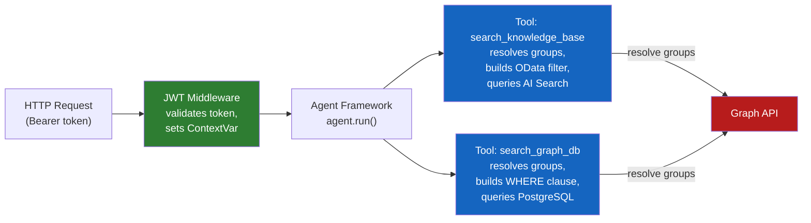
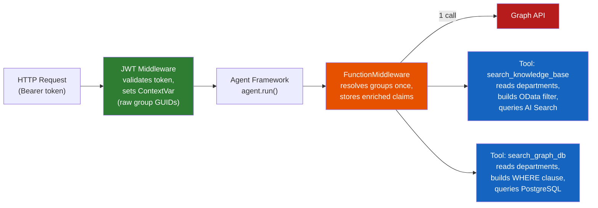
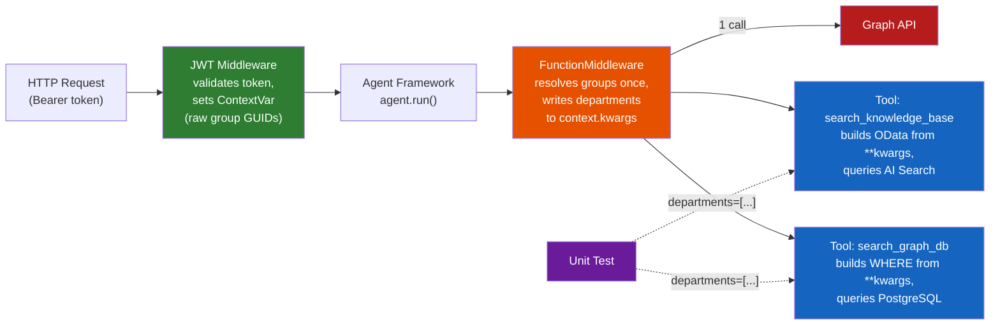

# 007 — Contextual Tool Filtering (Out-of-Band Context Propagation)

## Problem Statement

Pass application-level context (logged-in user's department, RBAC roles, security filters) from the front-end/API layer through the agent into tools, **without** these values entering the LLM prompt. The LLM should never see `department=Engineering` in its messages — tools receive it as out-of-band runtime context and apply it as needed (e.g., OData filters on Azure AI Search queries).

**Core use cases:** security trimming, RBAC-scoped search, tenant isolation, per-user data filtering.

## Current Request Flow

```
Web App (Next.js + CopilotKit)
  → APIM (auth gateway)
    → Agent API (Starlette + JWT middleware)
      → Agent Framework (agent.run)
        → LLM (GPT-4.1)
          → Tool call: search_knowledge_base(query)
            → Azure AI Search (hybrid query)
```

Today the JWT middleware (`middleware/jwt_auth.py`) validates the Entra ID token but does not extract or propagate claims beyond authentication. The search tool receives only the LLM-provided `query` argument.

## Framework Mechanisms (Agent Framework v1.0.0rc3)

The Microsoft Agent Framework provides four complementary mechanisms for out-of-band context propagation to tools. None of them inject context into LLM messages.

### 1. `**kwargs` + `_forward_runtime_kwargs` (per-tool)

When a tool function declares `**kwargs`, the framework auto-detects this and sets `_forward_runtime_kwargs = True`. Any kwargs passed to `agent.run()` flow through `additional_function_arguments` in the chat options and are forwarded to the tool at invocation time.

**Source:** `agent_framework/_tools.py` lines 337–342 (signature scan), lines 1421–1453 (runtime_kwargs filtering and forwarding).

**Flow:**

```
agent.run(message, user_department="Engineering", security_filter="...")
  → _prepare_run_context() merges kwargs into additional_function_arguments
    → chat client tool loop extracts them as runtime_kwargs
      → tool.invoke(arguments=parsed_args, **runtime_kwargs)
```

**Filtered keys:** `conversation_id`, `_function_middleware_pipeline`, `middleware` are stripped before forwarding.

**Tool example:**

```python
def search_knowledge_base(
    query: Annotated[str, "The search query"],
    **kwargs,  # framework detects this → forwards runtime context
) -> str:
    security_filter = kwargs.get("security_filter")
    results = search_kb(query, security_filter=security_filter)
    ...
```

### 2. `FunctionMiddleware` + `FunctionInvocationContext.kwargs` (cross-cutting)

A `FunctionMiddleware` intercepts every tool invocation through a pipeline. The `FunctionInvocationContext` exposes:

- `context.function` — the tool being called
- `context.arguments` — the LLM-provided arguments (mutable)
- `context.kwargs` — the runtime kwargs from `agent.run()` (same as mechanism 1)
- `context.metadata` — middleware-to-middleware shared dict

This is ideal for cross-cutting concerns (apply security filter to all tools) without modifying each tool's signature.

**Source:** `agent_framework/_middleware.py` class `FunctionMiddleware`, `FunctionInvocationContext`.

**Example:**

```python
from agent_framework import FunctionMiddleware, FunctionInvocationContext

class SecurityFilterMiddleware(FunctionMiddleware):
    async def process(self, context: FunctionInvocationContext, call_next):
        claims = context.kwargs.get("user_claims", {})
        if context.function.name == "search_knowledge_base":
            # Inject OData filter into tool arguments
            department = claims.get("department")
            if department:
                context.arguments["security_filter"] = f"department eq '{department}'"
        await call_next()
```

Register on the agent:

```python
agent = Agent(
    ...,
    middleware=[SecurityFilterMiddleware()],
)
```

### 3. Request `metadata` Field (caller-provided context)

The `AgentFrameworkAIAgentAdapter` already extracts `metadata` from the Responses API request body and attaches it to the agent instance:

```python
# _ai_agent_adapter.py lines 66-70
request_context: Dict[str, Any] = {}
metadata = context.raw_payload.get("metadata", {})
if isinstance(metadata, dict):
    request_context.update(metadata)
self._agent._request_headers = request_context
```

The caller (web-app or APIM) sends context in the request body:

```json
{
  "input": "What is Azure AI Search?",
  "stream": true,
  "metadata": {
    "user_department": "Engineering",
    "user_roles": ["reader", "contributor"],
    "security_filter": "department eq 'Engineering'"
  }
}
```

**Limitation:** `_request_headers` is a dynamically-set attribute on the agent instance — not thread-safe for concurrent requests (the agent is a singleton). Suitable only if the adapter creates a per-request agent or if the framework serializes requests.

### 4. `ContextVar` + Starlette Middleware (async-native per-request context)

Python's `contextvars.ContextVar` propagates values through the async call stack without threading issues. The agent server SDK already uses this pattern for user identity via `UserInfoContextMiddleware`:

```python
# Built-in: extracts x-aml-oid / x-aml-tid headers into ContextVar
from azure.ai.agentserver.core.tools.runtime._user import ContextVarUserProvider
```

This pattern can be extended for custom claims.

**Source:** `azure.ai.agentserver.core.tools.runtime._starlette.py` (UserInfoContextMiddleware), `_user.py` (ContextVarUserProvider, resolve_user_from_headers).

## Mechanism Comparison

| Mechanism | LLM sees it? | Thread-safe? | Suitable for | Complexity |
|-----------|:---:|:---:|---|---|
| `ContextVar` from HTTP middleware | No | Yes | Per-request context (user claims, RBAC filters) | Low |
| `FunctionMiddleware` | No | Yes | Per-request cross-cutting concerns (all tools) | Medium |
| `**kwargs` on tool | No | Yes | Per-request context with testable tool signatures | Low |
| Request `metadata` → `_request_headers` | No | **No** | Static/global agent config (not request-specific) | Low |

## Recommended Architectures — Pick Your Level

Three architectures, each building on the previous one. Start with Architecture 1 — it's complete and sufficient on its own. Add layers only when you need what they provide.

### Architecture 1 — ContextVar Only (minimal, complete)

The JWT middleware extracts claims from the token and stores them in a `ContextVar`. Tools import it and read what they need. This is the only required layer.

**What you get:** Per-request, thread-safe, async-safe context visible to any code in the call stack — tools, helpers, services. No framework-specific API needed. Works with any Python async web framework.



```python
# middleware/request_context.py — shared module
from contextvars import ContextVar

user_claims_var: ContextVar[dict] = ContextVar("user_claims", default={})
```

```python
# middleware/jwt_auth.py — set raw claims after token validation
from middleware.request_context import user_claims_var

class JWTAuthMiddleware(BaseHTTPMiddleware):
    async def dispatch(self, request, call_next):
        token = ...  # extract and validate as today
        claims = jwt.decode(token, ...)
        user_claims_var.set({
            "user_id": claims.get("oid"),
            "tenant_id": claims.get("tid"),
            "groups": claims.get("groups", []),   # Entra security group GUIDs
            "roles": claims.get("roles", []),
        })
        return await call_next(request)
```

```python
# agent/kb_agent.py — tool resolves groups AND builds its own filter
from middleware.request_context import user_claims_var
from agent.group_resolver import resolve_departments  # async Graph API / cache lookup

def search_knowledge_base(query: Annotated[str, "The search query"]) -> str:
    claims = user_claims_var.get()
    # N+1/DUPLICATE: same Graph API call that search_graph_db also makes
    departments = resolve_departments(claims.get("groups", []))
    filters = []
    if departments:
        dept_list = ",".join(f"'{d}'" for d in departments)
        filters.append(f"search.in(department, '{dept_list}')")
    if roles := claims.get("roles"):
        filters.append(f"access_level eq '{_max_access(roles)}'")
    odata_filter = " and ".join(filters) if filters else None
    results = search_kb(query, security_filter=odata_filter)
    ...
```

```python
# agent/graph_tool.py — duplicates the SAME resolution + builds SQL syntax
from middleware.request_context import user_claims_var
from agent.group_resolver import resolve_departments  # same expensive call, again

def search_graph_db(query: Annotated[str, "The graph query"]) -> str:
    claims = user_claims_var.get()
    # N+1/DUPLICATE: same Graph API call that search_knowledge_base also makes
    departments = resolve_departments(claims.get("groups", []))
    conditions = []
    if departments:
        dept_list = ",".join(f"'{d}'" for d in departments)
        conditions.append(f"n.department IN ({dept_list})")
    if tenant := claims.get("tenant_id"):
        conditions.append(f"n.tenant_id = '{tenant}'")
    where = "WHERE " + " AND ".join(conditions) if conditions else ""
    results = _run_cypher(query, extra_where=where)
    ...
```

**The problem:** Both tools independently call `resolve_departments()` — an async lookup that hits Microsoft Graph API (or a cache) to translate Entra group GUIDs into department names. This is **redundant I/O**: the same groups resolve to the same departments on every tool call within the same request. Each tool also independently formats the result into its backend's syntax. Adding a third tool means a third redundant resolution call plus a third format translation.

---

### Architecture 2 — ContextVar + FunctionMiddleware (centralizes filter logic)

**When to add:** The middleware does **expensive or complex work once** that all tools need — resolving group GUIDs to department names, expanding role hierarchies, fetching permission lists. Without it, every tool repeats the same async lookup. The middleware doesn't know about tools or their backends — it just enriches the raw claims and stores the resolved values.

**What you get:** A single place that does the expensive work — the Graph API lookup happens once per request. Tools read the resolved values from a ContextVar and build their own backend-specific filter syntax.



```python
# middleware/request_context.py — add a ContextVar for the resolved enrichment
from contextvars import ContextVar

user_claims_var: ContextVar[dict] = ContextVar("user_claims", default={})
resolved_departments_var: ContextVar[list[str]] = ContextVar("resolved_departments", default=[])
```

```python
# agent/security_middleware.py — does the expensive work ONCE, nothing more
# Knows nothing about tools, backends, or filter syntax.
from agent_framework import FunctionMiddleware, FunctionInvocationContext
from middleware.request_context import user_claims_var, resolved_departments_var
from agent.group_resolver import resolve_departments

class SecurityFilterMiddleware(FunctionMiddleware):
    async def process(self, context: FunctionInvocationContext, call_next):
        claims = user_claims_var.get()

        # Expensive: resolve Entra group GUIDs → department names (Graph API / cache)
        # Done ONCE here — not repeated in every tool
        groups = claims.get("groups", [])
        departments = resolve_departments(groups) if groups else []
        resolved_departments_var.set(departments)

        await call_next()
```

```python
# agent/kb_agent.py — register middleware on the agent
agent = Agent(
    ...,
    middleware=[SecurityFilterMiddleware()],
)
```

```python
# agent/kb_agent.py — tools read resolved departments, build their own filter syntax
from middleware.request_context import user_claims_var, resolved_departments_var

def search_knowledge_base(query: Annotated[str, "The search query"]) -> str:
    claims = user_claims_var.get()
    departments = resolved_departments_var.get()  # already resolved, no Graph API call
    filters = []
    if departments:
        dept_list = ",".join(f"'{d}'" for d in departments)
        filters.append(f"search.in(department, '{dept_list}')")
    if roles := claims.get("roles"):
        filters.append(f"access_level eq '{_max_access(roles)}'")
    odata_filter = " and ".join(filters) if filters else None
    results = search_kb(query, security_filter=odata_filter)
    ...

def search_graph_db(query: Annotated[str, "The graph query"]) -> str:
    claims = user_claims_var.get()
    departments = resolved_departments_var.get()  # already resolved
    conditions = []
    if departments:
        dept_list = ",".join(f"'{d}'" for d in departments)
        conditions.append(f"n.department IN ({dept_list})")
    if tenant := claims.get("tenant_id"):
        conditions.append(f"n.tenant_id = '{tenant}'")
    where = "WHERE " + " AND ".join(conditions) if conditions else ""
    results = _run_cypher(query, extra_where=where)
    ...
```

**Trade-off:** One more class, but the expensive group resolution happens **once per request** instead of once per tool call. The LLM may invoke 2–5 tools in a single turn — without the middleware, that's 2–5 redundant Graph API calls. The middleware stays generic (resolve claims, store results) — it has no knowledge of OData, SQL, or any tool.

---

### Architecture 3 — ContextVar + FunctionMiddleware + `**kwargs` (decoupled tools)

**When to add:** You want tools to be testable without importing ContextVars. The tool declares it accepts extra context through `**kwargs`, and the framework forwards runtime kwargs from `agent.run()` or from `FunctionMiddleware` via `context.kwargs`.

**What you get:** Tools have no import-time dependency on the ContextVar module. In tests, you pass context as plain kwargs. The middleware populates `context.kwargs`, the framework forwards them to any tool with `**kwargs` in its signature.



```python
# agent/security_middleware.py — resolves once, writes enriched values to context.kwargs
class SecurityFilterMiddleware(FunctionMiddleware):
    async def process(self, context: FunctionInvocationContext, call_next):
        claims = user_claims_var.get()

        # Resolve once (same as Architecture 2)
        groups = claims.get("groups", [])
        departments = resolve_departments(groups) if groups else []

        # Pass resolved values — tools build their own syntax
        context.kwargs["departments"] = departments
        context.kwargs["roles"] = claims.get("roles", [])
        context.kwargs["tenant_id"] = claims.get("tenant_id")

        await call_next()
```

```python
# agent/kb_agent.py — tools receive resolved values via **kwargs, build own filters
def search_knowledge_base(
    query: Annotated[str, "The search query"],
    **kwargs,
) -> str:
    departments = kwargs.get("departments", [])
    roles = kwargs.get("roles", [])
    filters = []
    if departments:
        dept_list = ",".join(f"'{d}'" for d in departments)
        filters.append(f"search.in(department, '{dept_list}')")
    if roles:
        filters.append(f"access_level eq '{_max_access(roles)}'")
    odata_filter = " and ".join(filters) if filters else None
    results = search_kb(query, security_filter=odata_filter)
    ...

def search_graph_db(
    query: Annotated[str, "The graph query"],
    **kwargs,
) -> str:
    departments = kwargs.get("departments", [])
    tenant = kwargs.get("tenant_id")
    conditions = []
    if departments:
        dept_list = ",".join(f"'{d}'" for d in departments)
        conditions.append(f"n.department IN ({dept_list})")
    if tenant:
        conditions.append(f"n.tenant_id = '{tenant}'")
    where = "WHERE " + " AND ".join(conditions) if conditions else ""
    results = _run_cypher(query, extra_where=where)
    ...
```

```python
# tests/ — pass resolved departments directly, no Graph API, no ContextVar
def test_search_kb_with_filter():
    result = search_knowledge_base(
        "azure search",
        departments=["Engineering", "Research"],
        roles=["admin"],
    )
    ...

def test_search_graph_with_filter():
    result = search_graph_db(
        "find related services",
        departments=["Engineering", "Research"],
        tenant_id="abc-123",
    )
    ...
```

**Trade-off:** `**kwargs` makes the tool’s dependency on security context implicit (you have to know what keys to expect). But tools are fully decoupled from the HTTP/middleware layer — in tests you just pass `departments=["Engineering"]` as plain Python, no Graph API, no ContextVar.

---

### Summary — Pick Your Level

| Layers | What you get | Code to add |
|--------|-------------|-------------|
| **ContextVar only** | Thread-safe per-request context, tools resolve + filter themselves | 1 module + extend JWT middleware |
| **+ FunctionMiddleware** | Expensive resolution done once, tools get enriched values | 1 middleware class |
| **+ `**kwargs`** | Tools decoupled from ContextVar, testable with plain Python args | Change tool signatures |

## References

- `agent_framework/_tools.py` — `_forward_runtime_kwargs`, `runtime_kwargs` filtering, `custom_args` flow
- `agent_framework/_agents.py` — `_prepare_run_context()`, `additional_function_arguments` merge
- `agent_framework/_middleware.py` — `FunctionMiddleware`, `FunctionInvocationContext`
- `azure.ai.agentserver.agentframework._ai_agent_adapter.py` — `metadata` → `_request_headers`
- `azure.ai.agentserver.core.tools.runtime._starlette.py` — `UserInfoContextMiddleware`
- `azure.ai.agentserver.core.tools.runtime._user.py` — `ContextVarUserProvider`, `UserInfo`
- [Azure AI Search — Security filters](https://learn.microsoft.com/en-us/azure/search/search-security-trimming-for-azure-search)

---

## Implementation Status

**Epic 011** implemented **Architecture 3** (ContextVar + FunctionMiddleware + `**kwargs`):

| Component | File | Status |
|-----------|------|--------|
| ContextVar definitions | `src/agent/middleware/request_context.py` | ✅ Done |
| JWT claims extraction | `src/agent/middleware/jwt_auth.py` | ✅ Done |
| Group resolver (simulated) | `src/agent/agent/group_resolver.py` | ✅ Done |
| SecurityFilterMiddleware | `src/agent/agent/security_middleware.py` | ✅ Done |
| Tool with `**kwargs` | `src/agent/agent/kb_agent.py` | ✅ Done |
| search_kb `security_filter` | `src/agent/agent/search_tool.py` | ✅ Done |
| Index `department` field | `src/functions/fn_index/indexer.py` | ✅ Done |
| KB by department | `kb/staging/engineering/` | ✅ Done |

**Key decisions:**
- Group resolver returns `["engineering"]` for any non-empty group list (simulated — replace with real Graph API in a future epic)
- OData filter uses `search.in(department, 'dept1,dept2', ',')` syntax for multi-value matching
- Dev mode (`REQUIRE_AUTH=false`) sets default claims with `groups: ["dev-group-guid"]`, which resolves to `["engineering"]`
