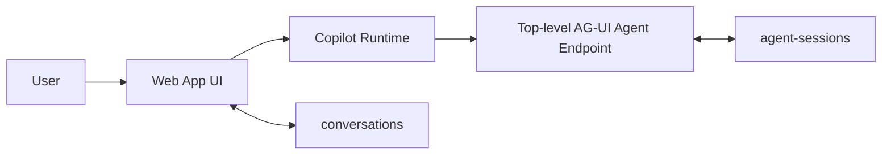
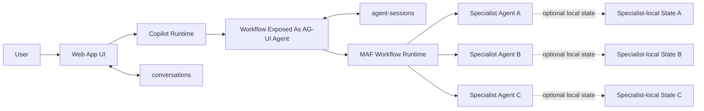
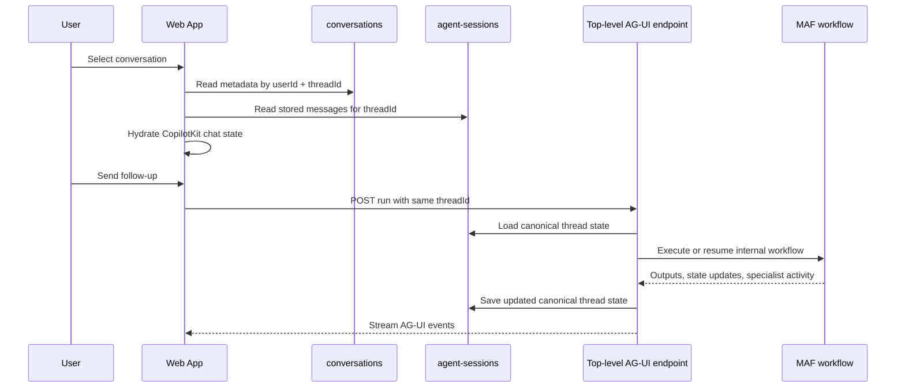

# Conversation State Model

> **Status:** Proposed
> **Purpose:** Define the ownership and persistence model for user-visible conversations across the web app, AG-UI, and Microsoft Agent Framework agents and workflows.
> **Companion spec:** This document complements `docs/specs/agent-sessions.md` and preserves the current decision that the agent owns canonical turn history.

## 1. Decision Summary

The application adopts the following conversation model:

- A **user-visible conversation** maps to one top-level AG-UI `threadId`.
- The **top-level agent endpoint** owns the canonical transcript and session state for that thread.
- The **web app** owns only lightweight conversation metadata used for navigation and UI affordances.
- Internal **workflow** and **sub-agent** state remain backend-owned implementation details unless explicitly surfaced to the user.
- A handoff between internal agents does **not** create a new user-visible conversation.

This keeps the current implementation direction intact while providing a clean path for future Microsoft Agent Framework workflows.

## 2. Scope

This spec covers:

- the current single-agent application
- future MAF workflows exposed as top-level AG-UI agents
- UI behavior for sequential, concurrent, and handoff orchestration
- the boundary between transcript state, UI metadata, and workflow-internal state

This spec does not:

- redesign the current compaction strategy in `agent-sessions`
- define a detailed workflow checkpoint schema
- require a second durable transcript store in the UI layer

## 3. Architecture Principles

The conversation model is driven by four principles.

### 3.1 One canonical transcript per user-visible thread

The application must not maintain two durable transcript stores that can both become authoritative.

The canonical transcript for a conversation belongs to the backend agent endpoint associated with the AG-UI `threadId`.

### 3.2 The web app stays thin

The web app stores only the metadata required to:

- list conversations in the sidebar
- authorize access to a thread
- rename, archive, or otherwise organize conversations
- restore the correct backend-owned thread into the UI

The web app should not become the durable owner of assistant, tool, or reasoning history.

### 3.3 Workflows stay behind a top-level agent boundary

When a MAF workflow is introduced, the workflow should be exposed as a top-level agent for AG-UI and CopilotKit.

The UI should connect to that top-level endpoint, not to individual internal executors or specialist agents.

### 3.4 The UI surfaces orchestration, not workflow internals

The UI should make orchestration understandable to the user, but it should not become responsible for managing:

- executor-local state
- specialist-local working memory
- workflow checkpoints
- internal agent sessions
- raw orchestration mechanics that are not meaningful to the user

## 4. State Ownership Model

There are three distinct state domains.

### 4.1 Canonical conversation state

**Owner:** top-level agent endpoint

**Purpose:** drive resume, follow-up turns, grounding, tool continuity, and compaction-aware context loading

**Examples:**

- user messages
- assistant messages
- tool messages
- reasoning messages or encrypted reasoning values
- compaction metadata
- agent session state needed for future turns

**Store:** `agent-sessions`

**Canonical for resume:** yes

### 4.2 Conversation metadata

**Owner:** web app

**Purpose:** support navigation and user-scoped thread management

**Examples:**

- thread title
- user ownership
- created and updated timestamps
- sidebar ordering
- optional archive or pin flags
- optional last-visible-agent label for display

**Store:** `conversations`

**Canonical for resume:** no

### 4.2.1 Allowed `conversations` schema

The `conversations` store is metadata-only. The allowed durable fields are limited to UI ownership concerns such as:

- `id`
- `userId`
- `userIdentifier`
- `name`
- `createdAt`
- `updatedAt`
- optional future metadata-only UI fields such as archive or pin flags

The `conversations` store must not persist transcript-bearing state such as:

- user messages
- assistant messages
- reasoning blocks
- tool messages
- tool results
- citation payloads
- compact or full search chunk bodies

If legacy data or an accidental write introduces extra fields, the web app read and write paths should sanitize those records back to the allowed metadata-only shape instead of preserving transcript content there.

### 4.3 Derived display enrichment state

**Owner:** web app runtime, sourced from the top-level agent endpoint

**Purpose:** support richer post-resume display without turning the UI into a second transcript owner

**Examples:**

- lazily loaded full citation excerpts for a stored search result
- stale/missing status for a cited chunk after reloading
- temporary UI state for which compact citation rows have already been enriched

**Store:** none required durably; derived on demand from canonical transcript handles

**Canonical for resume:** no

### 4.4 Workflow-internal execution state

**Owner:** backend workflow runtime

**Purpose:** support orchestration that is richer than the top-level conversation transcript

This state domain may include workflow-owned shared state and optional specialist-local state.
Specialist-local state is allowed as an internal implementation detail, but it does not make the
specialist the canonical owner of the user-visible conversation.

**Examples:**

- active executor ID
- internal routing state
- approval state
- internal sub-agent sessions or threads
- specialist-local scratch state or working memory
- specialist-local private tool outputs or intermediate artifacts
- workflow shared state used by executors
- checkpoints, if they are introduced later

**Store:** backend-owned only; not part of the active UI persistence model today

**Canonical for resume:** only inside the backend runtime

The key rule is:

- the top-level AG-UI agent owns the canonical thread
- the workflow runtime may coordinate internal state across specialists
- a specialist may keep local state or even an internal session if the workflow requires it
- none of those internal specialist stores become a second authoritative transcript for the same user-visible conversation

## 5. Recommended Durable Stores

| Store | Owner | Purpose | Canonical Transcript? |
|---|---|---|---|
| `agent-sessions` | Agent endpoint | Canonical conversation thread state | Yes |
| `conversations` | Web app | Sidebar metadata and user-scoped thread references | No |

No additional workflow store is required in the baseline design.

The baseline design also does not require a separate durable citation or reference store. Rich citation display may be derived on demand from compact transcript handles owned by the agent.

If durable workflow checkpoints are needed later, the decision on whether to embed them in the top-level session abstraction or store them in a separate workflow container is **deferred until there is a concrete need**.

## 6. Why This Model Fits the Stack

### 6.1 AG-UI

AG-UI defines the conversation boundary around `threadId` and provides protocol-level support for:

- transcript synchronization through `MESSAGES_SNAPSHOT`
- shared state synchronization through `STATE_SNAPSHOT` and `STATE_DELTA`
- run lifecycle through `runId`
- serialization, compaction, and branching within a thread

This naturally favors a backend-owned canonical thread model.

### 6.2 CopilotKit

CopilotKit proxies a backend AG-UI agent through the runtime and treats that proxied agent as the source of:

- messages
- state
- tool activity
- thread context

The current repo already follows this pattern:

- `src/web-app/app/api/copilotkit/route.ts` creates a Copilot Runtime with a single `HttpAgent`
- `src/web-app/lib/agent.ts` builds the runtime-facing AG-UI agent
- `src/web-app/components/ChatHistoryHydrator.tsx` restores messages into CopilotKit
- `src/web-app/lib/conversations.ts` reads stored messages from the agent-owned `agent-sessions` container and normalizes them for the UI

### 6.3 Microsoft Agent Framework

MAF distinguishes between:

- **agents**, which expose protocol integrations
- **workflows**, which coordinate internal execution across executors and agents

The hosting guidance is decisive:

> To use protocol integrations such as AG-UI with a workflow, the workflow must be exposed as a top-level agent.

From the UI perspective, the workflow is therefore still one conversational endpoint.

## 7. Reference Architecture

### 7.1 Current single-agent model

### 7.2 Workflow model

### 7.3 Resume flow

## 8. UI Contract

### 8.1 Thread semantics

One user-visible conversation equals one AG-UI `threadId`.

That `threadId` is:

- the stable key for the `conversations` document
- the stable key for resume and hydration
- the identity passed by the UI to the top-level AG-UI endpoint

Each individual execution within the thread gets a distinct `runId`, but runs do not create new conversations.

### 8.2 Message attribution

When specialist agents participate in a workflow, the UI **should attribute each assistant response to the active specialist agent**.

This attribution is part of the user-facing conversation model, not just a debugging aid.

Recommended forms of attribution:

- inline agent label on assistant messages
- response header or badge showing the active specialist name

### 8.3 Handoff presentation

When control changes between agents in a handoff workflow, the UI should render that transition **inline in the chat**.

Recommended inline markers include:

- `Routed to Math Tutor`
- `Handed off to Billing Specialist`
- `Returned to Triage Agent`

Inline markers are the primary presentation model. A dedicated side panel is not required by this spec.

### 8.4 What the UI should surface

The UI should surface the parts of orchestration that help the user understand progress and ownership.

Recommended:

- streaming assistant text
- specialist attribution on assistant responses
- inline handoff markers
- tool progress and tool results
- reasoning summaries when policy allows
- active agent or active executor
- approval requests
- structured state or progress panels when useful

Usually avoid surfacing:

- raw internal handoff tool mechanics
- internal checkpoint IDs
- hidden reasoning
- multiple internal session IDs
- executor implementation details that do not help the user complete the task

## 9. Workflow Guidance

### 9.1 Single-agent mode

The current app should continue to behave as follows:

- the top-level agent endpoint owns the thread
- the web app stores metadata only
- resume is driven by backend-owned stored messages
- compaction remains fully agent-controlled
- citation enrichment after resume is optional, read-only, and derived from compact transcript handles

This is already the current implementation direction and should remain the baseline.

### 9.2 Sequential orchestration

In sequential orchestration:

- agents operate in a pipeline
- each stage builds on prior context
- the user still experiences one conversation

UI requirements:

- keep a single thread
- attribute responses to the specialist that produced them
- optionally surface stage boundaries as step or activity events

Implementation rule:

- a stage specialist may keep local working state if needed
- that local state remains subordinate to the workflow and does not become the canonical conversation session

### 9.3 Concurrent orchestration

In concurrent orchestration:

- multiple agents work on the same input in parallel
- results are aggregated by the workflow runtime

UI requirements:

- keep a single thread
- optionally show per-agent progress or activity updates
- attribute each surfaced assistant contribution to the specialist that produced it

Implementation rule:

- parallel specialists may maintain local execution state independently
- aggregation and canonical thread ownership still remain with the top-level workflow-exposed agent

### 9.4 Handoff orchestration

Handoff is different from agent-as-tools.

In MAF handoff orchestration:

- control passes between agents
- the receiving agent takes ownership of the task
- user and agent messages are synchronized across participants
- tool-related contents, including handoff tool calls and results, are not broadcast across all participants

UI requirements:

- keep a single conversation thread
- never split the conversation solely because an internal handoff occurred
- attribute assistant responses to the active specialist agent
- render handoff transitions inline in the chat

Implementation rule:

- the receiving specialist may have its own local state or internal session context
- handoff transfers responsibility for task execution, not canonical ownership of the user-visible thread

### 9.5 Magentic orchestration

At the time of writing, public C# documentation states that Magentic orchestration is not yet supported there.

The design rule remains the same:

- expose Magentic or equivalent orchestration behind one top-level AG-UI agent boundary
- keep one user-visible thread
- keep internal orchestration state backend-owned

## 10. Persistence Rules

### 10.1 Canonical transcript contents

The canonical transcript must contain the stored message forms required for correct resume and future turns, including as applicable:

- user messages
- assistant messages
- tool messages
- reasoning messages
- encrypted reasoning values

For heavy search tool results, the canonical transcript does not need to retain full raw chunk bodies forever. It is sufficient to persist compact citation rows that preserve:

- stable chunk handles
- summary-sized preview text
- source metadata needed for UI fallback and re-enrichment

Specialist-local state may contribute to how a response is produced, but it does not replace or redefine the canonical transcript for the conversation.

### 10.1.1 Derived citation enrichment rule

If the UI wants fuller source detail after resume, it should request that detail through an agent-owned, thread-scoped lookup path.

The UI must not:

- treat enriched citation content as canonical transcript state
- write enriched chunk bodies into `conversations`
- accept arbitrary client-supplied chunk handles as sufficient authorization

### 10.2 Shared state

AG-UI shared state should be used for live collaborative UI state, not as a replacement for durable transcript storage.

Good uses:

- progress state
- draft artifacts
- active specialist or active executor
- approval state
- structured intermediate outputs

Bad uses:

- duplicating the canonical transcript
- storing workflow checkpoints in UI state
- reconstructing durable history from UI-only state snapshots

### 10.3 Conversation splits

The product does **not** support splitting a conversation into a new user-visible thread when handing off to another top-level assistant.

All handoffs remain within the same conversation unless a future product requirement explicitly introduces conversation splitting.

## 11. Alternatives Considered

### 11.1 Recommended: agent-owned transcript plus UI metadata

- `agent-sessions` stores canonical thread state
- `conversations` stores lightweight metadata
- the UI hydrates from backend-owned stored messages

This is the recommended design.

### 11.2 Rejected: single shared document for transcript plus UI metadata

This would mix agent-owned session data with UI-owned metadata and recreate the ownership and read-modify-write problems the current design already solved.

### 11.3 Rejected: duplicate durable transcript in both backend and UI

This would create two transcript stores that can drift on:

- tool call semantics
- reasoning visibility
- compaction behavior
- workflow-specific message shaping

This is explicitly not recommended.

## 12. Deferred Decisions

The following decisions are intentionally deferred:

- whether durable workflow checkpoints, if needed later, should be embedded in the top-level agent session abstraction or stored in a separate workflow container

The following decisions are intentionally fixed for now:

- assistant responses should be attributed to the active specialist agent
- handoff markers should appear inline in the chat
- handoffs do not create new user-visible conversations

## 13. Final Decision

Adopt the following architecture as the default conversation state model:

- **Canonical transcript and session state remain agent-owned.**
- **Conversation metadata remains web-app-owned.**
- **No separate durable UI transcript store is introduced.**
- **MAF workflows are exposed as top-level agents for AG-UI.**
- **Internal workflow and sub-agent state remain backend-owned.**
- **The UI attributes assistant responses to the active specialist and shows handoff markers inline.**

This is the best fit for the current application, the AG-UI protocol, CopilotKit's runtime model, and future Microsoft Agent Framework orchestration support.
