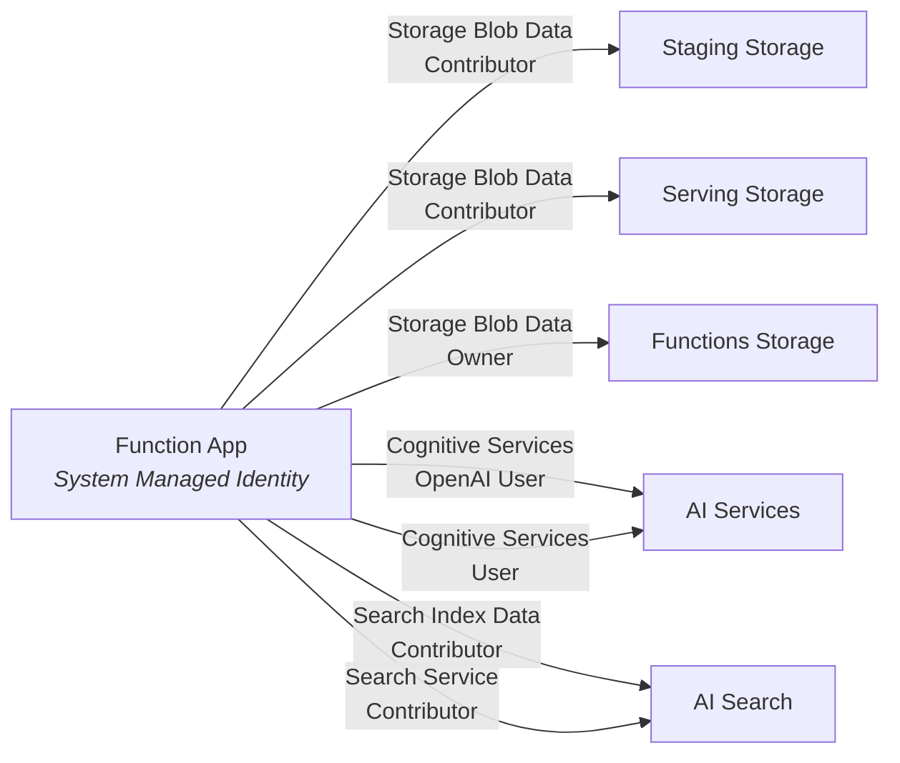

# Infrastructure

> **Status:** Draft — February 13, 2026

## Overview

All infrastructure is defined as **Bicep IaC** under `/infra/` and deployed via **Azure Developer CLI (AZD)**. The design follows zero-trust principles: all inter-service authentication is via **managed identity** with RBAC — no keys, secrets, or connection strings are stored in application settings.

**Region:** East US 2 — selected for availability of all required services: Content Understanding, text-embedding-3-small, gpt-5-mini, Azure AI Search, and Azure Functions Flex Consumption.

## Resource Inventory

| Resource | Bicep Module | Name Pattern | SKU / Tier |
|----------|-------------|--------------|------------|
| Resource Group | _(AZD-managed)_ | `rg-kbidx-{env}` | — |
| Log Analytics Workspace | `monitoring.bicep` | `log-kbidx-{env}` | PerGB2018, 30-day retention |
| Application Insights | `monitoring.bicep` | `appi-kbidx-{env}` | Workspace-based |
| Storage — Staging | `storage.bicep` | `stkbidxstaging{env}` | Standard_LRS, Hot |
| Storage — Serving | `storage.bicep` | `stkbidxserving{env}` | Standard_LRS, Hot |
| Storage — Functions Runtime | `function-app.bicep` | `stkbidxfunc{env}` | Standard_LRS |
| Azure AI Services (Foundry) | `ai-services.bicep` | `ai-kbidx-{env}` | S0 (AIServices kind) |
| → Embedding Deployment | `ai-services.bicep` | `text-embedding-3-small` | GlobalStandard, 120K TPM |
| → Agent Deployment | `ai-services.bicep` | `gpt-5-mini` | GlobalStandard, 30K TPM |
| Azure AI Search | `search.bicep` | `srch-kbidx-{env}` | Basic, 1 partition, 1 replica |
| Function App | `function-app.bicep` | `func-kbidx-{env}` | Flex Consumption (FC1), Python 3.11, Linux |
| App Service Plan | `function-app.bicep` | `plan-kbidx-{env}` | FlexConsumption / FC1 |

> `{env}` is the AZD environment name (e.g., `dev`, `staging`, `prod`).

## Module Structure

```
infra/
├── main.bicep                  # Orchestration — wires all modules + role assignments
├── main.parameters.json        # AZD parameter file (env name, location, search SKU)
└── modules/
    ├── monitoring.bicep         # Log Analytics + Application Insights
    ├── storage.bicep            # Reusable storage account with containers + RBAC
    ├── ai-services.bicep        # AI Services account + model deployments + RBAC
    ├── search.bicep             # AI Search service + RBAC
    └── function-app.bicep       # Flex Consumption plan + Function App + runtime storage
```

---

## Service Details

### Monitoring (`monitoring.bicep`)

Provides centralized logging and telemetry for all services.

| Resource | Configuration |
|----------|--------------|
| **Log Analytics Workspace** | SKU `PerGB2018`, 30-day retention |
| **Application Insights** | Workspace-based (linked to Log Analytics), type `web` |

The Application Insights connection string is passed to the Function App as an app setting for automatic telemetry collection.

### Storage (`storage.bicep`)

A reusable module deployed three times — once each for staging, serving, and functions runtime.

| Setting | Value |
|---------|-------|
| Kind | StorageV2 |
| SKU | Standard_LRS |
| Access Tier | Hot |
| Public Blob Access | Disabled |
| Shared Key Access | Disabled (managed identity only) |
| Minimum TLS | 1.2 |
| HTTPS Only | Yes |

**Containers created:**

| Account | Container | Purpose |
|---------|-----------|---------|
| Staging | `staging` | Source HTML articles + images uploaded for processing |
| Serving | `serving` | Processed Markdown articles + PNG images consumed by fn-index and agents |
| Functions | `deployments` | Function App deployment packages (auto-managed) |

The module accepts an optional `contributorPrincipalId` parameter. When provided, it grants the **Storage Blob Data Contributor** role to that principal (used to give the Function App access to staging and serving accounts).

### Azure AI Services (`ai-services.bicep`)

A single **AIServices** (Foundry) resource hosting Content Understanding and two model deployments.

| Setting | Value |
|---------|-------|
| Kind | `AIServices` |
| SKU | S0 |
| Custom Subdomain | `ai-kbidx-{env}` |
| Local Auth | Disabled (`disableLocalAuth: true`) |
| Public Network | Enabled |

**Model Deployments:**

| Deployment | Model | SKU | Capacity | Purpose |
|-----------|-------|-----|----------|---------|
| `text-embedding-3-small` | OpenAI `text-embedding-3-small` v1 | GlobalStandard | 120K TPM | Vector embeddings for fn-index (1536 dimensions) |
| `gpt-5-mini` | OpenAI `gpt-5-mini` v2025-08-07 | GlobalStandard | 30K TPM | Future agent chat/reasoning |

Model deployments are serialized (`dependsOn`) to avoid Azure API conflicts.

**RBAC Roles (granted to Function App):**

| Role | Role ID | Purpose |
|------|---------|---------|
| Cognitive Services OpenAI User | `5e0bd9bd-7b93-4f28-af87-19fc36ad61bd` | Call embedding and agent model endpoints |
| Cognitive Services User | `a97b65f3-24c7-4388-baec-2e87135dc908` | Access Content Understanding APIs |

### Azure AI Search (`search.bicep`)

| Setting | Value |
|---------|-------|
| SKU | Basic |
| Partitions | 1 |
| Replicas | 1 |
| Semantic Search | Free tier |
| Auth | AAD or API Key (`aadOrApiKey`) with `http401WithBearerChallenge` |
| Public Network | Enabled |

The search index (`kb-articles`) is created by application code at runtime, not in Bicep. See the [Architecture spec](architecture.md) for the full index schema.

**RBAC Roles (granted to Function App):**

| Role | Role ID | Purpose |
|------|---------|---------|
| Search Index Data Contributor | `8bbe4f3e-f3ed-4a68-b546-e74b3c6b0ace` | Push documents to the search index |
| Search Service Contributor | `7ca78c08-252a-4471-8644-bb5ff32d4ba0` | Create and manage indexes |

### Function App (`function-app.bicep`)

| Setting | Value |
|---------|-------|
| Plan | Flex Consumption (FC1) |
| Runtime | Python 3.11 |
| OS | Linux |
| Max Instance Count | 40 |
| Instance Memory | 2048 MB |
| Identity | System-assigned managed identity |
| Deployment Storage | Blob container (`deployments`) on dedicated functions storage account, authenticated via system identity |

**Application Settings:**

| Setting | Source | Purpose |
|---------|--------|---------|
| `AzureWebJobsStorage__accountName` | Functions storage account name | Functions runtime storage (identity-based) |
| `APPLICATIONINSIGHTS_CONNECTION_STRING` | App Insights output | Telemetry |
| `STAGING_BLOB_ENDPOINT` | Staging storage blob endpoint | Read source articles |
| `SERVING_BLOB_ENDPOINT` | Serving storage blob endpoint | Write processed articles |
| `AI_SERVICES_ENDPOINT` | AI Services endpoint | Content Understanding + embeddings |
| `EMBEDDING_DEPLOYMENT_NAME` | `text-embedding-3-small` | Model deployment name for embeddings |
| `SEARCH_ENDPOINT` | AI Search endpoint | Push chunks to search index |
| `SEARCH_INDEX_NAME` | `kb-articles` (hardcoded default) | Target search index |

The Function App's own storage account gets **Storage Blob Data Owner** (role `b7e6dc6d-f1e8-4753-8033-0f276bb0955b`) granted to the Function App identity — required for Flex Consumption deployment and `AzureWebJobsStorage` access.

---

## Security Model

### Zero-Secret Architecture

No keys, connection strings, or secrets appear in application settings or configuration. All service-to-service communication is authenticated via the Function App's **system-assigned managed identity**.



### Key Security Settings

| Resource | Setting | Value |
|----------|---------|-------|
| Storage (Staging, Serving) | `allowSharedKeyAccess` | `false` |
| Storage (all) | `allowBlobPublicAccess` | `false` |
| Storage (all) | `minimumTlsVersion` | `TLS1_2` |
| AI Services | `disableLocalAuth` | `true` |
| AI Search | Auth mode | `aadOrApiKey` (AAD preferred, API key fallback) |

### RBAC Role Summary

| Principal | Resource | Role |
|-----------|----------|------|
| Function App | Staging Storage | Storage Blob Data Contributor |
| Function App | Serving Storage | Storage Blob Data Contributor |
| Function App | Functions Storage | Storage Blob Data Owner |
| Function App | AI Services | Cognitive Services OpenAI User |
| Function App | AI Services | Cognitive Services User |
| Function App | AI Search | Search Index Data Contributor |
| Function App | AI Search | Search Service Contributor |

---

## Deployment

### Prerequisites

- Azure CLI with Bicep (`az bicep version`)
- Azure Developer CLI (`azd version`)
- An Azure subscription with sufficient quota in East US 2

### Commands

```bash
# Initialize AZD environment (first time only)
azd init

# Provision all infrastructure
azd provision

# Deploy application code
azd deploy

# Or provision + deploy in one step
azd up
```

AZD reads `azure.yaml` (project root) and `infra/main.parameters.json` to resolve environment-specific values:

| Parameter | Source | Default |
|-----------|--------|---------|
| `environmentName` | `${AZURE_ENV_NAME}` | — (set during `azd init`) |
| `location` | `${AZURE_LOCATION}` | `eastus2` |
| `searchSkuName` | Hardcoded in parameters file | `basic` |

### Makefile Targets

| Target | Command |
|--------|---------|
| `make azure-provision` | `azd provision` |
| `make azure-deploy` | `azd deploy` |

---

## Outputs

The following values are exported by `main.bicep` and available as AZD environment variables after provisioning:

| Output | Example Value |
|--------|--------------|
| `AZURE_LOCATION` | `eastus2` |
| `RESOURCE_GROUP` | `rg-kbidx-dev` |
| `STAGING_STORAGE_ACCOUNT` | `stkbidxstagingdev` |
| `STAGING_BLOB_ENDPOINT` | `https://stkbidxstagingdev.blob.core.windows.net/` |
| `SERVING_STORAGE_ACCOUNT` | `stkbidxservingdev` |
| `SERVING_BLOB_ENDPOINT` | `https://stkbidxservingdev.blob.core.windows.net/` |
| `AI_SERVICES_NAME` | `ai-kbidx-dev` |
| `AI_SERVICES_ENDPOINT` | `https://ai-kbidx-dev.cognitiveservices.azure.com/` |
| `EMBEDDING_DEPLOYMENT_NAME` | `text-embedding-3-small` |
| `AGENT_DEPLOYMENT_NAME` | `gpt-5-mini` |
| `SEARCH_SERVICE_NAME` | `srch-kbidx-dev` |
| `SEARCH_ENDPOINT` | `https://srch-kbidx-dev.search.windows.net` |
| `FUNCTION_APP_NAME` | `func-kbidx-dev` |
| `FUNCTION_APP_HOSTNAME` | `func-kbidx-dev.azurewebsites.net` |
| `APPINSIGHTS_NAME` | `appi-kbidx-dev` |

---

## Design Decisions

| # | Decision | Rationale |
|---|----------|-----------|
| 1 | **Flex Consumption plan** over Consumption | Better cold-start performance, VNet support, instance memory control (2 GB). Ideal for AI workloads with moderate execution times. |
| 2 | **Three separate storage accounts** | Staging, serving, and functions runtime are isolated for security, lifecycle management, and independent scaling. Shared key access is disabled on staging/serving. |
| 3 | **AIServices kind** (Foundry) | Single resource hosts Content Understanding, OpenAI models (embeddings + agent), avoiding multiple Cognitive Services accounts. |
| 4 | **Basic search tier** | Supports up to 15 indexes, 2 GB storage, and semantic search — sufficient for the initial knowledge base. Upgrade path to Standard is straightforward. |
| 5 | **System-assigned managed identity** | Simplest identity model — lifecycle tied to the Function App. No credential rotation or secret management required. |
| 6 | **East US 2 region** | Broadest model availability for the required services: Content Understanding (GA), text-embedding-3-small, gpt-5-mini, Flex Consumption, and AI Search. |
| 7 | **Modular Bicep structure** | Each service is a self-contained module with optional RBAC parameters. Modules are re-deployed with role assignments after the Function App identity is available. |
| 8 | **GlobalStandard model SKU** | Provides highest availability and regional flexibility for OpenAI model deployments. Uses Microsoft-managed capacity across Azure regions. |
