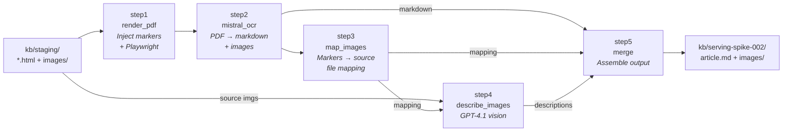

# Spike 002: Mistral Document AI Pipeline

> **Date:** 2026-02-20
> **Status:** Ready
> **Research:** [005-mistral-document-ai.md](../research/005-mistral-document-ai.md)
> **Goal:** Validate that `mistral-document-ai-2512` can replace Azure Content Understanding for KB article conversion, producing comparable or better output.

---

## Objective

Build a minimal script-based pipeline that converts KB articles from `kb/staging/` → `kb/serving-spike-002/` using Mistral Document AI + GPT-4.1 vision, so we can **side-by-side compare** the output against `kb/serving/` (current CU pipeline).

This spike answers the open questions from the research doc (§8) with empirical evidence, not theory.

### Success Criteria

1. All 3 staging articles produce `article.md` + `images/` in `kb/serving-spike-002/`
2. Image markers are correctly read by Mistral OCR → source images map to placeholders
3. Image descriptions generated by GPT-4.1 are comparable quality to CU's `kb-image-analyzer`
4. Hyperlinks from the original HTML survive in the output markdown
5. Output format is compatible with the existing `fn-index` pipeline (same structure as `kb/serving/`)

### Non-Goals

- No changes to existing `fn-convert`, `fn-index`, infra Bicep, or the web app
- No Azure Function deployment — scripts only
- No search indexing — just produce the serving output for comparison
- No production readiness — spike code lives in `src/spikes/002-mistral-pipeline/`
- **No code changes outside `src/spikes/002-mistral-pipeline/`** — no Makefile, no `scripts/`, no infra

---

## Prerequisites

### Model Deployment

Deploy `mistral-document-ai-2512` to the existing AI Foundry resource via `deploy_model.sh` (inside the spike folder). Use `az cognitiveservices account deployment create`. The implementing agent should verify the correct `--model-format`, `--sku-name`, and capacity values via `az cognitiveservices account list-models` or the Foundry portal. If CLI deployment isn't straightforward for Mistral serverless models, deploy manually via the portal and document the steps.

### Environment

Reuse `src/functions/.env` (already populated by `make dev-setup-env`). The spike needs:

| Variable | Source | Notes |
|---|---|---|
| `AI_SERVICES_ENDPOINT` | Existing | Shared AI Services endpoint |
| `AGENT_DEPLOYMENT_NAME` | Existing | GPT-4.1 deployment for image descriptions |
| `MISTRAL_DEPLOYMENT_NAME` | New | Defaults to `mistral-document-ai-2512` |
| `RESOURCE_GROUP` | Existing | For model deployment script |
| `AI_SERVICES_ACCOUNT` | Existing | For model deployment script |

### Dependencies

Own `pyproject.toml` with: `playwright`, `azure-identity`, `openai`, `python-dotenv`, `httpx`.

Auth: `DefaultAzureCredential` everywhere (Entra ID / keyless). Same pattern as rest of codebase.

---

## Pipeline Overview



---

## File Structure

```
src/spikes/002-mistral-pipeline/
├── pyproject.toml
├── deploy_model.sh
├── run.py
├── step1_render_pdf.py
├── step2_mistral_ocr.py
├── step3_map_images.py
├── step4_describe_images.py
├── step5_merge.py
└── compare.py
```

---

## Scripts: Inputs, Outputs, and Validation

### `deploy_model.sh` — One-Time Model Deployment

| | |
|---|---|
| **Goal** | Deploy `mistral-document-ai-2512` to existing Foundry resource |
| **Input** | `.env` vars: `RESOURCE_GROUP`, `AI_SERVICES_ACCOUNT` |
| **Output** | Model deployment visible in Foundry portal |
| **Verify** | Script exits 0; `az cognitiveservices account deployment show` returns the deployment |

### `step1_render_pdf.py` — HTML → PDF with Image Markers

| | |
|---|---|
| **Goal** | Inject `IMG:<filename>` markers before each `` tag, then render the HTML to PDF using Playwright (headless Chromium) |
| **Input** | `kb/staging/<article>/<name>.html` + `images/` |
| **Output** | `<temp>/<article>/article.pdf` |
| **Verify** | Open the PDF — images render correctly, markers appear as small grey text above each image |

The markers are small styled `<div>` elements (6px, grey) inserted before each ``. They survive PDF rendering and OCR, letting us map Mistral's generic `img-N.jpeg` placeholders back to source filenames. See research doc §5a for the full marker injection strategy.

### `step2_mistral_ocr.py` — PDF → Mistral OCR

| | |
|---|---|
| **Goal** | Send the PDF to Mistral Document AI and get back structured markdown + extracted images |
| **Input** | `<temp>/<article>/article.pdf` |
| **Output** | Raw OCR JSON response (pages with markdown, images, bounding boxes) |
| **Verify** | Response has `pages[]` with non-empty `markdown` fields; images extracted |

**Endpoint discovery:** The exact REST path for Mistral on Foundry may differ from OpenAI models. After deploying, check the "Target URI" in the portal. The OCR API is at `/v1/ocr`. Auth via `DefaultAzureCredential` (bearer token); fall back to API key if needed.

Save the raw response as `ocr_response.json` for debugging.

### `step3_map_images.py` — Marker-Based Image Mapping

| | |
|---|---|
| **Goal** | Parse the OCR markdown for `IMG:<filename>` markers and associate each one with the next Mistral image placeholder (`img-N.jpeg`) |
| **Input** | Per-page markdown from OCR response |
| **Output** | `dict[str, str]` mapping Mistral placeholders → source filenames (e.g., `{"img-0.jpeg": "content-understanding-framework-2025.png"}`) |
| **Verify** | Mapping count equals the number of `` tags in the source HTML; filenames match staging images |

**Fallbacks if markers don't survive OCR:**
1. Increase marker font size to 8–10px
2. Try a different format (e.g., plain text `[SOURCE:filename.png]`)
3. Fall back to sequential correlation (img-0 = first `` in HTML DOM order)

### `step4_describe_images.py` — GPT-4.1 Image Descriptions

| | |
|---|---|
| **Goal** | For each mapped source image, call GPT-4.1 vision to produce a structured description (Description, UIElements, NavigationPath) — matching the schema from our CU `kb-image-analyzer` |
| **Input** | Source images from `kb/staging/<article>/images/`, image mapping from step 3 |
| **Output** | `dict[str, str]` mapping source filename → description text |
| **Verify** | Every mapped image gets a description; descriptions are comparable quality to CU's output in `kb/serving/*/article.md` |

### `step5_merge.py` — Assemble Final Output

| | |
|---|---|
| **Goal** | Combine OCR markdown + image descriptions into `article.md`, copy source images, match the CU output format |
| **Input** | Full OCR markdown, image mapping, image descriptions, staging dir |
| **Output** | `kb/serving-spike-002/<article>/article.md` + `images/*.png` |
| **Verify** | Output structure matches `kb/serving/` — same `article.md` + `images/` layout, image blocks use format `> **[Image: <stem>](images/<stem>.png)**` |

Merge logic:
1. Remove marker lines from markdown
2. Replace `` placeholders with image description blocks
3. Copy source images from staging to output as PNGs
4. Write `article.md`

### `run.py` — Orchestrator

| | |
|---|---|
| **Goal** | Process all articles from `kb/staging/` through steps 1–5, output to `kb/serving-spike-002/` |
| **Input** | `kb/staging/` (3 articles), `.env` config |
| **Output** | `kb/serving-spike-002/` with all articles converted |
| **Verify** | All 3 articles in output dir; no errors; temp dir cleaned up |

Loads `.env` from `src/functions/.env`, iterates staging dirs, calls steps 1–5, uses a temp directory for intermediate artifacts (PDF, OCR response).

### `compare.py` — Quality Comparison

| | |
|---|---|
| **Goal** | Compare `kb/serving/` (CU) vs `kb/serving-spike-002/` (Mistral) side-by-side |
| **Input** | Both serving directories |
| **Output** | Per-article stats (char count, line count, image block count, hyperlink count) + unified `.diff` files |
| **Verify** | All 3 articles compared; stats printed; diff files written to `kb/serving-spike-002/` |

---

## Expected Output

```
kb/serving-spike-002/
├── agentic-retrieval-overview-html_en-us/
│   ├── article.md
│   └── images/
├── content-understanding-overview-html_en-us/
│   ├── article.md
│   └── images/
│       └── content-understanding-framework-2025.png
└── search-security-overview-html_en-us/
    ├── article.md
    └── images/
```

The `article.md` format must match the CU convention:
```markdown
> **[Image: <stem>](images/<stem>.png)**
> <description text>
```

---

## Run Sequence

All commands from the spike folder:

```bash
cd src/spikes/002-mistral-pipeline

# 1. Install deps + Playwright browsers
uv sync && uv run playwright install chromium

# 2. Deploy model (one-time)
bash deploy_model.sh

# 3. Run pipeline
uv run python run.py

# 4. Compare output vs CU
uv run python compare.py

# 5. Manually inspect kb/serving-spike-002/*/article.md
```

---

## Validation Checklist

| # | Check | How to Verify |
|---|---|---|
| 1 | **Model deploys** | `deploy_model.sh` exits 0; deployment visible in Foundry portal |
| 2 | **PDF renders correctly** | Open temp PDF — images visible, markers visible as small grey text |
| 3 | **OCR returns pages** | `ocr_response.json` has `pages[]` with markdown content |
| 4 | **Markers survive OCR** | grep for `IMG:` in OCR markdown |
| 5 | **Image mapping correct** | Mapping count = `` count in HTML; filenames match staging |
| 6 | **GPT-4.1 descriptions quality** | Compare descriptions to CU output in `kb/serving/*/article.md` |
| 7 | **Hyperlinks preserved** | grep `http` links in output, compare count to CU |
| 8 | **Output structure matches** | `kb/serving-spike-002/<article>/article.md` + `images/` exists |
| 9 | **compare.py works** | Stats printed, `.diff` files written |
| 10 | **Temp cleaned up** | No leftover temp directories |

### Known Risks / Fallbacks

| Risk | Mitigation |
|---|---|
| Mistral OCR strips the 6px markers | Increase font size; try plain text format; fall back to sequential correlation |
| Foundry endpoint path differs from `/v1/ocr` | Check deployment target URI in portal; try alternatives |
| Auth fails with `DefaultAzureCredential` | Fall back to API key from deployment's key page |
| PDF exceeds 30 pages / 30MB | Our articles are small (3-5 PDF pages); if hit, split |

---

## Definition of Done

- [ ] `src/spikes/002-mistral-pipeline/` contains all scripts listed above
- [ ] `deploy_model.sh` deploys the model (or documents manual steps if CLI doesn't work)
- [ ] `uv run python run.py` processes all 3 staging articles without errors
- [ ] `kb/serving-spike-002/` contains `article.md` + `images/` for all 3 articles
- [ ] `uv run python compare.py` prints stats and writes `.diff` files
- [ ] Output `article.md` format matches CU convention
- [ ] Observations documented (append results section to this file)

---

## References

- [Research: Mistral Document AI](../research/005-mistral-document-ai.md)
- [Research: Architecture Proposal](../research/004-architecture-proposal.md)
- [Research: CU Architecture Research](../research/002-architecture-research.md)
- [ARD-001: HTML Direct Processing](../ards/ARD-001-html-direct-processing.md)
- [Current fn-convert pipeline](../../src/functions/fn_convert/__init__.py)
- [Current convert script](../../scripts/functions/convert.sh)
